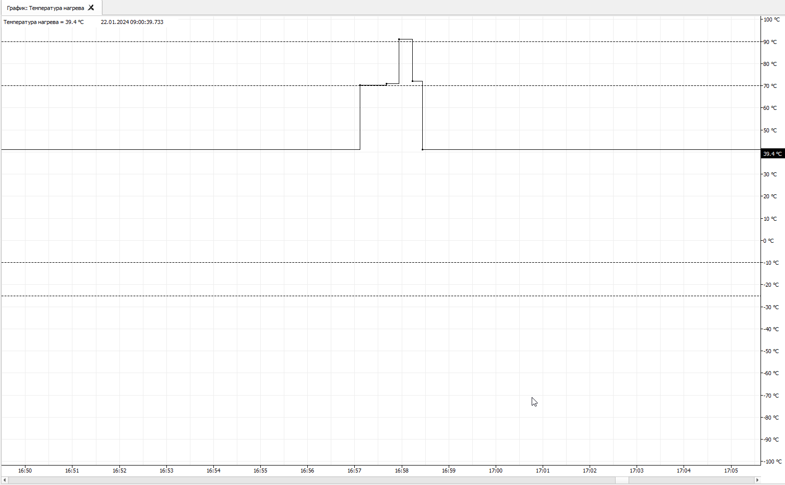
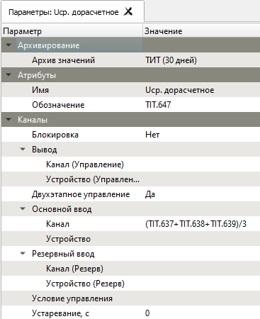
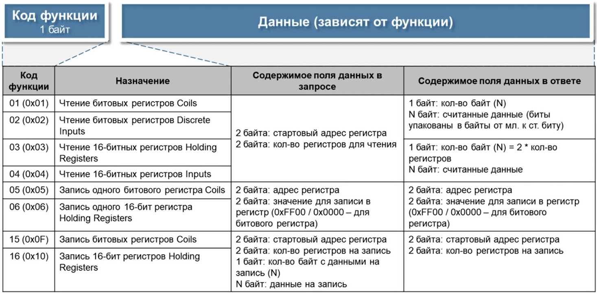

# Архитектура

{:.no_toc}

* TOC
{:toc}

## Конфигурация

Хранит на диске информацию обо всех объектах Сервера ОИК, структуре оборудования и пользователях. Предоставляет возможность редактирования информации пользователем и извещает модули для применения изменений без рестарта Сервера ОИК.

Конфигурация содержит информацию об объектах Сервера ОИК и используется всеми его компонентами. Конфигурация хранится во внутренней базе данных на локальном диске Сервера ОИК и обновляется в момент редактирования, позволяя избежать потери данных при отключении питания.

Редактирование конфигурации производится встроенными средствами ОИК. Для редактирования конфигурации пользователь должен обладать административными полномочиями. В шаблонной конфигурации, создаваемой пользователем по умолчанию, таким пользователем является «root» без пароля (пароль может быть задан в дальнейшем).

Пользователь может обновлять конфигурацию в любой момент. При этом каждый компонент получит извещение, таким образом сделанные изменения будут отражены немедленно для всей системы.

Конфигурация содержит несколько типов информации: объекты, устройства, описание пользователей, и др.

Предусмотрена возможность [Редактирования конфигурации в Excel](development#excel-cfg)

### Объекты

Информационными объектами ОИК являются логические параметры, представляющие в обработанной форме всю информацию, которая по различным физическим каналам связи от источников данных (от контролируемого оборудования) поступает на Сервер ОИК для их дальнейшей обработки, хранения и отображения в удобном для оператора виде.

В ОИК все информационные объекты делятся на следующие типы:

* Объекты телесигнализации (ТС), предназначенные для работы с поступающей на Сервер ОИК дискретной информацией
* Объекты телеизмерения (ТИТ), предназначенные для работы с поступающей на Сервер ОИК измерительной информацией

В ОИК реализован контроль над исполнением команд телеуправления (ТУ или телерегулирования), предназначенных для работы с информацией, подлежащей передаче от Сервера ОИК в направлении контролируемого оборудования.

Объекты могут быть идентифицированы по номеру и, опционально, по текстовому алиасу - уникальному в рамках ОИК псевдониму, задаваемому пользователем (длина алиаса не должна превышать 50 символов, в названии алиаса пробелов быть не должно). Идентификация необходима для привязки объектов к элементам графических схем и для использования в дорасчётных выражениях.

Для реализации функций горячего резервирования каждому объекту может быть присвоено до двух источников данных. В случае двух источников, потеря достоверности по основному источнику приведет к автоматическому переключению объекта на резервный источник данных, а при восстановлении снова будет задействован основной источник данных для объекта.

Также может быть задан один канал ТУ. В частности, каналом ТУ может быть канал, используемый в качестве источника данных этого же объекта.

Значения, полученные от источников данных, могут быть инвертированы (для объектов ТС), преобразованы по линейной шкале (для объектов ТИТ) или вычислены с использованием математической формулы ([Дорасчёт]).

Также для объекта может быть настроено архивирование в базу данных с указанием глубины архива в днях.

<dl>

<dt>ВНИМАНИЕ: При удалении объекта удаляется вся связанная с ним история.</dt>

</dl>

### Группы объектов

Объекты могут быть включены в группы объектов. Группы, в свою очередь, могут быть включены в другие группы. Пользователь может перемещать объекты между группами без нарушения поведения системы.

В общем случае группы объектов имеют древовидную структуру следующего вида на примере энергообъекта:

	Название подстанции

		Название фидера подстанции

			Название узла учета
				...

### Устройства

Для задания конфигурации оборудования ОИК определяет два класса: направления и устройства. Направления представляют собой определение физического канала связи с устройствами (параметры COM-порта, IP-адрес и т.д) с указанием параметров протокола взаимодействия. Устройства входят в направления и определяются различными адресами устройств, подключенных к данному каналу.

Для взаимодействия с устройствами ОИК поддерживает следующие цифровые протоколы обмена данными:

* МЭК 60870-5-101
* МЭК 60870-5-104
* МЭК 61850
* MODBUS RTU
* MODBUS TCP

### Ретрансляция

Устройствам могут быть заданы таблицы ретрансляции, устанавливающие соответствие между объектами и адресами информационных каналов удаленного устройства. При этом ретрансляция будет осуществлена и для пользовательских команд ТУ.

## Система приема/передачи данных

Система приема/передачи данных (далее - Сканер) Выполняет сбор данных с оборудования в соответствии с конфигурацией. Исполняет пользовательские команды ТУ, телерегулирования, принудительный опрос устройств и синхронизацию времени. Осуществляет ретрансляцию данных.

Сканер устанавливает соединения по всем заданным направлениям и выполняет сбор данных, в соответствии с протоколом и параметрами, определенным для направления. При изменении пользователем конфигурации направления или устройства, а также добавлении или удалении, сканер автоматически переустанавливает или закрывает канал связи с устройством. После установления связи с устройством, Сканер выполняет команды инициализации (полный опрос, синхронизация времени), в соответствии с конфигурацией устройства.

Сканер передает на устройства команды команды ТУ или другие команды, получаемые от пользователя.

При потере или восстановлении связи сканер регистрирует соответствующие системные события.

### Информационные каналы

Чаще информационные каналы определяются единственным числом - адресом информационного объекта (как в протоколах МЭК), однако, в общем случае спецификация канала зависит от типа устройства и используемого протокола (в MODBUS).

Примеры каналов МЭК: `1`, `23`, `1403`.

Примеры каналов MODBUS:
* `BOOL:3` - параметр типа COIL с адресом с фактическим шестнадцатеричным Modbus адресом `0x0002`, принимающий значения 0 или 1;
* `UINT16:30020` - параметр типа INPUT REGISTER с фактическим шестнадцатеричным Modbus адресом `0x0013`, принимающий значения в диапазоне `0..2^16-1`

Информационным каналам присуще "качество" ("достоверность"), определяемое состоянием канала связи с устройством, или признаками достоверности, передаваемыми устройством.

## Система обработки данных реального времени

Получает данные оборудования от сканера и распределяет их по объектам системы в реальном времени (РВ). Выполняет расчет качества и резервирование каналов данных, вычисляет дорасчетные и эмулируемые значения. Извещает клиентов об обновлении данных объектов. В обратную сторону, перенаправляет пользовательские команды сканеру для исполнения.

Система РВ распределяет значения информационных каналов устройств, полученные от сканера, между объектами системы в соответствии с конфигурацией. В обратном направлении, система выполняет передачу команд пользователя сканеру. При наличии у объектов ОИК двух источников данных (основного и резервного), система РВ автоматически переключается на резервный источник данных и обратно в зависимости от качества основного источника данных. Выполняет вычисление дорасчетных и эмулируемых объектов.

Значение объекта ТС может быть инвертировано, в соответствии с его конфигурацией. Для объектов ТИ может быть определено линейное преобразование для преобразование физической шкалы в логическую.

При изменении состояния объекта ТС система РВ регистрирует системное событие. Для объектов ТИТ позволяется задание четырех уставок (нижняя/верхняя аварийная, нижняя/верхняя предаварийная), выход за которые (как и возвращение в нормальный диапазон) также приводит к регистрации события.

При этом системой РВ выставляются признаки качества значения объекта, с учетом качества источника данных. Признаки качества значения объекта ОИК обычно отображаются рядом со значением объекта, также им присущи следующие буквенные обозначения:

| Признак | Описание                            |
|:-:|:-----------------------------------------:|
| К | не настроен или ошибка конфигурации       |
| С | нет связи                                 |
| Н | ошибка подключения или неверное выражение |
| Р | ручной ввод                               |
| 2 | резервный канал                           |
| Б | блокировка канала                         |
| У | устаревание                               |
| В | выход за уставку                          |

При перезапуске Сервера ОИК, система РВ восстанавливает последние значения объектов из архива.

Система РВ поддерживает изменения значений объектов назад во времени. То есть, информация, относящаяся к более раннему моменту времени, чем уже поступившая, будет корректно обработана системой. В том числе, помещена в архив.

Кроме того, система РВ выполняет дорасчет и эмуляцию значений объектов.

### Ручной ввод и блокировка

### Контроль уставок

Для объектов ТИТ можно включить контроль нахождения значения в пределах установленных границ, называемых уставками. Допустимо задание двух пар уставок: аварийные и предаварийные. Каждая пара определяет нижнюю и верхнюю границу.

Разрешено задавать как две, так и одну из пары уставок. Не обязательно задавать верхнюю и нижнюю уставки одновременно.

Предаварийные уставки, если заданы, не должны выходить за аварийные уставки.

При выходе значения объекта за уставку регистрируется соответствующее системное событие.

| Уставка               | Событие при попадании значения в диапазон |
|-----------------------|-------------------------------------------|
|                       | Авария: Значение > x                      |
| Верхняя аварийная     |                                           |
|                       | Значение > x                              |
| Верхняя предаварийная |                                           |
|                       | Значение в норме                          |
| Нижняя предаварийная  |                                           |
|                       | Значение < x                              |
| Нижняя аварийная      |                                           |
|                       | Авария: Значение < x                      |

При отображении графика объекта ТИТ с заданными уставками, они отображаются на графике пунктирными линиями.

### Дорасчет

В качестве источника данных любому объекту ОИК можно задать математическое выражение, также называемое дорасчетом.

Формулы дорасчета могут состоять из математических операций, скобок, имен каналов и алиасов других объектов в качестве переменных.

Также допустимо использование функций:

| Функция            | Описание                   |
|:------------------:|----------------------------|
| `sin(x)`           | синус                      |
| `cos(x)`           | косинус                    |
| `tan(x)`           | тангенс                    |
| `asin(x)`          | арксинус                   |
| `acos(x)`          | арккосинус                 |
| `atan(x)`          | арктангенс                 |
| `atan2(y, x)`      | арктангенс y/x             |
| `abs(x)`           | модуль                     |
| `not(x)`           | отрицание                  |
| `sqrt(x)`          | квадратный корень          |
| `sign(x)`          | знак числа                 |
| `min(x1, x2, ...)` | минимум                    |
| `max(x1, x2, ...)` | максимум                   |
| `and(x1, x2, ...)` | логическое И               |
| `or(x1, x2, ...)`  | логическое ИЛИ             |
| `if(x, a, b)`      | тернарый условный оператор |

Углы тригонометрических функций задаются в радианах.
... - означает произвольное число параметров.

Примеры:
* `ТИТ1 + ТИТ2 * ТИТ3`
* `sin({IEC_DEV.1\Канал1})`
* `if (or(рек1_ток>3, рек2_ток>3),рек3_ток,0)`
* `and(!TS.1379,!TS.1380,!TS.1382)`

`TIT.637, TIT.638, TIT.639` - не редактируемый номер объекта ТИТ, который присваивается ему Сервером ОИК автоматически при его создании в базе данных (БД) объектов.

### Устаревание

Система РВ позволяет отслеживать актуальность данных объекта, при установке периода устаревания в его конфигурации. В случае, если значение объекта не будет обновляться в течение периода устаревания, значению объекта будет выставленен признак устаревания [У].

### Эмуляция

Для тестирования поведения системы на этапе подготовки проекта ОИК позволяет задать режим эмуляции объектам системы. Наличие оборудования при этом не требуется.

В качестве генератора данных используется одна из предопределенных функций с заданными параметрами фазы и частоты, которые в ОИК называются эмулируемыми сигналами.

### Апертура

Для избавления от дребезга и избыточных данных для объектов ТИТ имеется возможность фильтрации данных с указанием минимального изменения значения. Данный параметр называется апертурой. Апертура задается в абсолютных единицах - в тех же, что и значение объекта. Любые отклонения значения от текущего на величину меньшую данного параметра будут проигнорированы.

### Мертвая зона

Мертвая зона позволяет исключить дребезг параметров ТИТ в районе нуля. Для задания мертвой зоны используется величина в единицах объекта ТИТ. Любые значения, меньшие по модулю величины мертвой зоны, будут сведены к нулю.

## Системные события

Системное событие ОИК представляет собой запись с несколькими полями, главными из которых являются время события и сообщение. При регистрации события, оно помечается как неквитированное, до квитирования его пользователем (при этом событие квитируется во всей системе).

Если событие относится к объекту системы, ему также присваивается ссылка на объект. Примерами событиями, относящимися к объекту, являются:
* изменение состояния объекта ТС;
* выход значения объекта ТИ за уставку;
* ручной ввод значения объекта и установка блокировки;
* снятие объекта с блокировки;
* этапы выполнения команды управления объектом.

Некоторые типы событий могут иметь привязку к устройству (источнику данных):
* потеря и восстановление связи с устройством;
* изменение конфигурации, рестарт, либо удаление устройства.

## Архивирование

Система архивирования, в соответствии с настройками конфигурации, сохраняет историю изменения значений объектов и системных событий в одной или нескольких базах данных [Sqlite](http://www.sqlite.org). Данная СУБД встроена в Сервер ОИК и не требует установки сторонних компонентов. Сохраненная в архиве история может быть запрошена из 
БД для отображения на графике или в табличной форме.

Смотрите описание [исторических баз данных](server#history) в Сервере ОИК.

## Поддерживаемые протоколы

Для всех протоколов предоставляется возможность наблюдения за обменом с устройством. Смотрите [Наблюдение](client#device-watch) в Клиенте ОИК.

### MODBUS

Modbus — коммуникационный протокол, основан на архитектуре ведущий-подчиненный (master-slave). Использует для передачи данных следующие интерфейсы: RS-485, RS-422, RS-232 (протоколы Modbus RTU/ASCII), а также интерфейс Ethernet сети TCP/IP (протокол Modbus TCP).

Поддерживаются стандартные коды функций Modbus:

Смотрите описание [Устройства MODBUS](development#mbDevice) в Клиенте ОИК.

Смотрите описание протокола [MODBUS](https://ru.wikipedia.org/wiki/Modbus).

### МЭК-60870-5

Элементами подсистемы МЭК-60870-5 являются направления, определяющие каналы данных: сетевой адрес или последовательный порт. Одно направление может обеспечивать соединение с несколькими устройствами.

Поддерживаемые блоки данных прикладного уровня ASDU:

| Метка типа ASDU	| Идентификатор типа ASDU	| Описание информации																						|
|:------------------|:-------------------------:|:---------------------------------------------------------------------------------------------------------:|
| M_SP_NA_1			| 1  			 			| одноэлементная (0 – ОТКЛ, 1 – ВКЛ)																		| 
| M_SP_TA_1 		| 2  			 			| одноэлементная с меткой времени																			| 
| M_DP_NA_1 		| 3 						| двухэлементная (0 – Неопределенное или Промежуточное, 1 – ОТКЛ, 2 – ВКЛ, 3 – Неопределенное)				| 
| M_BO_NA_1 		| 7 			 			| строка из 32 бит	(unsigned int32)																		| 
| M_ME_NA_1 		| 9 			 			| нормализованное значение	(float)																			| 
| M_ME_NB_1 		| 11 						| масштабированное значение (float)																			| 
| M_ME_TB_1 		| 12 			 			| масштабированное значение с меткой времени																| 
| M_ME_NC_1 		| 13 			 			| короткий формат с плавающей запятой (float)																| 
| M_IT_NA_1 		| 15 			 			| интегральная сумма (int32)																				| 
| M_SP_TB_1 		| 30 			 			| одноэлементная с меткой времени (СР56Время2а)																| 
| M_DP_TB_1 		| 31 			 			| двухэлементная с меткой времени (СР56Время2а)																| 
| M_ME_TD_1 		| 34 			 			| нормализованное значение с меткой времени (СР56Время2а)													| 
| M_ME_TE_1 		| 35 			 			| масштабированное значение с меткой времени (СР56Время2а)													| 
| M_ME_TF_1 		| 36 						| короткий формат с плавающей запятой с меткой времени (СР56Время2а)										| 
| M_IT_TB_1 		| 37 			 			| интегральные суммы с меткой времени (СР56Время2а)															| 
| C_SC_NA_1 		| 45 						| одноэлементная команда управления (0 – ОТКЛЮЧИТЬ, 1 – ВКЛЮЧИТЬ)											| 
| M_EI_NA_1 		| 70 			 			| конец инициализации (END OF INITIALIZATION)																| 
| C_IC_NA_1 		| 100 						| команда полного опроса (INTERROGATION)																	| 
| C_CI_NA_1		 	| 101 			 			| команда опроса счетчика (COUNTER INTERROGATION)															| 
| C_CS_NA_1 		| 103 			 			| команда синхронизации времени (SYNCHRONIZATION)															| 
| C_RP_NA_1 		| 105 			 			| команда установки процесса в исходное состояние (RESET PROCESS ACTIVATION / RESET PROCESS CONFIRMATION)	| 
| P_ME_NA_1 		| 110 			 			| запись параметра измеряемой величины, нормализованное значение (float)									| 
| P_ME_NB_1 		| 111 			 			| запись параметра измеряемой величины, масштабированное значение (float)									| 
| P_ME_NC_1 		| 112 			 			| запись параметра измеряемой величины, короткий формат с плавающей запятой (float)							| 

При управлении используются ADSU `C_SC_NA_1` для объектов ТС и `P_ME_NC_1` для объектов ТИТ.

Для переопределения типа ASDU можно указать тип в поле вывода в формате `тип:адрес`

где `тип` один из:

* `BOOL` - используется ASDU `C_SC_NA_1`;
* `INT16` - используется ASDU `P_ME_NB_1`;
* `FLOAT` - используется ASDU `P_ME_NC_1`.

Переопределение типа ASDU может использоваться если для управлении объектом ТИТ требуется отправить команду управления ASDU `C_SC_NA_1`.

Сервер UDP позволяет одновременную работу с несколькими удаленными устройствам через одно направление, так что нет необходимости задавать разные порты приема для разных устройств. Устройство идентифицируется по удаленному IP-адресу и порту.

При использовании сервера UDP поддерживаются устройства, отправляющие датаграммы из нескольких сообщений МЭК.

Смотрите параметры [Устройства МЭК-60870-5](development#iecDevice) в Клиенте ОИК.

Смотрите описание протоколов [МЭК-60870-5](https://ru.wikipedia.org/wiki/IEC_60870-5).

### МЭК-61850

Предоставляется прозрачный доступ к информационной модели устройства. Смотрите описание [МЭК-61850](client#iec-61850) в Клиенте ОИК и [Проектирование](development#iec-61850).

Сбор данных осуществляется посредством подписки на блоки отчетов RCB/BRCB сервиса MMS сообщений. Для включения сбора данных, блоки отчетов должны быть предварительно созданы для соответствующего устройства МЭК-61850. При установлении соединения с устройством, Сервер ОИК выполняет конфигурирование блоков отчетов устройства для спорадической передачи событий.

Для привязки объектов ТС и ТИТ к объектам МЭК-61850 используются адреса MMS в формате LogicalDevice/LogicalNode$FC$DataObject.

Для привязки объектов ТС используются объекты типа FC=ST, для привязки объектов ТИТ используются объекты типа FC=MX.

Поддерживается выдача двухфазной команды ТУ. Для привязки команды ТУ используется FC=CO.

<dl>

<dt>ВНИМАНИЕ: Поддерживается передача меток времени только в UTC. Если устройство использует другую временную зону, возникнут сложности с обновлением значений.</dt>

</dl>

Оператором может быть инициирована команда полного опроса устройства.

Смотрите описание протоколов [МЭК-61850](https://ru.wikipedia.org/wiki/МЭК-61850).