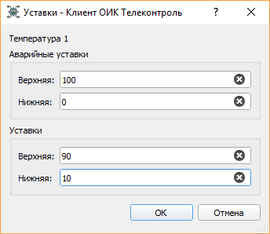
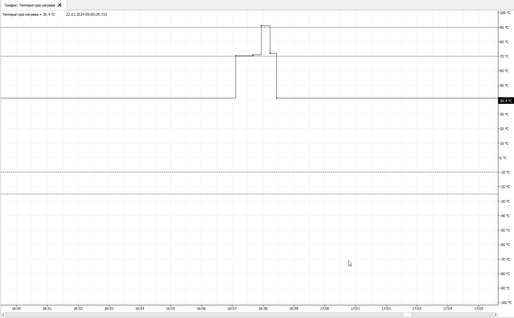

# Архитектура

{:.no_toc}

* TOC
{:toc}

## Обзор

ОИК Телеконтроль построен по Клиент-Серверной архитектуре. Центральный [Сервер](server) выполняет сбор данных с оборудования, обработку в реальном времени, архивирование и обслуживание клиентских подключений. [Клиенты](client) подключаются к Серверу по протоколу TCP/IP и предоставляют оператору средства визуализации и управления. Количество клиентов не ограничивается.

Основной поток данных:

1. **Устройства** передают телеметрию на Сервер по промышленным протоколам ([MODBUS](protocols#modbus), [МЭК-60870-5](protocols#iec-60870), [МЭК-61850](protocols#iec-61850)).
2. **Сканер** принимает данные и распределяет их по информационным каналам.
3. **Система реального времени** обрабатывает данные: резервирование, преобразование, контроль уставок, дорасчет.
4. **Архив** сохраняет историю изменений значений и системных событий.
5. **Клиенты** отображают данные оператору и передают команды управления в обратном направлении.

Сервер также может предоставлять данные внешним системам через [OPC UA](server#opcua) и принимать данные от внешних [OPC-серверов](server#opc-classic).

## Клиент-серверное взаимодействие

Клиенты подключаются к Серверу по протоколу TCP/IP (порт 2000 по умолчанию). Соединение устойчиво к кратковременным разрывам связи — при потере соединения Клиент автоматически выполняет переподключение. После восстановления связи Клиент получает актуальные данные от Сервера.

Через одно подключение Клиент получает обновления данных объектов в реальном времени (подписка), запрашивает исторические данные, выполняет команды управления и редактирует конфигурацию. Количество одновременных клиентских подключений не ограничивается.

Помимо графического Клиента, доступен [Веб-интерфейс](client/web) для удаленного доступа через браузер.

Настройка адресов и портов подключения описана в разделе [Клиентские подключения](server#sessions) Сервера.

## Разграничение доступа

ОИК поддерживает многопользовательский доступ с разделением полномочий. Каждый пользователь имеет одну из четырех ролей:

| Роль | Управление и уставки | Редактирование конфигурации |
|:---|:---:|:---:|
| 0 — Руководитель | Нет | Нет |
| 1 — Инженер АСУ и связи | Нет | Да |
| 2 — Диспетчер | Да | Нет |
| 3 — Администратор | Да | Да |

При подключении Клиент проходит аутентификацию по имени и паролю. Права доступа определяют доступность команд управления, ручного ввода, редактирования конфигурации и администрирования пользователей.

Подробности о настройке пользователей смотрите в разделе [Конфигурирование пользователей](dev/users).

## Объекты

Информационными объектами ОИК являются логические параметры, представляющие в обработанной форме всю информацию, которая по различным физическим каналам связи от источников данных (от контролируемого оборудования) поступает на Сервер ОИК для их дальнейшей обработки, хранения и отображения в удобном для оператора виде.

В ОИК все информационные объекты делятся на следующие типы:

* Объекты телесигнализации (ТС), предназначенные для работы с поступающей на Сервер ОИК дискретной информацией
* Объекты телеизмерения (ТИТ), предназначенные для работы с поступающей на Сервер ОИК измерительной информацией

В ОИК реализован контроль над исполнением команд телеуправления (ТУ или телерегулирования), предназначенных для работы с информацией, подлежащей передаче от Сервера ОИК в направлении контролируемого оборудования.

Объекты могут быть идентифицированы по номеру и, опционально, по текстовому алиасу - уникальному в рамках ОИК псевдониму, задаваемому пользователем (длина алиаса не должна превышать 50 символов, в названии алиаса пробелов быть не должно). Идентификация необходима для привязки объектов к элементам графических схем и для использования в дорасчётных выражениях.

Также для объекта может быть настроено архивирование в базу данных с указанием глубины архива в днях.

<dl>

<dt>ВНИМАНИЕ: При удалении объекта удаляется вся связанная с ним история.</dt>

</dl>

### Группы объектов

Объекты могут быть включены в группы объектов. Группы, в свою очередь, могут быть включены в другие группы. Пользователь может перемещать объекты между группами без нарушения поведения системы.

В общем случае группы объектов имеют древовидную структуру следующего вида на примере энергообъекта:

	Название подстанции

		Название фидера подстанции

			Название узла учета
				...

### Резервирование

Для реализации функций горячего резервирования каждому объекту может быть присвоено до двух источников данных. В случае двух источников, потеря достоверности по основному источнику приведет к автоматическому переключению объекта на резервный источник данных, а при восстановлении снова будет задействован основной источник данных для объекта.

Также может быть задан один канал ТУ. В частности, каналом ТУ может быть канал, используемый в качестве источника данных этого же объекта.

Значения, полученные от источников данных, могут быть инвертированы (для объектов ТС), преобразованы по линейной шкале (для объектов ТИТ) или вычислены с использованием математической формулы ([Дорасчёт](formulas)).

## Устройства и протоколы

Для задания конфигурации оборудования ОИК определяет два класса: направления и устройства. Направления представляют собой определение физического канала связи с устройствами (параметры COM-порта, IP-адрес и т.д) с указанием параметров протокола взаимодействия. Устройства входят в направления и определяются различными адресами устройств, подключенных к данному каналу.

Для взаимодействия с устройствами ОИК поддерживает следующие цифровые протоколы обмена данными:

* МЭК 60870-5-101
* МЭК 60870-5-104
* МЭК 61850
* MODBUS RTU
* MODBUS TCP

Подробное описание протоколов смотрите на странице [Поддерживаемые протоколы](protocols).

### Информационные каналы

Чаще информационные каналы определяются единственным числом - адресом информационного объекта (как в протоколах МЭК), однако, в общем случае спецификация канала зависит от типа устройства и используемого протокола (в MODBUS).

Примеры каналов МЭК: `1`, `23`, `1403`.

Примеры каналов MODBUS:
* `BOOL:3` - параметр типа COIL с адресом с фактическим шестнадцатеричным Modbus адресом `0x0002`, принимающий значения 0 или 1;
* `UINT16:30020` - параметр типа INPUT REGISTER с фактическим шестнадцатеричным Modbus адресом `0x0013`, принимающий значения в диапазоне `0..2^16-1`

Информационным каналам присуще "качество" ("достоверность"), определяемое состоянием канала связи с устройством, или признаками достоверности, передаваемыми устройством.

### Ретрансляция

Ретрансляция позволяет передавать данные объектов ОИК в другие системы верхнего уровня (например, диспетчерские центры) по поддерживаемым протоколам обмена. Для этого создается виртуальное серверное устройство с таблицей ретрансляции, устанавливающей соответствие между объектами ОИК и адресами информационных каналов удаленной системы.

Ретрансляция работает в обоих направлениях: значения объектов передаются удаленной системе, а команды управления (ТУ) от удаленной системы ретранслируются обратно на оборудование.

Настройка таблиц ретрансляции выполняется из [панели команд](client) Клиента.

## Сбор данных

Система приема/передачи данных (далее — Сканер) выполняет сбор данных с оборудования в соответствии с конфигурацией. Исполняет пользовательские команды ТУ, телерегулирования, принудительный опрос устройств и синхронизацию времени. Осуществляет ретрансляцию данных.

Сканер устанавливает соединения по всем заданным направлениям и выполняет сбор данных, в соответствии с протоколом и параметрами, определенным для направления. При изменении пользователем конфигурации направления или устройства, а также добавлении или удалении, сканер автоматически переустанавливает или закрывает канал связи с устройством. После установления связи с устройством, Сканер выполняет команды инициализации (полный опрос, синхронизация времени), в соответствии с конфигурацией устройства.

Сканер передает на устройства команды ТУ или другие команды, получаемые от пользователя.

При потере или восстановлении связи сканер регистрирует соответствующие системные события. Для наблюдения за обменом данными с устройствами смотрите [Наблюдение](client/device-watch).

## Обработка данных реального времени

Получает данные оборудования от сканера и распределяет их по объектам системы в реальном времени (РВ). Выполняет расчет качества и резервирование каналов данных, вычисляет дорасчетные и эмулируемые значения. Извещает клиентов об обновлении данных объектов. В обратную сторону, перенаправляет пользовательские команды сканеру для исполнения.

Система РВ распределяет значения информационных каналов устройств, полученные от сканера, между объектами системы в соответствии с конфигурацией. При наличии у объектов ОИК двух источников данных (основного и резервного), система РВ автоматически переключается на резервный источник данных и обратно в зависимости от качества основного источника данных.

Значение объекта ТС может быть инвертировано, в соответствии с его конфигурацией. Для объектов ТИ может быть определено линейное преобразование для преобразование физической шкалы в логическую.

При перезапуске Сервера ОИК, система РВ восстанавливает последние значения объектов из архива.

Система РВ поддерживает изменения значений объектов назад во времени. То есть, информация, относящаяся к более раннему моменту времени, чем уже поступившая, будет корректно обработана системой. В том числе, помещена в архив.

### Признаки качества

Системой РВ выставляются признаки качества значения объекта, с учетом качества источника данных. Признаки качества значения объекта ОИК обычно отображаются рядом со значением объекта, также им присущи следующие буквенные обозначения:

| Признак | Описание                            |
|:-:|:-----------------------------------------:|
| К | не настроен или ошибка конфигурации       |
| С | нет связи                                 |
| Н | ошибка подключения или неверное выражение |
| Р | ручной ввод                               |
| 2 | резервный канал                           |
| Б | блокировка канала                         |
| У | устаревание                               |
| В | выход за уставку                          |

### Ручной ввод и блокировка

Оператор может вручную задать значение любого объекта ТС или ТИТ при помощи команды «Ручной ввод» (требуются полномочия управления). При ручном вводе значению объекта присваивается признак качества [Р].

Одновременно с ручным вводом оператор может установить блокировку объекта. Установка блокировки для указанного объекта позволяет игнорировать телемеханические данные, которые поступают в Сервер от удаленных устройств. При установленной блокировке ручной ввод данных будет иметь преимущество перед телемеханическими данными. При снятой блокировке приоритет будет у телемеханических данных — значение будет перезаписано при следующем поступлении данных от устройства.

Заблокированному объекту присваивается признак качества [Б]. Снять блокировку можно командой «Снять блокировку» из контекстного меню объекта.

### Контроль уставок

Для объектов ТИТ можно включить контроль нахождения значения в пределах установленных границ, называемых уставками. Допустимо задание двух пар уставок: аварийные и предаварийные. Каждая пара определяет нижнюю и верхнюю границу.

Разрешено задавать как две, так и одну из пары уставок. Не обязательно задавать верхнюю и нижнюю уставки одновременно.

Предаварийные уставки, если заданы, не должны выходить за аварийные уставки.

При изменении состояния объекта ТС система РВ регистрирует системное событие. Для объектов ТИТ выход за уставку (как и возвращение в нормальный диапазон) также приводит к регистрации события.

| Уставка               | Событие при попадании значения в диапазон |
|-----------------------|-------------------------------------------|
|                       | Авария: Значение > x                      |
| Верхняя аварийная     |                                           |
|                       | Значение > x                              |
| Верхняя предаварийная |                                           |
|                       | Значение в норме                          |
| Нижняя предаварийная  |                                           |
|                       | Значение < x                              |
| Нижняя аварийная      |                                           |
|                       | Авария: Значение < x                      |

При отображении графика объекта ТИТ с заданными уставками, они отображаются на графике пунктирными линиями.

## Вычисления и фильтрация

### Дорасчет

В качестве источника данных любому объекту ОИК можно задать математическое выражение, также называемое дорасчетом. Формулы могут содержать арифметические операции, ссылки на другие объекты по алиасу и встроенные функции (тригонометрические, логические, условные).

Смотрите полное описание синтаксиса и функций в разделе [Формулы](formulas).

### Эмуляция

Для тестирования поведения системы на этапе подготовки проекта ОИК позволяет задать режим эмуляции объектам системы. Наличие оборудования при этом не требуется.

В качестве генератора данных используется одна из предопределенных функций с заданными параметрами фазы и частоты, которые в ОИК называются эмулируемыми сигналами.

### Апертура

Для избавления от дребезга и избыточных данных для объектов ТИТ имеется возможность фильтрации данных с указанием минимального изменения значения. Данный параметр называется апертурой. Апертура задается в абсолютных единицах - в тех же, что и значение объекта. Любые отклонения значения от текущего на величину меньшую данного параметра будут проигнорированы.

### Мертвая зона

Мертвая зона позволяет исключить дребезг параметров ТИТ в районе нуля. Для задания мертвой зоны используется величина в единицах объекта ТИТ. Любые значения, меньшие по модулю величины мертвой зоны, будут сведены к нулю.

### Устаревание

Система РВ позволяет отслеживать актуальность данных объекта, при установке периода устаревания в его конфигурации. В случае, если значение объекта не будет обновляться в течение периода устаревания, значению объекта будет выставлен признак устаревания [У].

## Системные события

Системное событие ОИК представляет собой запись с несколькими полями, главными из которых являются время события и сообщение. При регистрации события, оно помечается как неквитированное, до квитирования его пользователем (при этом событие квитируется во всей системе).

Если событие относится к объекту системы, ему также присваивается ссылка на объект. Примерами событий, относящихся к объекту, являются:
* изменение состояния объекта ТС;
* выход значения объекта ТИ за уставку;
* ручной ввод значения объекта и установка блокировки;
* снятие объекта с блокировки;
* этапы выполнения команды управления объектом.

Некоторые типы событий могут иметь привязку к устройству (источнику данных):
* потеря и восстановление связи с устройством;
* изменение конфигурации, рестарт, либо удаление устройства.

Для просмотра событий используется [Журнал событий](client/events).

## Архивирование

Система архивирования, в соответствии с настройками конфигурации, сохраняет историю изменения значений объектов и системных событий в одной или нескольких базах данных [SQLite](http://www.sqlite.org). Данная СУБД встроена в Сервер ОИК и не требует установки сторонних компонентов. Сохраненная в архиве история может быть запрошена из БД для отображения на [графике](client/graph), в [таблице данных](client/data) или в [сводке](client/summary).

Смотрите описание [исторических баз данных](server#history) в Сервере ОИК.

## Интеграция с внешними системами

### Сервер OPC UA

Сервер ОИК может выступать в роли сервера [OPC UA](https://opcfoundation.org/about/opc-technologies/opc-ua/), предоставляя внешним системам доступ к своему адресному пространству. Внешние OPC UA клиенты получают доступ ко всем объектам ОИК, их текущим значениям, историческим данным и возможности подписки на изменения.

Это позволяет интегрировать ОИК с системами верхнего уровня, SCADA-системами других производителей и аналитическими платформами без разработки специализированных адаптеров.

Настройка описана в разделе [Сервер OPC UA](server#opcua).

### Клиент OPC (Windows)

На Windows Сервер ОИК может подключаться к внешним OPC DA серверам в роли клиента. Теги внешних OPC-серверов отображаются в адресном пространстве ОИК и могут быть привязаны к объектам, позволяя собирать данные от оборудования, подключенного через сторонние OPC-серверы.

Настройка описана в разделе [Клиент OPC](server#opc-classic).

## Конфигурация

Конфигурация хранит на диске информацию обо всех объектах Сервера ОИК, структуре оборудования и пользователях. Конфигурация хранится во внутренней базе данных на локальном диске Сервера ОИК и обновляется в момент редактирования, позволяя избежать потери данных при отключении питания.

Редактирование конфигурации производится встроенными средствами ОИК. Для редактирования конфигурации пользователь должен обладать административными полномочиями. В шаблонной конфигурации, создаваемой по умолчанию, таким пользователем является «root» без пароля (пароль может быть задан в дальнейшем).

Пользователь может обновлять конфигурацию в любой момент. При этом каждый компонент получит извещение, таким образом сделанные изменения будут отражены немедленно для всей системы.

Подробности о редактировании конфигурации смотрите в разделе [Проектирование](development). Предусмотрена возможность [Редактирования конфигурации в Excel](dev/excel).
