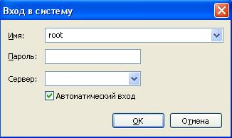
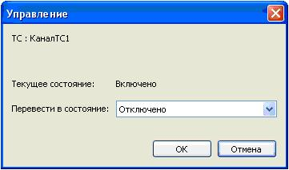
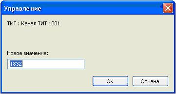
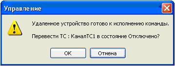
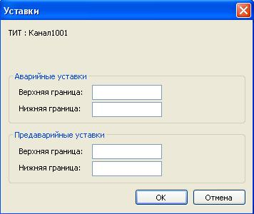
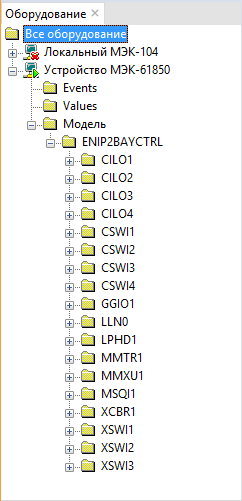
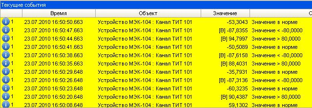
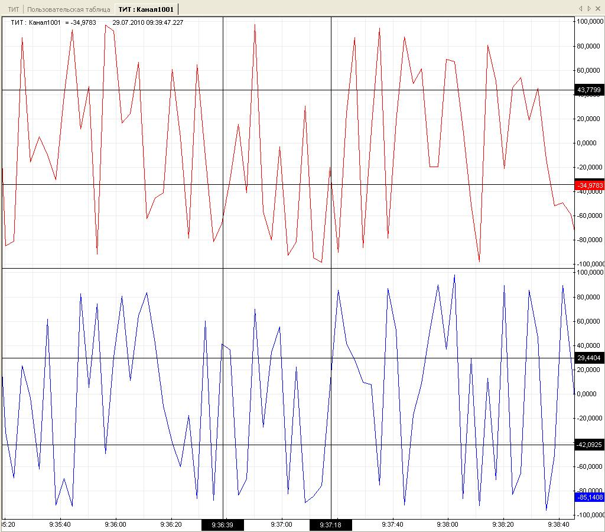
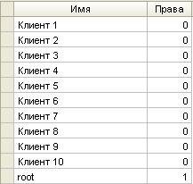

# Графический клиент

## Запуск

При первом входе в систему следует воспользоваться административным логином. Для этого нужно ввести имя root, а 
пароль оставить пустым.

Если сервер ОИК установлен на другом компьютере, его имя (или 
адрес IP) нужно ввести в поле Сервер.

Далее для использования системы отображения следует использовать имена других созданных пользователей, а пароль пользователя root необходимо изменить.

При установленном флаге Автоматический вход программа запомнит текущие настройки имени пользователя, пароля и сервера и будет запускаться без отображения окна Вход в систему. Для отключения этого режима удерживайте Ctrl при запуске программы.

## Главное окно

Главное окно графического клиента имеет строку меню, расположенную под заголовком окна, панель команд, находящуюся под нею, и строку состояния, примыкающую к нижней границе окна.

Строка меню содержит следующие пункты:

<dl>

<dt>Схема</dt>
<dd>Содержит список всех доступных мнемосхем. Служит для вызова мнемосхем.</dd>

<dt>График</dt>
<dd>Позволяет создать новое окно графика или вызвать существующий график, внесенный ранее в избранное.</dd>

<dt>Таблица</dt>
<dd>Позволяет создать новое окно таблицы или пользовательской таблицы.</dd>

<dt>Объект</dt>
<dd>Содержит контекстный список команд, применимых к выделенному объекту.</dd>

<dt>Далее</dt>
<dd>Позволяет отображать различные панели и окна редактирования конфигурации в режиме администрирования. Также содержит команды импорта и экспорта конфигурации.</dd>

<dt>Лист</dt>
<dd>Команды для работы с листами. Позволяет создать, переименовать или удалить лист. Также содержит список всех листов для переключения между ними.</dd>

<dt>Окно</dt>
<dd>Команды для работы с окнами текущего листа. Позволяет переименовывать и закрывать открытые окна, а также помещать окна в избранное (см. [Избранное]). Содержит список окон и позволяет переключаться между ними. Кроме того, содержит список последних закрытых окон, позволяя восстановить случайно закрытое окно.</dd>

<dt>Настройки</dt>
<dd>Позволяет изменять внешний вид и поведение графического клиента.
  <dl>

  <dt>Панель инструментов</dt>
  <dd>Позволяет изменить расположение панели инструментов, либо скрыть ее.</dd>

  <dt>Строка состояния</dt>
  <dd>Позволяет скрыть или отобразить строку состояния.</dd>

  <dt>Подтверждение управления</dt>
  <dd>При включении этой опции, позволяет избежать случайной выдачи команд управление. При выполнении команды управления пользователем будет выдан запрос для подтверждения команды, либо отказа от ее выполнения.</dd>

  <dt>Сообщение об успешном управлении</dt>
  <dd>При успешном выполнении команды, добавляет соответствующее сообщение в панель событий (данное сообщение не является системным событием).</dd>

  <dt>Показывать события при появлении</dt>
  <dd>Отображает панель событий при возникновении системного события.</dd>

  <dt>Скрывать события при квитировании</dt>
  <dd>Скрывает панель событий при квитировании всех событий.</dd>

  <dt>Мигание основного окна по событию</dt>
  <dd>При наличии неквитированных событий включает мигание заголовка главного окна.</dd>

  <dt>Звуковая сигнализация по событию</dt>
  <dd>При наличии неквитированных событий включает звуковую сигнализацию.</dd>

  <dt>Встроенный визуализатор схем MODUS</dt>
  <dd>Включает встроенную систему отображения мнемосхем MODUS. Позволяет просматривать мнемосхемы без использования ActiveXeme (см. [Встроенный визуализатор схем MODUS]).</dd>

  </dl>
</dd>

<dt>Cправка</dt>
<dd>Позволяет открыть окно документации (Web-страница http://www.telecontrol.ru/workplace_manual) или отобразить информацию о версии программы.</dd>

</dl>

У нижней границы окна располагается строка состояния. В строке состояния отображается следующая информация:
* количество неквитированных событий;
* текущий порог важности фильтра событий;
* имя пользователя, пользующегося клиентом в данный момент;
* состояние связи с сервером.

Центральная часть главного называется листом. На листе могут быть открыты панели и рабочие окна. Допускается создание нескольких листов, при этом всегда отображается один из них. Листы можно переключать, выбирая соответствующее имя в меню "Лист". Имя листа можно изменить с помощью команды меню "Лист - Переименовать".

Открытые окна имеют заголовки, в котором отображается имя окна. Справа от имени располагается кнопка закрытия окна. Имя окна может быть изменено командой меню «Окно - Переименовать». При щелчке правой кнопкой по заголовку отображается контекстное меню окна, позволяющее переименовать окно, закрыть его или добавить в избранное (см. [Избранное]).

Окна и панели могут располагаться на листе в произвольной разметке. Для перемещения окна по разметке следует перетащить его мышью за заголовок. При перетаскивании синим цветом будет показано новое расположение окна. Окна могут располагаться как рядом, с использованием горизонтального или вертикального разбиения, так и в «стопке» - в этом случае окна накладываются одно на другое, щелчок по заголовку позволяет переместить нужное окно на верх. При сохранении листа разметка окон сохраняется, что позволяет переключать наборы отображаемых данных в зависимости от необходимости.

При закрытии окна, оно помещается в корзину. Корзина содержит 10 последних закрытых окон. Для восстановления окна из корзины нужно выбрать его имя в нижней части меню «Окно».

Любое окно может быть помещено в избранное. Для этого нужно выбрать команду меню Окно — В избранное, после чего ввести имя окна для идентификации. При этом окно сохраняется вместе с содержимым и может быть вызвано в любой момент из панели избранного (см. [Панель избранного]). Кроме того, графики и таблицы, помещенные в избранное начинает отображаться в соответствующем пункте меню главного окна.

## Панель команд

Панель команд, располагающаяся под строкой меню, служит для быстрого доступа к командам выделенного объекта.

### Команды объектов

<dl>

<dt>График</dt>
<dd>Отображает окно графика по выделенному объекту. Если график с объектом уже открыт, переключается на нее.</dd>

<dt>Таблица</dt>
<dd>Отображает таблицу по выделенному объекту или группе объектов. Если таблица с объектом уже открыта, переключается на нее.</dd>

<dt>Схема</dt>
<dd>Отображает мнемосхему, содержащую привязку к выделенному объекту. Если мнемосхема уже открыта, переключается на нее. Также выделяет привязанного графический элемент на схеме и индицирует его положение анимацией.</dd>

<dt>Данные</dt>
<dd>Отображает таблицу истории изменения значения выделенного объекта. Если таблица истории уже открыта для этого объекта, переключается на нее.</dd>

<dt>Сводка</dt>
<dd>Отображает сводку данных выделенного объекта. Если сводка уже открыта для этого объекта, переключается на нее.</dd>

<dt>События</dt>
<dd>Отображает журнал системных событий, относящихся к выделенному объекту. Если журнал событий уже открыт для этого объекта, переключается на него.</dd>

<dt>Таблица группы</dt>
<dd>Отображает таблицу для всех объектов, находящихся в той же группе, что и выделенный объект.</dd>

<dt>Квитировать</dt>
<dd>Квитирует все события, относящиеся к выделенному объекту.</dd>

<dt>Снять блокировку</dt>
<dd>Снимает блокировку с выделенного объекты (см. [Блокировка]).</dd>

<dt>Управление</dt>
<dd>Позволяет выдать команду ТУ или телерегулирования для выделенного объекта (см. [Управление]).</dd>

<dt>Ручной ввод</dt>
<dd>Позволяет ввести нового значение объекта вручную (см. [Ручной ввод]).</dd>

<dt>Устройство</dt>
<dd>Группа команд, применимых к устройству, связанного с выделенным объектом. Идентично аналогичной группе команд устройства.</dd>

</dl>

### Команды устройств

<dl>

<dt>Наблюдение</dt>
<dd>Отображает окно наблюдения за выделенным устройством.</dd>

<dt>Метрики</dt>
<dd>Отображает таблицу метрик выделенного устройства. Если выделено направление, то отображаются также метрики по всем устройствам подключенным к направлению.</dd>

<dt>Включить</dt>
<dd>Запускает обмен сервера с выделенным устройством.</dd>

<dt>Отключить</dt>
<dd>Останавливает обмен сервера с выделенным устройством.</dd>

<dt>Устройство</dt>
<dd>Группа команд, применимых к выделенным устройству.</dd>

<dt>Опросить устройство</dt>
<dd>Заставляет сервер выполнить принудительный полный опрос устройства.</dd>

<dt>Синхронизация часов</dt>
<dd>Заставляет сервер выполнить синхронизацию часов устройства.</dd>

</dl>

### Общие команды

<dl>

<dt>Печать</dt>
<dd>Распечатывает содержимое активного окна.</dd>

<dt>Квитировать все</dt>
<dd>Квитирует все системные события.</dd>

<dt>Панель событий</dt>
<dd>Отображает панель событий. Либо переключается на панель событий, если она уже отображена.</dd>

<dt>Параметры (только для администратора)</dt>
Отображает окно параметров выделенного объекта.

<dt>Элементы (только для администратора)</dt>
<dd>Отображает таблицу параметров всех элементов, входящих в выделенный объект (группу или направление).</dd>

<dt>Удалить (только для администратора)</dt>
<dd>Удаляет выделенный объект или устройство из системы.</dd>

</dl>

### Управление

Телеуправление:

Телерегулирование:

Подтверждение управления:

### Ручной ввод

Блокировка.

### Уставки

Задание уставок:

## Панель объектов

Панель объектов служит для быстрого выбора объектов, вызова различных окон и выполнения команд и операций с объектами. В панели объектов отображается структура объектов, разбитых по группам. Панель объектов можно отобразить командой меню «Далее - Объекты».

Напротив имен объектов в правой части панели выводятся их значения и признаки качества. Недостоверные значения отображаются серым цветом. При наличии неквитированных системных событий, связанных с объектом, значение мигает желтым цветом.

Слева от объектов и групп располагается переключатель, предназначенный для включения объектов в текущее окно или или исключения их оттуда. При щелчке по переключателю группы, в текущее окно включаются все объекты нижележащей иерархии группы (переключатель самой группы при этом остается отключенным, т.к. группы не могут быть включены в окна).

При двойном щелчке по объекту будет открыт график объекта, а при двойном щелчке по группе - таблица со всеми объектами, входящими в группу.

При щелчке правой клавишей мыши отображается контекстное меню, содержащее операции применяемые к выделенному объекту или группе.

В режиме администрирования разрешается перетаскивание объектов по иерархии мышкой.

### Создание объектов

### Перетягивание объектов

## Панель оборудования

Для вызова панели Оборудование следует выбрать меню Далее – Оборудование.

### Статусы устройств

###  Наблюдение

Начать наблюдение за обменом с устройством можно выбрав из контекстного меню подсистемы пункт Наблюдение.

### Создание устройств

Для редактирования параметров элемента следует из контекстного меню элемента выбрать пункт Параметры.

### МЭК-61850

Смотрите [описание подсистемы МЭК-61850](architecture#iec-61850).

Панель оборудования позволяет просматривать модель данных устройств МЭК-61850. Когда связь с устройством установлена, модель данных отображается поддеревом узла устройства - Модель MMS.

Выбором Параметры из контекстного меню любого объекта поддерева Модели MMS можно посмотреть адрес объекта МЭК-61850 для привязки к объектам сервера.

Создать привязанные объекты сервера также можно перетягиванием объектов из Модели MMS в произвольную группу Панели объектов. Перетаскиванием группы FC МЭК-61850 можно создать все объекты этой группы.

## Панель событий

Панель событий отображает список неквитированных системных событий:

Для квитирования события нужно дважды щелкнуть по строке события или выделить событие щелком по нему и затем нажать "Квитировать" на панели команд. После квитирования, событие пропадает из панели событий. Также, удерживая клавишу Shift, можно выделить несколько событий и квитировать их одновременно. Для квитирования всех событий нажать кнопку "Квитировать все" на панели инструментов.

При включении опции "Отображение событий при появлении" в меню "Настройки" окно будет автоматически отображено при появлении нового события.

При щелчке правой кнопкой по строке события отображается контекстное меню с командами, применяемыми к событию. Если событие связано с объектом или устройством, то также отображаются команды, применяемые к объекту или устройству.

[Команды контекстного меню] 

## Таблица

Данное окно отображает текущие значения объектов в виде таблицы, строкам которой соответствуют объекты, а столбцам их текущие значения и сопутствующая информация: признаки качества, время последнего изменения значения, время последнего обновления значения с устройства, системные события.

При щелчке по строке таблицы она становится выделенной. При этом панель команд отображает команды, применимые к объекту этой строки. Щелок правой кнопкой вызывает контекстное меню с командами, применимыми к объекту и строке таблицы. С помощью клавиш Shift и Ctrl можно выделить несколько строк одновременно.

Добавление строк осуществляется с помощью панели объектов (включением объекта), либо непосредственным вводом алиаса объекта в последнюю строку таблицы. Кроме алиасов можно использовать математические формулы (см. [Формулы]).

Удаление выделенной строки производится нажатием клавиши Delete, либо с помощью панели объектов - при этом удаляются все строки таблицы, в которых указан исключаемый объект.

### Контекстное меню

Двойной щелчок по строке таблицы открывает график объекта.

При наличии неквитированных событий, ячейка, соответствующая значению объекта, начинает мигать. В этом случае, двойной щелчок в соответствующей строке приведет к квитированию всех событий, относящихся к объекту. Описание последнего неквитированного системного события, связанного с объектом, при наличии такового, отображается в крайнем правом столбце. Если неквитированных событий несколько, их количество выводится в начале, заключенное в квадратные скобки. При наведении указателя мыши на строку с событиями, после небольшой задержки, во всплывающей подсказке будут отображены первые три события. Все события по объекту можно просмотреть в журнале событий, вызовом команды «События» после выделения строки.

Строки таблицы можно перемещать вверх и вниз нажатием клавиш Ctrl+Вверх и Ctrl+Вниз, либо выбором из контекстного меню строки пунктов Сместить вверх и Сместить вниз.

### Формулы

### Сортировка по имени/каналам

## Мнемосхема

## График

Внизу окна графика располагается шкала времени, слева - шкала значений. Центральную область занимает область графика. Область графика отображает историю изменения значения объекта в виде линии тренда, проходящей через точки, определяемые временем (горизонтальная ось) и соответствующим времени значением (вертикальная ось) объекта. По мере поступления новых данных линия графика дополняется новыми точками. Недостоверные значения отображаются пунктирной линией, исходящей из соответствующей точки.

### Текущее значение

### ТС

При включении в окно графика нескольких объектов (при помощи панели объектов), для каждого объекта создается собственная область графика и шкала значений.

Для просмотра значений объекта в табличном виде следует вызвать команду «Данные» из панели команд или контекстного меню графика.

### Контекстное меню

### Ступенчатый

### Точки

### Легенда

Границы шкала значений устанавливается в соответствии со шкалой объекта, определенной в его конфигурации.

Границы шкалы времени определяется пользователем. Для прокрутки графика по шкале времени, следует нажать левую кнопку мыши в области графика и перемещать мышь влево или вправо. При этом прокрутка вправо ограничена текущим временем. Также можно задать временной период относительно текущего момента, выбирая интервал на панели команд. Для возврата к текущему значению и включению автоматической прокрутки при появлении новых данных следует из контекстного меню графика выбрать пункт Текущее время. При прокрутке графика влево, данные для открывшейся зоны будут автоматически запрошены с сервера.

Для изменения масштаба, следует нажать левую клавишу мыши на соответствующей шкале и перемещать мышь влево/вправо (для шкалы времени) или вверх/вниз (для шкалы времени).

При одиночном щелчке по шкале времени или значений, в соответствующую позицию шкалы добавляется курсор, служащий для исследования графика. Курсор - это горизонтальная (для значений) или вертикальная (для времени) линия, привязанная к значению шкалы и проходящая через всю область графика. На шкале отображается "корешок" курсора, подписанный значением, к которому привязан курсор.

После добавления курсора он становится перемещаемым и следует за указателем мыши. При этом легенда отображает значения линии графика, соответствующее положению курсора. Для закрепления курсора следует еще раз щелкнуть в нужной позиции шкалы. Допустимо произвольное количество курсоров на графике. При изменении масштаба графика курсоры остаются привязанными к значениям шкалы.

Чтобы открепить курсор и вновь сделать его перемещаемым, следует щелкнуть по его корешку. Для удаления курсора следует открепить его и нажать клавишу Delete.

### Уставки

## Таблица истории значений объекта

## Сводка

## Пользовательская таблица

## Журнал событий

## Избранное

Добавление в избранное.

## Портфолио

Добавление в портфолио.

## Наблюдение

## Параметры

### Параметры объектов

<dl>

<dt>Имя объекта</dt>
<dd>Отображается в любом месте системы, где есть упоминание об этом объекте. Имя может состоять из произвольных символов, уникальность не требуется. Для точной идентификации объекта в местах отображения используется полный формат имени, включающий в себя имена всех родительских групп, например: "Группа 1 : Подгруппа 1 : ТС1".</dd>

<dt>Алиас</dt>
<dd>Задает уникальное имя объекта в системе. Может использоваться для быстрого ввода объекта в таблицы и графики, а также для привязки объектов к элементам мнемосхемы. В других случаях алиас можно не указывать. Допустимы алиасы, состоящие из английских и русских букв и цифр, но не содержащие пробелов. Длина алиаса не должна превышать 50 символов.</dd>

<dt>Источник данных</dt>
<dd>Позволяет выбрать Основной или Резервный источник данных. А также перейти в режим Управления.</dd>

<dt>Режим управления</dt>
<dd>Задается, если нужно телеуправление объектом.</dd>

<dt>Устройство</dt>
<dd>Позволяет выбрать устройство, являющееся источником данных. Либо, если устройство не выбрано, в строке элемент задается дорасчет.</dd>

<dt>Элемент</dt>
<dd>Здесь указывается либо адрес информационного объекта устройства, либо выбирается параметр из списка. Если устройство не выбрано, здесь же вводится выражение дорасчета.</dd>

<dt>Инверсия</dt>
<dd>Определяет, следует ли инвертировать полученное с устройства состояние ТС.</dd>

<dt>Формат</dt>
<dd>Позволяет указать способ отображения объекта ТС на экране, выбрав один из существующих форматов. Просмотреть и изменить список форматов можно выбрав из главного меню Далее – Форматы.</dd>

<dt>Преобразование и диапазоны</dt>
<dd>Содержит параметры, определяющие правила обработки входящих данных для объектов ТИТ.
  <dl>

  <dt>Линейное</dt>
  <dd>Используется линейное преобразование шкалы (смещение и масштабирование).</dd>

  <dt>Нет</dt>
  <dd>Позволяет отключить преобразование входных данных.</dd>

  </dl>
</dd>

<dt>Лог мин и Лог макс</dt>
<dd>Определяют логический диапазон значений объекта ТИТ. Используются для любого типа преобразования. Определяют шкалу графиков.</dd>

<dt>Физ мин и Физ макс</dt>
<dd>Используются для линейного преобразования и определяют физический диапазон значений получаемых с устройства.</dd>

<dt>Ограничение диапазона</dt>
<dd>Ограничивает значение пределами логического диапазона.</dd>

<dt>Контроль устаревания</dt>
<dd>Позволяет задать время устаревания событий.</dd>

<dt>Архивирование</dt>
<dd>Задает глубину хранения архивных данных для объекта.</dd>

<dt>Параметры</dt>
<dd>Определяет форматирование значения объекта ТИТ при отображении
  <dl>

  <dt>Формат</dt>
  <dd>Определяет количество знаков после запятой.</dd>

  <dt>Ед. изм.</dt>
  <dd>Определяет единицу измерения ("Вт", "А"), выводимую после значения.</dd>

  </dl>
</dd>

<dt>Эмуляция</dt>
<dd>Позволяет включить эмуляцию сигнала. Тип эмуляции можно выбрать в выпадающем списке. Редактирование списка доступно из вкладки Далее – Эмулируемые сигналы.</dd>

</dl>

## Таблица параметров

## Пользователи

### Смена пароля

## Использование редактора Modus

Для привязки объекта ТС или ТИТ к мнемосхеме нужно задать алиас. Это можно сделать из ОИК в окне параметров, открываемом при выборе пункта Параметры из контекстного меню объекта. Допустимы алиасы, состоящие из английских и русских букв и цифр, но не содержащие пробелов.

После того, как алиас будет определен, его нужно привязать к элементу схемы. Объекты ТС привязываются к переключателям, имеющим свойство положение, а ТИТ - к текстовым полям со свойством текст. В Графическом редакторе выберите элемент и укажите алиас как значение для свойства ключ_привязки в редакторе свойств (F11). 

Готовые мнемосхемы (файлы с расширением sde) следует скопировать в папку public, расположенную рядом с client.exe. После перезапуска системы отображения они будут доступны в меню Схемы.

После изменения схемы или алиаса достаточно закрыть и повторно открыть схему в ОИК для просмотра результата.

## Импорт/Экспорт конфигурации
