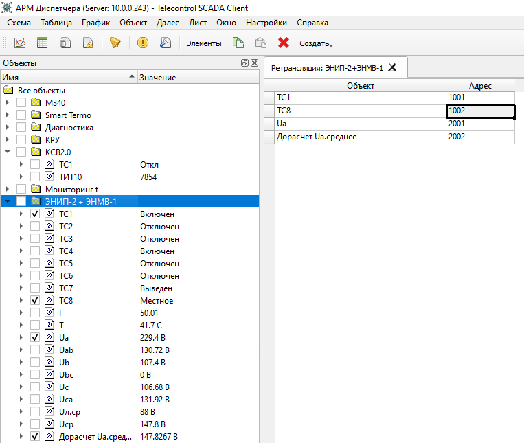
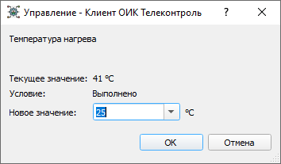

# Клиент
{:.no_toc}

* TOC
{:toc}

## Главное окно

Главное окно графического Клиента ОИК:

 Главное окно имеет строку главного меню, расположенную под заголовком окна, панель команд, находящуюся под нею, и строку состояния, примыкающую к нижней границе окна.

Строка меню содержит следующие пункты:

<dl>

<dt>Схема</dt>
<dd>Содержит список всех доступных мнемосхем. Служит для вызова мнемосхем.</dd>

<dt>Таблица</dt>
<dd>Позволяет создать окна со следующими таблицами:

- Новая таблица

- Новая пользовательская таблица

- Таблица данных

- Таблица группы</dd>

<dt>График</dt>
<dd>Позволяет создать окна со следующими графиками:

- Новый график

- График</dd>

<dt>Объект</dt>
<dd>Содержит контекстный список команд, применимых к выделенному объекту.</dd>

<dt>Далее</dt>
<dd>Позволяет отобразить, как окно текущих событий, так и окно с журналом событий. Позволяет вызывать различные панели и окна редактирования конфигурации в режиме администрирования. Также содержит команды экспорта и импорта конфигурации.</dd>

<dt>Лист</dt>
<dd>Команды для работы с листами. Позволяет создать, переименовать или удалить лист. Также содержит список всех листов для переключения между ними.</dd>

<dt>Окно</dt>
<dd>Команды для работы с окнами текущего листа. Позволяет переименовывать и закрывать открытые окна, а также помещать окна в избранное. Содержит список окон и позволяет переключаться между ними. Кроме того, содержит список последних закрытых окон, позволяя восстановить случайно закрытое окно.</dd>

<dt>Настройки</dt>
<dd>Позволяет изменять внешний вид и поведение графического клиента.
  <dl>

  <dt>Панель инструментов</dt>
  <dd>Позволяет изменить расположение панели инструментов, либо скрыть ее.</dd>

  <dt>Строка состояния</dt>
  <dd>Позволяет скрыть или отобразить строку состояния.</dd>

  <dt>Подтверждение управления</dt>
  <dd>При включении этой опции, позволяет избежать случайной выдачи команд управление. При выполнении команды управления пользователем будет выдан запрос для подтверждения команды, либо отказа от ее выполнения.</dd>

  <dt>Сообщение об успешном управлении</dt>
  <dd>При успешном выполнении команды, добавляет соответствующее сообщение в панель событий (данное сообщение не является системным событием).</dd>

  <dt>Показывать события при появлении</dt>
  <dd>Позволяет при возникновении новых событий автоматически открывать панель с новыми событиями .</dd>

  <dt>Скрывать события при квитировании</dt>
  <dd>Скрывает панель событий при квитировании всех событий.</dd>

  <dt>Мигание основного окна по событию</dt>
  <dd>При наличии не квитированных событий включает мигание заголовка главного окна.</dd>

  <dt>Звуковая сигнализация по событию</dt>
  <dd>При наличии не квитированных событий включает звуковую сигнализацию до момента квитирования всех событий.</dd>

  <dt>Встроенная отрисовка схем Модус</dt>
  <dd>Включает встроенную систему отображения мнемосхем Модус.
  Позволяет просматривать мнемосхемы без использования программного компонента ActiveXeme. Для редактирования схем потребуется Графический редактор Модус.</dd>

  <dt>Стиль</dt>
  <dd>Позволяет выбрать стиль, единый для всех окон графического Клиента ОИК.</dd>

  </dl>
</dd>

<dt>Cправка</dt>
<dd>Позволяет открыть окно Документации (потребуется подключение к сети Интернет) или отобразить информацию о текущей версии графического Клиента ОИК.</dd>

</dl>

У нижней границы окна располагается строка состояния. В строке состояния отображается следующая информация:
* количество не квитированных событий;
* текущий порог важности для фильтрации событий в панели текущих событий. Новые события, имеющие Важность ниже заданного порога важности, не будут отображаться в окне текущих событий;
* имя пользователя, пользующегося клиентом в данный момент;
* состояние связи с сервером;
* время отклика Сервера на запросы Клиента - значение в мс, которое должно быть больше 0 (в среднем около `20мс` для одномашинного комплекса).

Центральная часть главного называется листом. На листе могут быть открыты панели и рабочие окна. Допускается создание нескольких листов с помощью команды меню `Лист - Новый`, при этом всегда отображается один из них. Листы можно переключать, выбирая соответствующее имя в меню `Лист`. Имя листа можно изменить с помощью команды меню `Лист - Переименовать`. Лист можно удалить с помощью команды меню `Лист - Удалить`.

Открытые окна имеют заголовки, в котором отображается имя окна. Справа от имени располагается кнопка закрытия окна. Имя окна может быть изменено командой меню `Окно - Переименовать`. При клике ПКМ по заголовку окна отображается контекстное всплывающее меню окна, позволяющее переименовать окно, закрыть его или добавить в избранное (см. [Избранное]).

Окна и панели могут располагаться на листе в произвольной разметке. Для перемещения окна по разметке следует перетащить его мышью за заголовок. При перетаскивании синим цветом будет показано новое расположение окна. Окна могут располагаться как рядом, с использованием горизонтального или вертикального разбиения, так и в «стопке» - в этом случае окна накладываются одно на другое, щелчок по заголовку позволяет переместить нужное окно на верх. При сохранении листа разметка окон сохраняется, что позволяет переключать наборы отображаемых данных в зависимости от потребности.

При закрытии окна, оно помещается в корзину. Корзина содержит 10 последних закрытых окон. Для восстановления окна из корзины нужно выбрать его имя в нижней части меню `Окно`.

Любое `Окно` может быть помещено в `Избранное`. Для этого нужно выбрать команду меню `Окно — В избранное`, после чего ввести имя окна и имя папки для идентификации и удобства хранения. При этом окно сохраняется вместе с содержимым и может быть вызвано в любой момент из панели `Избранное`. Кроме того, все графики и таблицы, помещенные в `Избранное` начинают автоматически отображаться внизу соответствующих пунктов главного меню: `График` и `Таблица`.

## Панель команд

Панель команд, располагающаяся под строкой главного меню, служит для быстрого доступа к командам выделенного объекта.

### Команды объектов

<dl>

<dt>График</dt>
<dd>Отображает окно графика для выделенного объекта. Если окно с графиком выделенного объекта уже открыто, то переключается на него.</dd>

<dt>Таблица</dt>
<dd>Отображает таблицу по выделенному объекту или группе объектов. Если таблица с объектом уже открыта, переключается на нее.</dd>

<dt>Схема</dt>
<dd>Отображает мнемосхему, содержащую привязку к выделенному объекту. Если мнемосхема уже открыта, переключается на нее. Также выделяет привязанный графический элемент на схеме и индицирует его положение на мнемосхеме анимацией.</dd>

<dt>Данные</dt>
<dd>Отображает таблицу истории изменения значения выделенного объекта. Если таблица истории уже открыта для этого объекта, переключается на нее.</dd>

<dt>Сводка</dt>
<dd>Отображает сводку данных выделенного объекта. Если сводка уже открыта для этого объекта, переключается на нее.</dd>

<dt>События</dt>
<dd>Отображает журнал событий, относящихся к выделенному объекту. Если журнал событий уже открыт для этого объекта, переключается на него.</dd>

<dt>Таблица группы</dt>
<dd>Отображает таблицу для всех объектов, находящихся в той же группе, что и выделенный объект.</dd>

<dt>Квитировать</dt>
<dd>Квитирует все события.</dd>

<dt>Снять блокировку</dt>
<dd>Снимает блокировку с выделенного объекты.</dd>

<dt>Управление</dt>
<dd>Позволяет выдать команду ТУ или телерегулирования для выделенного объекта.</dd>

<dt>Ручной ввод</dt>
<dd>Позволяет ввести нового значение объекта вручную.</dd>

<dt>Устройство</dt>
<dd>Группа команд, применимых к устройству, связанного с выделенным объектом. Доступны следующие команды:

- Опросить устройство (заставляет Сервер выполнить принудительный полный опрос устройства)

- Синхронизировать часы (заставляет Сервер выполнить синхронизацию часов устройства с часами Сервера).</dd>

</dl>

### Команды устройств

<dl>

<dt>Наблюдение</dt>
<dd>Отображает окно наблюдения за выделенным устройством.</dd>

<dt>Метрики</dt>
<dd>Отображает таблицу метрик выделенного устройства. Если выделено направление, то отображаются также метрики по всем устройствам подключенным к направлению.</dd>

<dt>Включить</dt>
<dd>Запускает обмен сервера с выделенным устройством.</dd>

<dt>Отключить</dt>
<dd>Останавливает обмен сервера с выделенным устройством.</dd>

<dt>Таблица ретрансляции</dt>
<dd>Создает виртуальное серверное устройство для ретрансляции выбранных объектов в другие системы верхнего уровня по выбранному протоколу обмена данными. Заполнение таблицы ретрансляции производится путем выбора объектов в окне дерева объектов. После заполнения таблицы ретрансляции необходимо изменить адреса ретранслируемых объектов:</dd>

</dl>

### Общие команды

<dl>

<dt>Печать</dt>
<dd>Распечатывает содержимое активного окна.</dd>

<dt>Квитировать все</dt>
<dd>Квитирует все события.</dd>

<dt>События</dt>
<dd>Отображает окно с журналом событий для выделенного объекта. Либо переключается на окно событий, если оно уже отображено.</dd>

</dl>

### Управление

Телеуправление разрешено:

Подтверждение исполнения команды телеуправления:

Телеуправление заблокировано:

Телерегулирование разрешено:

Подтверждение исполнения команды телерегулирования:

Телерегулирование заблокировано:

### Ручной ввод

Ручной ввод (блокировка снята):

Установка блокировки для указанного объекта позволяет игнорировать телемеханические данные, которые поступают в Сервер от удаленных устройств. При установленной блокировке ручной ввод данных будет иметь преимущество перед телемеханическими данными. При снятой блокировке приоритет будет у телемеханических данных.

### Уставки

Задание уставок:

Диапазон минимум/максимум предупредительных уставок не должен выходить за границы диапазона минимум/максимум аварийных уставок.

## Панель объектов

Панель объектов служит для быстрого выбора объектов, вызова различных окон и выполнения команд и операций с объектами. В панели объектов отображается структура объектов, разбитых по группам. Панель объектов можно отобразить командой меню *Далее - Объекты*.

Напротив имен объектов в правой части панели выводятся их значения и признаки качества. Недостоверные значения отображаются серым цветом. При наличии не квитированных системных событий, связанных с объектом, значение мигает желтым цветом.

Для групп отображается состояние связи с устройством, привязанного к группе. Привязать устройство можно в параметрах группы, будучи в режиме администрирования:

Слева от объектов и групп объектов располагается переключатель, предназначенный для включения объектов в текущее окно или или исключения их оттуда. При щелчке по переключателю группы, в текущее окно включаются все объекты нижележащей иерархии группы (переключатель самой группы при этом остается отключенным, т.к. группы не могут быть включены в окна).

При двойном клике ЛКМ по объекту будет открыт график объекта, а при двойном клике ЛКМ по группе - таблица со всеми объектами, входящими в группу.

При клике ПКМ отображается контекстное меню, содержащее операции применяемые к выделенному объекту или группе объектов.

В режиме администрирования разрешается перетаскивание объектов по иерархии групп объектов с зажатой ЛКМ.

## Панель оборудования

Для вызова панели Оборудование следует выбрать меню *Далее–Оборудование*.

### Статусы устройств

В окне `Оборудование` отображается иерархия устройств, слева от которых располагаются иконки с индикаторами текущего состояния канала связи с устройством (*канал связи отключен*, *канал связи включен* и *устройство не отвечает*). Для вызова служебной информации о канале связи с устройством следует выбрать устройство и по клику ПКМ выбрать пункт меню *Метрики*:

### Наблюдение

Для того, чтобы начать наблюдение за текущим траффиком обмена данными с устройством нужно выбрать устройство и по клику ПКМ выбрать пункт всплывающего меню *Наблюдение*. Смотрите описание [окна наблюдения](#device-watch).

### Устройства МЭК-61850

Панель оборудования позволяет просматривать модель данных устройств МЭК-61850. Когда связь с устройством установлена, модель данных отображается поддеревом узла устройства - группа `Модель`:

Смотрите [отображение модели МЭК-61850](architecture#iec-61850) и [проектирование](development#iec-61850) в Клиенте.

## Панель событий

Панель событий отображает список текущих не квитированных событий:

Для квитирования события нужно дважды кликнуть ЛКМ по строке события или выделить строку с событием и кликнуть по ней ПКМ, далее выбрать пункт всплывающего меню *Квитировать*. После квитирования, данное событие скрывается из панели событий. Также, удерживая клавишу *Shift*, можно выделить несколько событий и квитировать их одновременно. Для квитирования всех событий нажать кнопку *Квитировать все* на панели инструментов.

При включении опции *Отображение событий при появлении* в меню *Настройки* окно будет автоматически отображено в панели текущих событий при появлении нового события.

При клику ПКМ по строке события отображается контекстное меню с командами, применяемыми к событию. Если событие связано с объектом или устройством, то в контекстное меню также отображаются команды, применяемые к объекту или устройству.

## Панель файлов

Панель файлов предоставляет доступ к файлам мнемосхем Модус, хранимых на сервере:

Файлы могут быть организованы по папкам.

Из контекстного меню панели доступны команды редактирования файлов. Подменю Создать позволяет создать папку или загрузить существующий файл на сервер. Доступна команда удаления файлов.

Для переименования файла или папки необходимо использовать команду `Параметры` и отредактировать имя объекта (имя файла).

## Сводка

Для каждого объекта или нескольких объектов можно вызвать окно с таблицей `Сводка`:

Добавить и удалить столбцы в таблице можно из панели объектов установкой переключателя напротив объекта. Смотрите [Панель объектов](#object-tree).

Размеры таблицы `Сводка` ограничены 10000 строками и 1000 колонками.

При вызове из контекстного меню таблицы `Сводка` команд `График` или `Данные` будет использован выделенный объект и временной период.

Ячейки сводки окрашиваются серым цветом пока выполняется запрос данных с Сервера. По мере поступления данных на клиент, ячейки будут станут белыми.

При отсутствии исторических данных в архиве Сервера на соответствующий временной интервал ячейка останется пустой.

## Журнал событий

## Избранное

## Наблюдение

