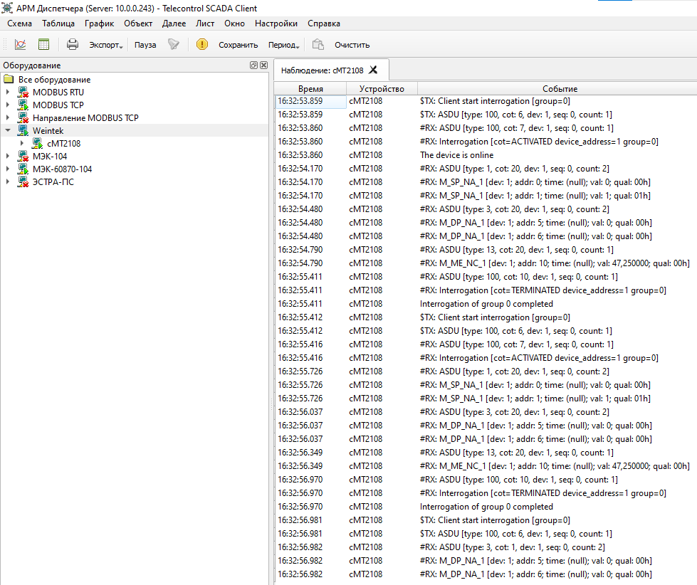

# Наблюдение
{:.no_toc}

* TOC
{:toc}

Окно наблюдения отображает журнал событий обмена данными с выбранным устройством в реальном времени.

Для вызова окна наблюдения выберите устройство в панели оборудования и нажмите кнопку *Наблюдение* на панели команд, либо выберите пункт *Наблюдение* из контекстного меню.

Окно содержит таблицу с колонками:

| Колонка | Описание |
|---------|----------|
| Время | Временная метка события |
| Устройство | Идентификатор устройства |
| Событие | Описание события обмена данными |

События отображаются в хронологическом порядке. Новые события добавляются внизу таблицы. Таблица автоматически прокручивается к последнему событию, если курсор находится в нижней части таблицы.

Для приостановки потока событий нажмите кнопку *Пауза*. Для сохранения журнала в файл выберите команду *Сохранить как*.

Количество отображаемых событий ограничено 10000 записями. При достижении лимита старые записи автоматически удаляются.
