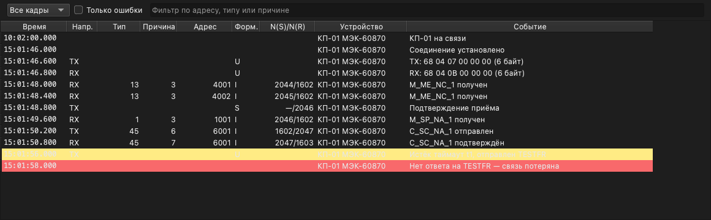

# Наблюдение
{:.no_toc}

* TOC
{:toc}

Окно наблюдения отображает журнал обмена данными с выбранным устройством в
реальном времени.

Для вызова окна наблюдения выберите устройство в панели оборудования и нажмите
кнопку *Наблюдение* на панели команд, либо выберите пункт *Наблюдение* из
контекстного меню.

## Два режима

Окно отвечает на два разных вопроса об одном устройстве и имеет для них два
режима. Переключает их пункт контекстного меню *Трассировка кадров*; в режиме
трассировки к заголовку окна добавляется «— Трассировка кадров», так что по
вкладке видно, что открыто.

<dl>

<dt>Журнал устройства</dt>
<dd>Всё, о чём сообщило устройство, как записано. Режим по умолчанию.</dd>

<dt>Трассировка кадров</dt>
<dd>Только протокольный обмен — строки, помеченные драйвером как трафик, — и
рядом с таблицей панель разбора выбранного кадра.</dd>

</dl>

## Таблица

| Колонка | Описание |
|---------|----------|
| Время | Временная метка события |
| Напр. | Направление: `RX` — принято, `TX` — передано |
| Тип | Идентификатор типа ASDU |
| Причина | Причина передачи |
| Адрес | Адрес объекта информации (IOA) |
| Форм. | Формат кадра: I, S или U |
| N(S)/N(R) | Номера отправленного и принятого кадра |
| Устройство | Идентификатор устройства |
| Событие | Описание события обмена данными |

Разобранные поля кадра — «Тип», «Причина», «Адрес», «Форм.», «N(S)/N(R)» — у
обычных строк журнала пусты: колонки одни и те же в обоих режимах, потому что
знать, какие строки журнала являются протокольным трафиком, полезно и в режиме
журнала.

События отображаются в хронологическом порядке. Новые события добавляются внизу
таблицы. Таблица автоматически прокручивается к последнему событию, если
выделена последняя строка.

## Фильтр

Над таблицей расположена строка фильтра. Она действует в обоих режимах и
сужает не только видимые строки, но и то, что записывает команда *Сохранить
как*.

<dl>

<dt>Формат кадра</dt>
<dd>«Все кадры», «Формат I» — кадры, несущие ASDU, то есть собственно данные,
или «Формат S/U» — подтверждения и управление каналом. Вторые сгруппированы,
потому что ни один из них не несёт данных и оба нужны для одного вопроса:
почему канал не передаёт.</dd>

<dt>Только ошибки</dt>
<dd>Оставляет предупреждения и более важные записи — обычно то, ради чего окно
и открывали.</dd>

<dt>Поле поиска</dt>
<dd>Подстрока, которая ищется по всем колонкам: адресу, типу, причине, номерам
кадров и тексту сообщения.</dd>

</dl>

## Разбор кадра

В режиме трассировки справа от таблицы располагается панель разбора выделенного
кадра. Она показывает:

* заголовок, называющий выбранный кадр (направление, время и краткое описание);
* все захваченные байты кадра в шестнадцатеричном виде;
* дерево разобранных полей с колонками «Поле», «Смещение» и «Значение» — APCI,
  ASDU и объекты информации. «Смещение» указывает, каким байтом кадра передано
  поле.

Панель разбирает **собственные байты кадра**, а не те поля, которые уже выделил
Сервер: смещения и есть смысл панели, и панель, повторяющая прочтение Сервера,
не смогла бы показать расхождение между ними.

Разбор нарочно терпелив: усечённый захват, неизвестный идентификатор типа или
драйвер, работающий не по МЭК-60870-5-104, приводят к показу необработанных
байтов, а не к ошибке и не к догадке.

Ниже дерева группа **«Привязка»** сопоставляет найденные в кадре адреса объектов
с адресным пространством: для каждого адреса выводится имя сигнала и
идентификатор его узла. Адрес, которого нет в карте адресов устройства,
помечается соответствующим образом — так видно, что пришло от устройства, но
никуда не привязано.

## Пауза, сохранение и очистка

Контекстное меню окна содержит команды:

<dl>

<dt>Пауза</dt>
<dd>Приостанавливает поток событий; в заголовке окна появляется пометка.</dd>

<dt>Сохранить как…</dt>
<dd>Записывает журнал в файл. Записывается то, что видно, — фильтр действует и
на сохранение.</dd>

<dt>Очистить</dt>
<dd>Очищает таблицу.</dd>

</dl>

Количество отображаемых событий ограничено 10000 записями. При достижении
лимита старые записи автоматически удаляются.
