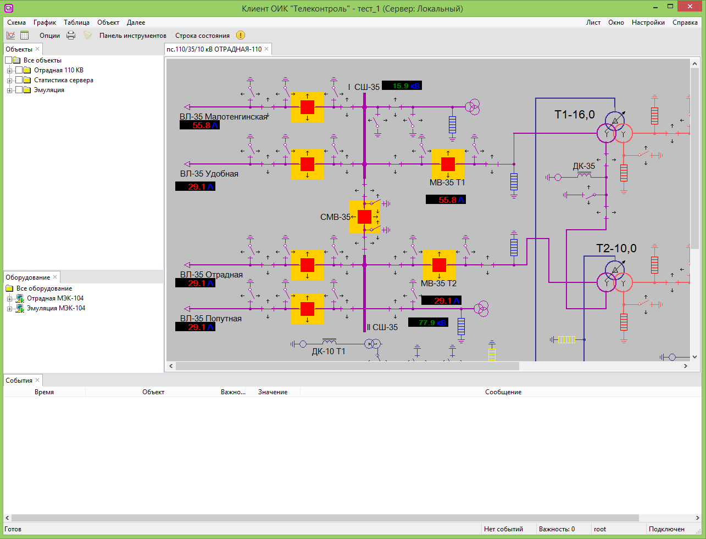

# Мнемосхема
{:.no_toc}

* TOC
{:toc}

Для отображения мнемосхем используются электронные схемы [ActiveXeme](http://swman.ru/content/blogcategory/21/49/).

## Переход на схему для выделенного объекта

При выборе объекта в панели объектов или таблице можно перейти к мнемосхеме, содержащей этот объект, при помощи команды «Схема» из панели команд или контекстного меню. Команда доступна при наличии подключения к серверу.

При выполнении команды система ищет мнемосхему, содержащую выбранный объект. Если схема найдена и уже открыта — активируется существующее окно, иначе открывается новое. После открытия схемы объект автоматически выделяется на ней.

Если ни одна схема не содержит выбранный объект, отображается соответствующее сообщение.
