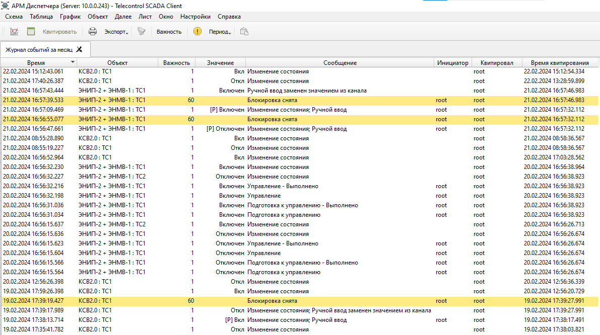

# Журнал событий
{:.no_toc}

* TOC
{:toc}

В [экспериментальном интерфейсе](../workbench/#journal) журнал дополняется
панелью тревог: точкой «не квитировано» в первом столбце, названием важности,
итоговой строкой со сводкой неквитированных событий и кнопкой *Квитировать
все*.
