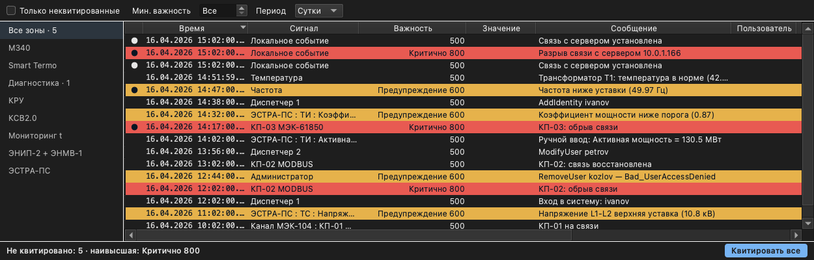

# Журнал событий
{:.no_toc}

* TOC
{:toc}

Журнал дополняется [панелью тревог](../workbench/#journal): точкой «не
квитировано» в первом столбце, названием важности,
итоговой строкой со сводкой неквитированных событий и кнопкой *Квитировать
все*.
