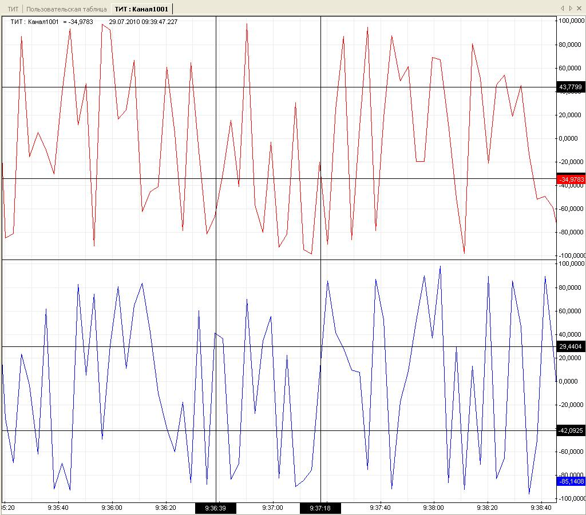

# График
{:.no_toc}

* TOC
{:toc}

Внизу окна графика располагается шкала времени, слева - шкала значений. Центральную область занимает область графика. Область графика отображает историю изменения значения объекта в виде линии тренда, проходящей через точки, определяемые временем (горизонтальная ось) и соответствующим времени значением (вертикальная ось) объекта. По мере поступления новых данных линия графика дополняется новыми точками. Недостоверные значения отображаются пунктирной линией, исходящей из соответствующей точки.

## Текущее значение

## ТС

При включении в окно графика нескольких объектов (при помощи панели объектов), для каждого объекта создается собственная область графика и шкала значений.

Для просмотра значений объекта в табличном виде следует вызвать команду «Данные» из панели команд или контекстного меню графика.

## Контекстное меню

## Ступенчатый

## Точки

## Легенда

## Вертикальная шкала значений

Границы шкала значений устанавливается в соответствии со шкалой объекта, определенной в его конфигурации.

## Горизонтальная шкала времени

Границы шкалы времени определяется пользователем. Для прокрутки графика по шкале времени, следует нажать левую кнопку мыши в области графика и перемещать мышь влево или вправо. При этом прокрутка вправо ограничена текущим временем. Также можно задать временной период относительно текущего момента, выбирая интервал на панели команд. Для возврата к текущему значению и включению автоматической прокрутки при появлении новых данных следует из контекстного меню графика выбрать пункт Текущее время. При прокрутке графика влево, данные для открывшейся зоны будут автоматически запрошены с сервера.

Для изменения масштаба, следует нажать левую клавишу мыши на соответствующей шкале и перемещать мышь влево/вправо (для шкалы времени) или вверх/вниз (для шкалы времени).

Задать точные границы времени можно при помощи команды панели инструментов *Период*.

Для поддержания достаточной динамики отображения графика при постоянном обновлении текущего значения, количество одновременно отображаемых точек ограничено 10000. Это значение выбрано как заведомо большее разрешения типового экрана. При превышеннии этого порога границы временной шкалы будут скорректированы автоматически.

## Курсоры

При одиночном щелчке по шкале времени или значений, в соответствующую позицию шкалы добавляется курсор, служащий для исследования графика. Курсор - это горизонтальная (для значений) или вертикальная (для времени) линия, привязанная к значению шкалы и проходящая через всю область графика. На шкале отображается "корешок" курсора, подписанный значением, к которому привязан курсор.

После добавления курсора он становится перемещаемым и следует за указателем мыши. При этом легенда отображает значения линии графика, соответствующее положению курсора. Для закрепления курсора следует еще раз щелкнуть в нужной позиции шкалы. Допустимо произвольное количество курсоров на графике. При изменении масштаба графика курсоры остаются привязанными к значениям шкалы.

Чтобы открепить курсор и вновь сделать его перемещаемым, следует щелкнуть по его корешку. Для удаления курсора следует открепить его и нажать клавишу Delete.

## Уставки

## Переключение на сводку
