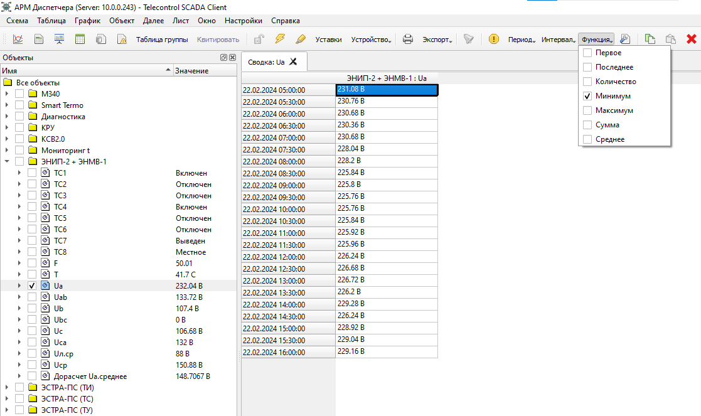

# Сводка
{:.no_toc}

* TOC
{:toc}

Для каждого объекта или нескольких объектов можно вызвать окно с таблицей `Сводка`:

Добавить и удалить столбцы в таблице можно из панели объектов установкой переключателя напротив объекта. Смотрите [Панель объектов](#object-tree).

Размеры таблицы `Сводка` ограничены 10000 строками и 1000 колонками.

При вызове из контекстного меню таблицы `Сводка` команд `График` или `Данные` будет использован выделенный объект и временной период.

Ячейки сводки окрашиваются серым цветом пока выполняется запрос данных с Сервера. По мере поступления данных на клиент, ячейки будут станут белыми.

При отсутствии исторических данных в архиве Сервера на соответствующий временной интервал ячейка останется пустой.

## Интервал агрегации

Для изменения временного интервала строк сводки используются предустановленные значения: 1 минута, 5 минут, 15 минут, 30 минут, 1 час, 12 часов, 1 день.

## Функция агрегации

Для изменения способа вычисления значений используются функции агрегации: Количество, Начало, Конец, Минимум, Максимум, Сумма, Среднее.
