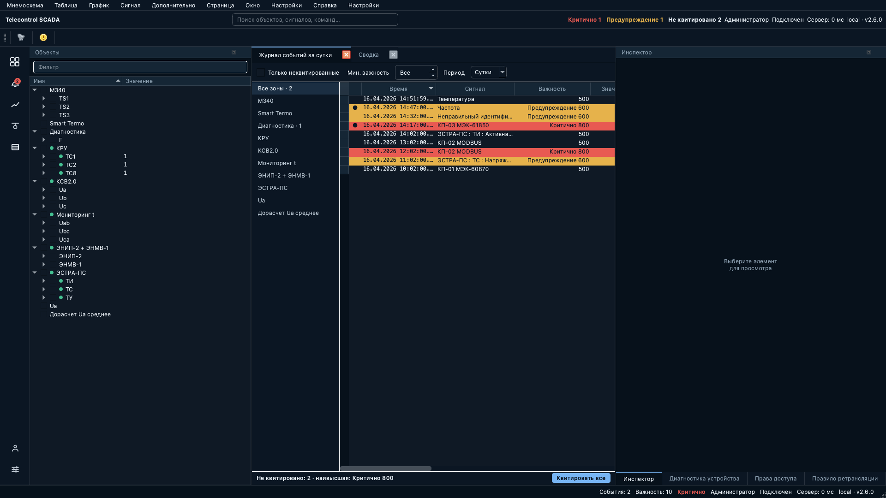
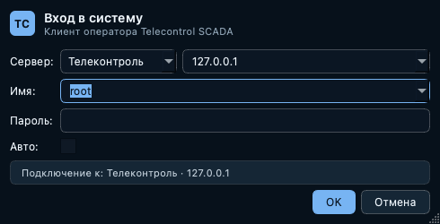
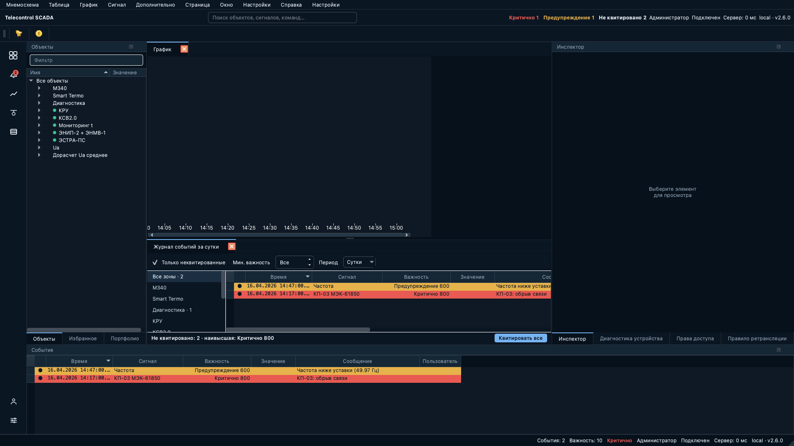
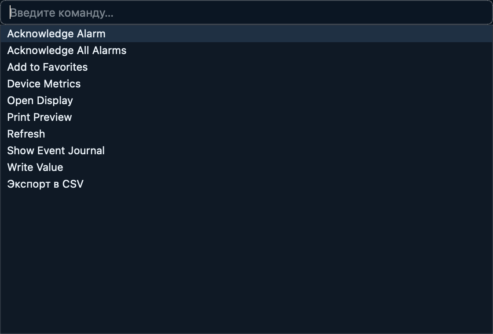
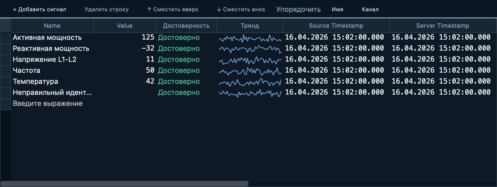
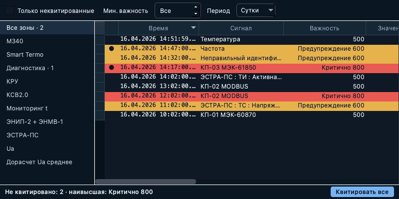
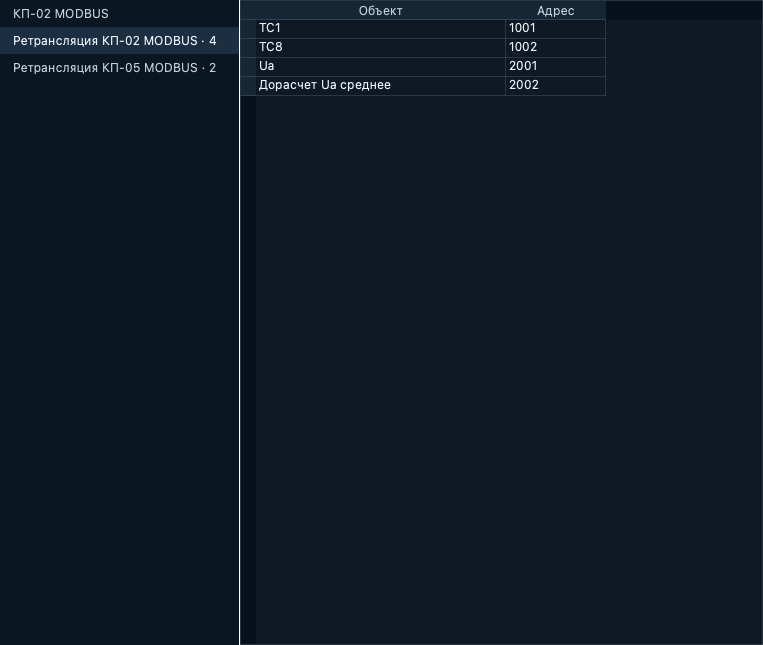
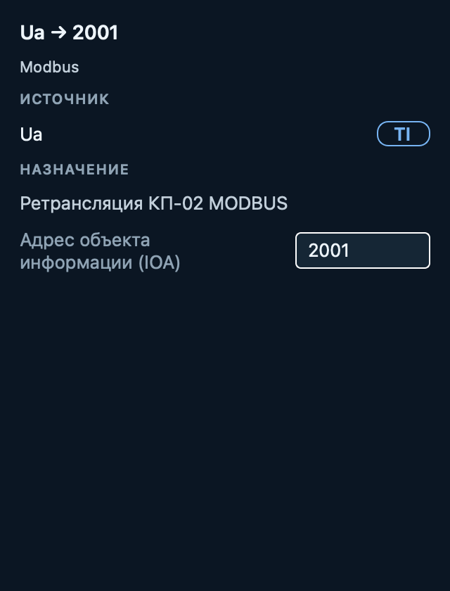
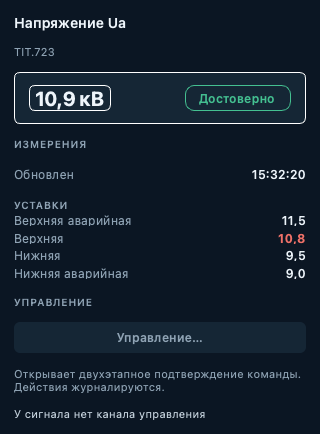
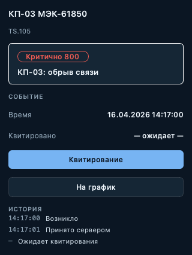

# Экспериментальный интерфейс
{:.no_toc}

* TOC
{:toc}

Клиент содержит экспериментальный вариант интерфейса — «рабочее место
оператора». Экспериментальный интерфейс **выключен по умолчанию** и не меняет
привычный вид клиента; функциональность в нём дорабатывается, состав элементов
может меняться.

Основные области рабочего места:

- **Панель разделов** (слева) — переключение между обзором, тревогами,
  трендами, подстанциями и таблицами; раздел «Тревоги» несёт счётчик
  неквитированных событий.
- **Строка контекста** (сверху) — поле поиска/команд и индикаторы состояния:
  плитки важности («Критично N», «Предупреждение N», «Не квитировано N»,
  подсвечиваются при наличии активных тревог; при более чем десяти
  неквитированных тревогах вместо счётчиков отображается единый индикатор
  «Поток тревог»), пользователь и роль, состояние подключения и версия
  сервера.
- **Панель объектов** — дерево объектов с полем «Фильтр» и точками качества:
  зелёная — достоверно, жёлтая — неопределённо, красная — недостоверно.
- **Вкладки рабочей области** — открытые окна (журнал, таблицы, графики,
  мнемосхемы) в виде вкладок редактора.
- **Панели справа** — Инспектор, Диагностика устройства, Права доступа,
  Правило ретрансляции; заполняются по текущему выделению.
- **Строка состояния** (снизу) — сводка событий, пользователь и роль,
  подключение, адрес и версия сервера.

Тёмная тема — вариант по умолчанию; доступны светлая и высококонтрастная
(`Ux/Theme`). Значения и метки времени во всех таблицах отображаются
моноширинным шрифтом. Диалоговые окна — вход в систему, телеуправление и
ручной ввод, уставки, смена пароля, выбор периода, создание объектов,
«О программе» — оформляются в той же теме.

## Включение

Экспериментальный интерфейс включается пунктом меню *Настройки →
Экспериментальный интерфейс* (требуется перезапуск клиента), настройкой
`Ux/Experimental` (QSettings) либо переменной окружения
`SCADA_UX_EXPERIMENTAL`. Дополнительные настройки:

<dl>

<dt>Ux/Theme</dt>
<dd>Вариант темы: <code>dark</code> (по умолчанию), <code>light</code>,
<code>hc</code> (высококонтрастная).</dd>

<dt>Ux/StyleSheet</dt>
<dd>При значении <code>false</code> оформление ограничивается цветовой
палитрой, без глобальной таблицы стилей — вариант для конфигураций со
встроенными компонентами, чувствительными к стилям.</dd>

</dl>

## Причины недоступности команд

Если команда контекстного меню недоступна, при наведении на неё
показывается подсказка с причиной — например, «У сигнала нет канала
управления» для команды *Управление…* или «Нет неквитированных событий»
для *Квитировать все*. Так видно, недоступна ли команда из-за состояния
объекта или она просто неприменима к текущему выделению.

Команды, недоступные полностью (например, при отсутствии права
«Управление»), в меню не отображаются; для выделенного объекта причину
показывает [инспектор](#inspector).

## Вход в систему

Окно входа в экспериментальном интерфейсе получает заголовок с логотипом и
названием продукта, а под полями — строку «Подключение к:», в которой видно,
к какому серверу и по какому протоколу будет выполнено подключение. Строка
обновляется при изменении полей, что помогает не подключиться к чужому
серверу по ошибке. Набор полей и порядок входа не изменились.

## Стартовая страница «Обзор»

Новый профиль (без сохранённых страниц) открывается на странице «Обзор» —
рабочем экране оператора: слева боковая панель с деревом объектов, сверху
доминирующий график (примерно две трети экрана), под ним — таблица активных
тревог (журнал событий в режиме текущих, только неквитированные события),
справа — инспектор.

Боковая панель совмещает несколько вкладок: «Объекты» (дерево объектов с
фильтром и индикаторами достоверности), «Избранное» и «Портфолио».
Переключение между ними — вкладками внизу панели; открытой по умолчанию
остаётся вкладка «Объекты». Сводка по важности при этом
всегда видна в плитках верхней панели. График пуст, пока оператор не
добавит в него сигналы; раскладка страницы сохраняется в профиле как
обычная страница.

## Палитра команд

*Ctrl+K* (или щелчок по полю поиска в строке контекста) открывает палитру
команд: строка ввода с фильтрацией по мере набора, все зарегистрированные
команды и открытие окон, а также поиск сигналов по имени — выбранный сигнал
открывается в таблице. *Enter* выполняет выбранный пункт.

## Таблица: панель инструментов

В экспериментальном интерфейсе окно [Таблица](../table/) дополняется панелью
инструментов над сеткой:

<dl>

<dt>+ Добавить сигнал</dt>
<dd>Открывает редактор в последней строке таблицы («Введите выражение») для
ввода алиаса объекта или формулы.</dd>

<dt>Удалить строку, Сместить вверх, Сместить вниз</dt>
<dd>Действия над выделенными строками — те же команды, что и в контекстном
меню. Команды, неприменимые к текущему выделению (например, при отсутствии
выделенной строки), отображаются серым.</dd>

<dt>Упорядочить: Имя / Канал</dt>
<dd>Ключ сортировки строк (см. <a href="../table/#sort">Сортировка</a>);
активный ключ подсвечен.</dd>

<dt>На график, CSV, Печать</dt>
<dd>Открытие графика по выделенному объекту, экспорт таблицы в CSV и печать.
Эти кнопки отображаются, когда соответствующая команда доступна в текущей
сессии и окно активно.</dd>

</dl>

Кроме того, значения и метки времени во всех таблицах отображаются
моноширинным шрифтом — цифры выровнены по разрядам и не «прыгают» при
обновлении значений, — а рядом со значением появляются столбец «Достоверность»
с текстовым признаком качества и столбец «Тренд» — мини-график изменения
значения за последний час, обновляющийся вместе со значением.

## Журнал событий как панель тревог

В экспериментальном интерфейсе [журнал событий](../events/) читается как
панель тревог:

- **Цвет строки — важность.** Строка тревоги окрашивается по важности
  (красная — критично, жёлтая — предупреждение); рядовые события остаются без
  заливки, чтобы взгляд притягивали только тревоги. Квитирование цвет строки
  не меняет.
- **Точка «не квитировано»** — первый столбец помечает каждую неквитированную
  строку точкой, а ячейка «Время квитирования» такой строки показывает
  «— ожидает —». Точка отвечает за состояние квитирования, цвет строки — за
  важность, поэтому неквитированная критичная тревога остаётся красной. Точка
  не попадает в экспорт и печать — это элемент отображения, а не записи.
- **Название важности** — столбец «Важность» дополняет число названием
  диапазона («Критично 800», «Предупреждение 600»).
- **Боковая панель «Зоны»** — слева от журнала перечислены «Все зоны» и
  объектные зоны верхнего уровня; зона с неквитированными событиями несёт их
  количество («Диагностика · 1»). Выбор зоны фильтрует журнал по ней; счётчики
  остальных зон при этом сохраняются.
- **Итоговая строка** — под журналом отображается сводка отображаемых
  неквитированных событий («Не квитировано: N · наивысшая: Критично 800»; при
  пустом журнале — «Нет неквитированных событий») и кнопка *Квитировать все*,
  выполняющая ту же команду, что и контекстное меню. Кнопка недоступна, когда
  квитировать нечего.

Живая тревога, уже попавшая в считанную историю, отображается одной строкой —
журнал не дублирует её исторической копией.

## Правила ретрансляции

Окно ретрансляции (список правил передачи «сигнал → адрес» устройства)
оформляется в теме рабочего места. Слева отображается список направлений —
все устройства-приёмники ретрансляции с числом правил у каждого; выбор
направления переключает таблицу на его правила, а число обновляется при
добавлении и удалении правил. Выделение правила заполняет панель
«Правило ретрансляции» справа:

Панель показывает источник (сигнал и его тип ТС/ТИ), устройство-приёмник,
протокол и адрес (IOA); адрес редактируется с кнопками *Отменить* /
*Применить*, когда доступен путь записи.

## Инспектор

Панель «Инспектор» (справа) отображает текущее выделение активного окна:

- наименование объекта и его адрес — идентификатор узла или формулу;
- текущее значение крупным шрифтом с признаком качества
  («Достоверно» / «Недостоверно»);
- время последнего обновления;
- уставки сигнала — все настроенные границы («Верхняя аварийная», «Верхняя»,
  «Нижняя», «Нижняя аварийная»). Граница, за которую вышло текущее значение,
  выделяется цветом и подписывается, поэтому видно, какая именно уставка
  сработала. Если у сигнала уставки не заданы, раздел не отображается;
- кнопку *Управление…*, открывающую двухэтапное подтверждение команды
  телеуправления. Когда управление недоступно, под кнопкой указывается
  причина: объектом нельзя управлять (например, вычисляемое выражение или
  папка), у сигнала нет канала управления, либо для управления не хватает
  права «Управление».

Выделение строки таблицы — в том числе строки с формулой — заполняет
инспектор; значение продолжает обновляться, пока строка остаётся выделенной.
Щелчок по элементу мнемосхемы также выбирает его в инспекторе.

Выделение строки в [журнале событий](../events/) показывает в инспекторе
карточку события: источник и его адрес, важность (название диапазона и число),
сообщение, время события и состояние квитирования («— ожидает —» для
неквитированного). Кнопка *Квитирование* выполняет ту же команду
квитирования, что и журнал, и недоступна для уже квитированных событий.
Кнопка *На график* открывает график источника события — так от аварийного
сообщения можно сразу перейти к тренду сигнала. Кнопка недоступна, если
источник события не удалось определить.
