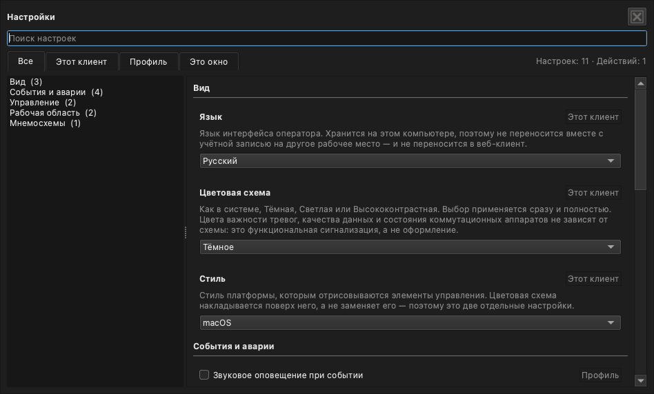
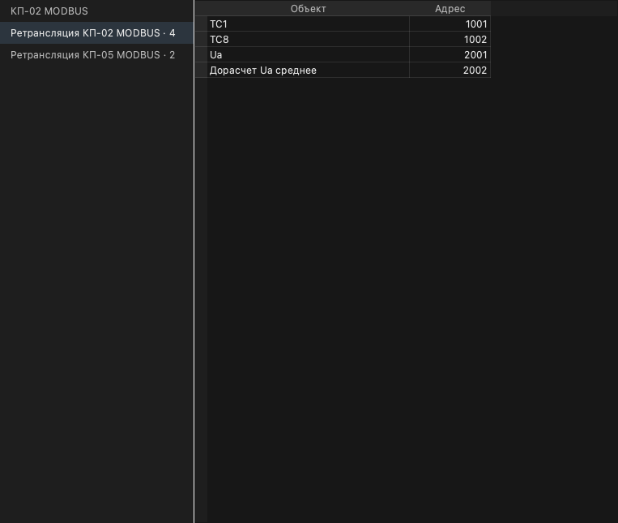
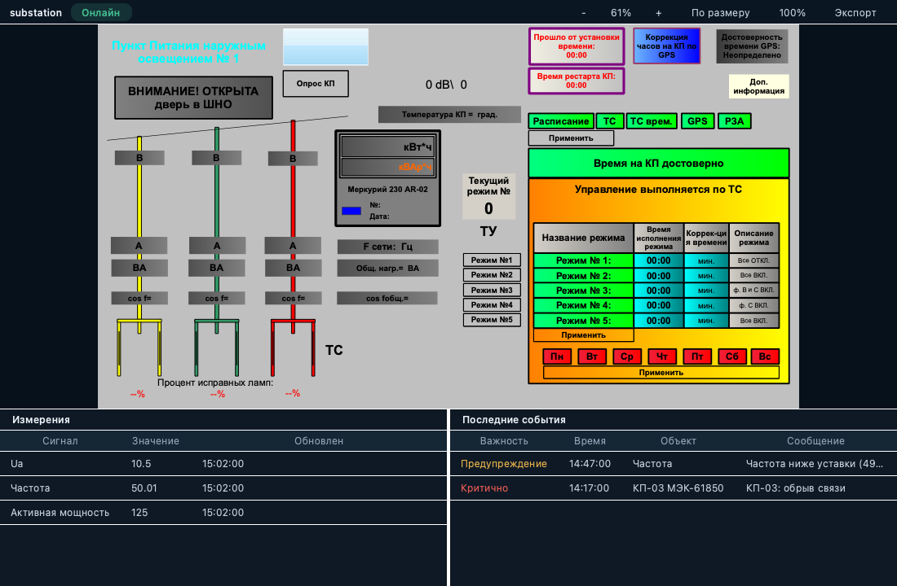

# Рабочее место оператора
{:.no_toc}

* TOC
{:toc}

Окно клиента построено как рабочее место оператора: панель разделов слева,
строка контекста сверху, вкладки рабочей области в центре, панели по
выделению справа и строка состояния снизу. Ниже описаны все эти области.

До версии 2.6 это оформление было экспериментальным и выключалось вариантом
«Классическое» в списке «Цветовая схема». Такого варианта больше нет:
рабочее место — единственный вид клиента, а «Цветовая схема» выбирает только
оформление (как в системе, тёмное, светлое, высококонтрастное).

Основные области рабочего места:

- **Панель разделов** (слева) — три зоны: **режимы боковой панели**,
  **страницы** профиля на собственной подложке и **закреплённые команды**
  внизу. Подробно описана [ниже](#activity-bar). Счётчик неквитированных
  событий выведен в строку контекста.
- **Строка контекста** (сверху) — поле поиска/команд и состояние тревог:
  плитки важности («Критично N», «Предупреждение N», «Не квитировано N»,
  подсвечиваются при наличии активных тревог; при более чем десяти
  неквитированных тревогах вместо счётчиков отображается единый индикатор
  «Поток тревог»). Пользователь, состояние подключения и адрес сервера в
  этой строке не показываются — они выведены только в строке состояния.
- **Панель объектов** — дерево объектов с полем «Фильтр» и точками качества:
  зелёная — достоверно, жёлтая — неопределённо, красная — недостоверно.
  Дерево начинается сразу с содержимого: заголовок панели уже называет его,
  поэтому отдельная корневая строка не выводится. То же и в панелях
  «Оборудование», «Файлы» и «Узлы».
- **Вкладки рабочей области** — открытые окна (журнал, таблицы, графики,
  мнемосхемы) в виде вкладок редактора.
- **Панели справа** — Инспектор, Диагностика устройства, Права доступа,
  Правило ретрансляции; заполняются по текущему выделению.
- **Строка состояния** (снизу) — сводка событий, минимальная важность,
  наивысшая активная важность, пользователь и роль, состояние подключения,
  время отклика сервера, адрес и версия сервера. Это единственное место, где
  показаны пользователь и параметры подключения.

Время отклика сервера — это возраст незавершённого опроса, поэтому растущее
число означает, что ответ не приходит. Если оно превышает 3 секунды, рядом с
числом появляется пометка «нет ответа», а в журнал добавляется предупреждение:
либо ухудшилось соединение, либо остановился сам клиент — операционная система
может приостановить клиент, окно которого не видно, и тогда прекращается приём
данных и событий, а не только обновление экрана. Когда сервер снова отвечает,
об этом сообщается отдельным событием.

По умолчанию оформление следует за операционной системой; доступны также
тёмное, светлое и высококонтрастное
([*Настройки → Настройки… → Цветовая схема*](#appearance)). Значения и метки времени во всех таблицах отображаются
моноширинным шрифтом. Диалоговые окна — вход в систему, телеуправление и
ручной ввод, уставки, смена пароля, выбор периода, создание объектов,
«О программе» — оформляются в той же теме.

## Панель разделов

Узкая полоса вдоль левого края окна. Она делится на три зоны и **никогда не
открывает вкладку рабочей области** — каждая зона отвечает за свой уровень
навигации.

<dl>

<dt>Режимы боковой панели (сверху)</dt>
<dd>Выбирают, <b>что показывает боковая панель</b>: «Объекты» (дерево
объектов и портфели), «Устройства» (дерево оборудования), «Файлы» (файлы и
избранное), «Узлы» (адресное пространство) и «Администрирование» (список
разделов администратора). Режим меняет только состав боковой панели — он не
открывает вкладок и не меняет страницу. «Узлы» и «Администрирование»
доступны только администратору: у остальных пользователей эти кнопки
<b>скрыты</b>, а не заблокированы.</dd>

<dt>Страницы (в середине, на подложке)</dt>
<dd>Страницы профиля: каждая заменяет всю рабочую область. Кнопка несёт
выбранный значок страницы, а если значок не выбран — её номер; название и
номер показаны во всплывающей подсказке (<code>2 · Тревоги</code>), потому
что на кнопку шириной 52 пикселя название не помещается. Кнопка «+» создаёт
страницу. Подложка под этой группой нужна для того, чтобы отметка активной
страницы не читалась как отметка режима: режим и страница активны
одновременно, и отметки у них одинаковые.</dd>

<dt>Закреплённые команды (снизу)</dt>
<dd>«Настройки» открывают
<a href="#settings-dialog">настройки</a>, «Пользователи» — список
учётных записей. Команда открывается <b>в текущей странице</b>, как обычное
окно, поэтому отметка страницы при этом не гаснет. «Пользователи» доступны
только администратору и скрыты у остальных.</dd>

</dl>

Страницу можно **переставить перетаскиванием**: при перетаскивании между
кнопками показывается линия — место, куда страница встанет. Отпускать можно
и в промежутке между кнопками, и ниже последней.

Правая кнопка мыши на кнопке страницы открывает меню:

<dl>

<dt>Открыть страницу</dt>
<dd>Переключиться на неё. Пункт отсутствует, если страница уже открыта.</dd>

<dt>Переименовать…</dt>
<dd>Задать название. Действует над текущей страницей.</dd>

<dt>Дублировать</dt>
<dd>Создать копию страницы вместе с её компоновкой и окнами и перейти на
неё. Копия снимается после сохранения, поэтому содержит то, что на экране, а
не то, что было сохранено ранее.</dd>

<dt>Переместить вверх / Переместить вниз</dt>
<dd>Переставить страницу без перетаскивания. На первой странице недоступно
«вверх», на последней — «вниз».</dd>

<dt>Значок</dt>
<dd>Выбрать значок страницы; «Нет» возвращает номер.</dd>

<dt>Удалить страницу</dt>
<dd>Удалить страницу вместе с её компоновкой. Отделён от остальных пунктов,
чтобы не попасть в него по привычке.</dd>

</dl>

Отметки на панели — это **отображение действительного состояния**, а не
память о последнем щелчке. Если открытые панели не соответствуют ни одному
режиму (например, одну из панелей закрыли вручную), отметка режима гаснет —
панель не станет утверждать то, чего нет.

## Настройки

Пункт *Настройки → Настройки…* открывает настройки клиента. Их же открывает
кнопка «Настройки» внизу [панели разделов](#activity-bar) — это одна и та же
команда, поэтому настройки собраны в одном месте.

Настройки открываются не диалогом, а **поверхностью** над главным окном, и у
неё три части, которых у прежнего диалога не было: поле поиска сверху,
перечень разделов слева — «Вид», «События и аварии», «Управление», «Рабочая
область», «Мнемосхемы», с числом настроек в каждом — и вкладки области
действия: «Все», «Этот клиент», «Профиль», «Это окно». Рядом с ними указано,
сколько всего настроек и действий собрано в текущей вкладке.

Каждая настройка подписана описанием и отметкой области действия, поэтому
видно, что хранится на этом компьютере, а что — в профиле и переносится с
учётной записью на другое рабочее место. Настройки применяются **сразу**, как
раньше применялись пункты меню: отдельного подтверждения нет, а закрывается
поверхность кнопкой закрытия в заголовке.

В разделе «Вид» собраны «Язык», «Цветовая схема» и «Стиль». В остальных —
видимость строки состояния и панели инструментов, подтверждение и сообщение
об успехе управления, поведение при событиях (показ, скрытие, мигание окна,
звук) и — там, где система поддерживает синтез речи, — речевое оповещение.
Недоступная настройка поясняет причину во всплывающей подсказке: речевое
оповещение доступно только в Windows-сборке.

## Оформление

Оформление выбирается в *Настройки → Настройки…*, списком
**«Цветовая схема»** — рядом со «Стилем» и так же, как он: выбор применяется
сразу и полностью, без перезапуска.

<dl>

<dt>Как в системе</dt>
<dd>Светлое или тёмное оформление — то, которое выбрано в операционной
системе. Вариант по умолчанию; переключение оформления в системе применяется
сразу.</dd>

<dt>Тёмное, Светлое, Высокая контрастность</dt>
<dd>Явно выбранное оформление. Такой выбор не меняется вслед за операционной
системой. Для диспетчерского зала рекомендуется тёмное.</dd>

</dl>

Выбор сохраняется при выходе из клиента и восстанавливается при следующем
запуске.

Цвета тревог, качества данных и состояния коммутационных аппаратов от
оформления не зависят: это функциональная сигнализация (ISA-101, ISA-18.2),
и её значения одинаковы во всех схемах.

### Дополнительные настройки

Выбор, сделанный в [настройках](#settings-dialog), хранится в
настройках приложения (QSettings) — их можно задать и заранее, например при
массовой установке.

<dl>

<dt>Ux/Theme</dt>
<dd>Вариант оформления: <code>system</code> (по умолчанию, как в системе),
<code>dark</code>, <code>light</code>, <code>hc</code>
(высококонтрастная). Соответствует списку «Цветовая схема» в диалоге.</dd>

<dt>Ux/StyleSheet</dt>
<dd>При значении <code>false</code> оформление ограничивается цветовой
палитрой, без глобальной таблицы стилей — вариант для конфигураций со
встроенными компонентами, чувствительными к стилям. В диалоге не
выведена.</dd>

</dl>

Параметр <code>Ux/Experimental</code>, включавший экспериментальный
интерфейс, больше не читается: его значение игнорируется, а рабочее место
отображается всегда.

## Причины недоступности команд

Если команда контекстного меню недоступна, при наведении на неё
показывается подсказка с причиной — например, «У сигнала нет канала
управления» для команды *Управление…* или «Нет неквитированных событий»
для *Квитировать все*. Так видно, недоступна ли команда из-за состояния
объекта или она просто неприменима к текущему выделению.

Команды, недоступные полностью (например, при отсутствии права
«Управление»), в меню не отображаются; для выделенного объекта причину
показывает [инспектор](#inspector).

## Вход в систему

Окно входа получает заголовок с логотипом и названием продукта, а под
полями — строку «Подключение к:», в которой видно,
к какому серверу и по какому протоколу будет выполнено подключение. Строка
обновляется при изменении полей, что помогает не подключиться к чужому
серверу по ошибке. Набор полей и порядок входа не изменились.

## Стартовая страница «Обзор»

Новый профиль (без сохранённых страниц) открывается на странице «Обзор» —
рабочем экране оператора: слева боковая панель с деревом объектов, сверху
доминирующий график (примерно две трети экрана), под ним — таблица активных
тревог (журнал событий в режиме текущих, только неквитированные события),
справа — инспектор.

Боковая панель несёт вкладки режима «Объекты»: «Объекты» (дерево объектов с
фильтром и индикаторами достоверности) и «Портфолио». Переключение между
ними — вкладками внизу панели; открытой по умолчанию остаётся вкладка
«Объекты». Вкладок других режимов на странице нет: «Избранное», например,
относится к режиму «Файлы», а боковая панель приводится к составу
выбранного режима. Сводка по важности при этом
всегда видна в плитках верхней панели. График пуст, пока оператор не
добавит в него сигналы; раскладка страницы сохраняется в профиле как
обычная страница.

## Палитра команд

*Ctrl+K* (или щелчок по полю поиска в строке контекста) открывает палитру
команд: строка ввода с фильтрацией по мере набора, все зарегистрированные
команды и открытие окон, а также поиск сигналов по имени — выбранный сигнал
открывается в таблице. *Enter* выполняет выбранный пункт.

## Таблица: панель инструментов

Окно [Таблица](../table/) дополняется панелью инструментов над сеткой:

<dl>

<dt>+ Добавить сигнал</dt>
<dd>Открывает редактор в последней строке таблицы («Введите выражение») для
ввода алиаса объекта или формулы.</dd>

<dt>Удалить строку, Сместить вверх, Сместить вниз</dt>
<dd>Действия над выделенными строками — те же команды, что и в контекстном
меню. Команды, неприменимые к текущему выделению (например, при отсутствии
выделенной строки), отображаются серым.</dd>

<dt>Упорядочить: Имя / Канал</dt>
<dd>Ключ сортировки строк (см. <a href="../table/#sort">Сортировка</a>);
активный ключ подсвечен.</dd>

<dt>На график, CSV, Печать</dt>
<dd>Открытие графика по выделенному объекту, экспорт таблицы в CSV и печать.
Эти кнопки отображаются, когда соответствующая команда доступна в текущей
сессии и окно активно.</dd>

</dl>

Кроме того, значения и метки времени во всех таблицах отображаются
моноширинным шрифтом — цифры выровнены по разрядам и не «прыгают» при
обновлении значений, — а рядом со значением появляются столбец «Достоверность»
с текстовым признаком качества и столбец «Тренд» — мини-график изменения
значения за последний час, обновляющийся вместе со значением.

## Журнал событий как панель тревог

[Журнал событий](../events/) читается как панель тревог:

- **Цвет строки — важность.** Строка тревоги окрашивается по важности
  (красная — критично, жёлтая — предупреждение); рядовые события остаются без
  заливки, чтобы взгляд притягивали только тревоги. Квитирование цвет строки
  не меняет.
- **Точка «не квитировано»** — первый столбец помечает каждую неквитированную
  строку точкой, а ячейка «Время квитирования» такой строки показывает
  «— ожидает —». Точка отвечает за состояние квитирования, цвет строки — за
  важность, поэтому неквитированная критичная тревога остаётся красной. Точка
  не попадает в экспорт и печать — это элемент отображения, а не записи.
- **Название важности** — столбец «Важность» дополняет число названием
  диапазона («Критично 800», «Предупреждение 600»).
- **Боковая панель «Зоны»** — слева от журнала перечислены «Все зоны» и
  объектные зоны верхнего уровня; зона с неквитированными событиями несёт их
  количество («Диагностика · 1»). Выбор зоны фильтрует журнал по ней; счётчики
  остальных зон при этом сохраняются.
- **Итоговая строка** — под журналом отображается сводка отображаемых
  неквитированных событий («Не квитировано: N · наивысшая: Критично 800»; при
  пустом журнале — «Нет неквитированных событий») и кнопка *Квитировать все*,
  выполняющая ту же команду, что и контекстное меню. Кнопка недоступна, когда
  квитировать нечего.

Живая тревога, уже попавшая в считанную историю, отображается одной строкой —
журнал не дублирует её исторической копией.

## Правила ретрансляции

Ретрансляция передаёт объекты ОИК в системы верхнего уровня. Для каждого
устройства-приёмника ведётся своя таблица правил, и одно правило связывает
один объект ОИК с одним адресом информационного канала удалённой системы.
Общее описание механизма — на странице [Архитектура](../architecture/).

### Как открыть таблицу

Команда **Таблица ретрансляции** открывает таблицу правил выделенного
устройства. Команда доступна, когда выделено устройство-приёмник (не канал
связи) и у пользователя есть право настройки конфигурации. Само
устройство-приёмник заводится в конфигурации как обычное устройство —
команда открывает его таблицу, а не создаёт устройство.

Слева в окне отображается список направлений: все устройства-приёмники
ретрансляции с числом правил у каждого. Выбор направления переключает
таблицу на его правила, а число обновляется при добавлении и удалении
правил.

### Протокол

Протокол правила определяется типом устройства-приёмника и отдельно не
выбирается. Поддерживаются **Modbus**, **IEC 60870-5-104** и **IEC 61850**.
Устройство, тип которого не описывает ретранслируемых объектов, в списке
направлений не появляется.

### Как создать правило

Таблица заполняется из [дерева объектов](../client/): отметьте объект
флажком — в таблице появится правило с этим объектом в колонке «Объект».
Снятый флажок удаляет правило. Отметки в дереве всегда соответствуют
содержимому открытой таблицы.

Каждому новому правилу нужно задать адрес приёмника: он вводится прямо в
колонке «Адрес» таблицы. Колонка «Объект» не редактируется — источник
задаётся только отметкой в дереве.

Выделенные правила удаляются командой **Удалить**; для неё нужно право
удаления узлов.

### Панель «Правило ретрансляции»

Выделение правила заполняет панель «Правило ретрансляции» справа:

Панель показывает источник (сигнал и его тип ТС/ТИ), устройство-приёмник,
протокол и адрес (IOA); адрес редактируется с кнопками *Отменить* /
*Применить*, когда доступен путь записи.

### Что происходит во время работы

Правила исполняет Сервер, а не Клиент: Клиент только редактирует таблицу.
Дальше Сервер передаёт значения перечисленных объектов удалённой системе по
протоколу устройства-приёмника, а команды управления (ТУ), пришедшие от
удалённой системы на указанные адреса, ретранслирует обратно на
оборудование. Изменения таблицы вступают в силу без перезапуска Клиента.

## Мнемосхема

Окно мнемосхемы получает панель инструментов (индикатор «Онлайн», масштаб / по размеру / 100% / экспорт) и две нижние
панели: «Измерения» — значения выбранных сигналов с временем обновления, и
«Последние события» — активные (неквитированные) тревоги с важностью,
временем, объектом и сообщением. Геометрия самой схемы не меняется.

## Инспектор

Панель «Инспектор» (справа) отображает текущее выделение активного окна:

- наименование объекта и его адрес — идентификатор узла или формулу;
- текущее значение крупным шрифтом с признаком качества
  («Достоверно» / «Недостоверно»);
- время последнего обновления;
- уставки сигнала — все настроенные границы («Верхняя аварийная», «Верхняя»,
  «Нижняя», «Нижняя аварийная»). Граница, за которую вышло текущее значение,
  выделяется цветом и подписывается, поэтому видно, какая именно уставка
  сработала. Если у сигнала уставки не заданы, раздел не отображается;
- кнопку *Управление…*, открывающую двухэтапное подтверждение команды
  телеуправления. Когда управление недоступно, под кнопкой указывается
  причина: объектом нельзя управлять (например, вычисляемое выражение или
  папка), у сигнала нет канала управления, либо для управления не хватает
  права «Управление».

Выделение строки таблицы — в том числе строки с формулой — заполняет
инспектор; значение продолжает обновляться, пока строка остаётся выделенной.
Щелчок по элементу мнемосхемы также выбирает его в инспекторе.

Выделение строки в [журнале событий](../events/) показывает в инспекторе
карточку события: источник и его адрес, важность (название диапазона и число),
сообщение, время события и состояние квитирования («— ожидает —» для
неквитированного). Кнопка *Квитирование* выполняет ту же команду
квитирования, что и журнал, и недоступна для уже квитированных событий.
Кнопка *На график* открывает график источника события — так от аварийного
сообщения можно сразу перейти к тренду сигнала. Кнопка недоступна, если
источник события не удалось определить.

Ниже, в разделе «История», показана хронология самого события: когда оно
возникло, когда его принял сервер (строка появляется, только если приём
задержался — по разнице видно задержку доставки) и когда его квитировали.
У неквитированного события последняя строка — «Ожидает квитирования» —
остаётся без времени.

## Администрирование

На панели режимов есть режим **«Администрирование»** — пятый после
«Объектов», «Устройств», «Файлов» и «Узлов». Он доступен только учётной записи с правом настройки: без него режим
не показывается вовсе, а не отображается недоступным.

Проводник этого режима перечисляет административные окна: «Пользователи»,
«Роли», «Политика паролей», «Базы данных», «Форматы», «Имитируемые сигналы».
Список формируется из тех команд, которые оболочка действительно может
выполнить, поэтому окно, отсутствующее в сборке или недоступное текущему
сеансу, просто не предлагается.

### Пользователи

Окно «Пользователи» читает стандартный список учётных записей сервера и
показывает для каждой: имя, описание, **роли** и состояние («Включено» или
«Отключено»). Отключённая учётная запись не может войти в систему.

Столбец «Роли» — это и есть модель прав: сервер выдаёт права по ролям, а не по
прежнему набору из двух признаков. Учётная запись может иметь несколько ролей
одновременно, и их права объединяются. Пустое значение «Нет» означает, что
ролей нет — такая запись может только войти в систему; «Нет данных» означает,
что список ролей прочитать не удалось, и это не одно и то же.

### Роли

Окно «Роли» показывает все роли сервера и участников каждой из них. Столбец
«Тип» различает стандартные роли (их нельзя удалить) и произвольные, созданные
в этой системе. Окно доступно только для чтения: изменение состава роли —
привилегированная операция, которая выполняется на сервере.

### Политика паролей

Окно «Политика паролей» показывает требования, которые сервер предъявляет к
новому паролю: допустимую длину, обязательные группы символов и текстовое
описание правила, заданное в этой установке. Это не настройки клиента —
именно по этим правилам сервер проверяет пароль.

Те же правила применяются при смене пароля: диалог предупреждает о
несоответствии до отправки запроса, но окончательную проверку всегда выполняет
сервер.

### Смена пароля

Команда *Задать пароль…* работает по-разному в зависимости от того, чья это
учётная запись:

- **своя** — требуется ввести текущий пароль;
- **чужая** (сброс администратором) — поле текущего пароля не показывается:
  сервер его не проверяет, и запрашивать его было бы вводом в заблуждение.

### Журнал аудита

Окно «Журнал аудита» — это журнал событий, ограниченный событиями аудита:
кто и что делал с учётными записями, паролями и составом ролей. Записываются
как успешные операции, так и отклонённые — журнал, в котором видны только
удавшиеся действия, не отвечает на вопрос «кто пытался».

Окно доступно только администратору. Средств квитирования в нём нет: запись
аудита фиксирует произошедшее, квитировать в ней нечего.
