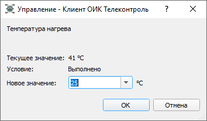
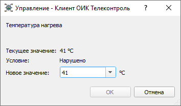
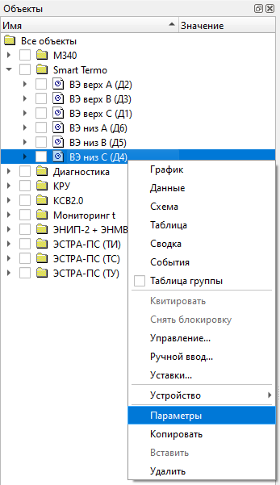
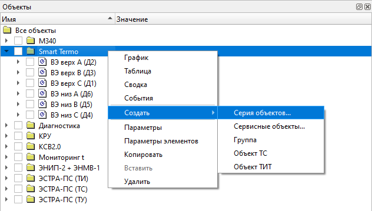
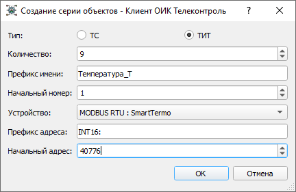
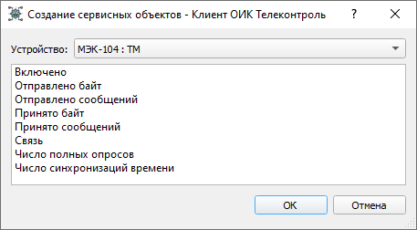
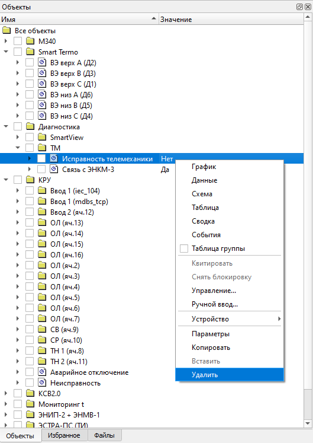
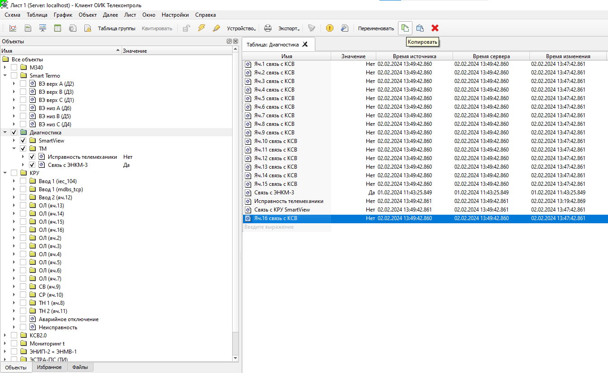

# Конфигурирование объектов данных
{:.no_toc}

* TOC
{:toc}

Только администраторы системы (пользователи с правами `Администратор` или `Инженер АСУ`) могут создавать, конфигурировать, удалять, копировать объекты между группами, создавать и удалять группы, копировать и перемещать группы.

[Объектам данных](architecture#data-items) может быть присвоено до двух источников данных (каналов) для выполнения горячего резервирования.
В случае двух источников, потеря достоверности приведет к автоматическому переключению объекта на резервный источник, а при восстановлении основного канала он снова будет задействован в качестве источника данных объекта.

Для каждого объекта данных может быть задан один канал управления (ТУ или телерегулирования). В частности, каналом управления, может быть канал управления, используемый в качестве источника данных этого же объекта.

Для канала управления может быть задано условие управления - логическое выражение, при выполнении которого управление может быть активно:

иначе управление будет заблокировано:

Значения, полученные от источников данных, могут быть инвертированы (для объектов ТС), преобразованы по линейной шкале (для объектов ТИТ) или вычислены с использованием математической формулы [Дорасчет](formulas).

Доступ к просмотру и редактированию конфигурации объекта данных возможен через пункты меню `Параметры` для одного объекта  или меню `Параметры элементов` для группы объектов.

## Создание объектов

Объекты могут быть созданы только внутри группы объектов. Группы, в свою очередь, могут быть включены в другие группы.

Создание одного объекта или серии из нескольких объектов внутри выбранной группы осуществляется через меню `Создать`:

При создании `Серии объектов` требуется выбрать тип объекта (ТС или ТИТ) и указать соответствующие параметры для новых объектов, которые будут созданы:

После успешного создания серии объектов указанные параметры могут быть изменены.

При создании `Сервисных объектов` требуется выбрать один из предлагаемых типов сервисного (служебного) объекта для конкретного устройства:

После успешного создания сервисного объекта его тип может быть заменен.

## Удаление объектов

Удаление объектов или групп объектов выполняется через пункты меню `Удалить`.

Пример контекстного меню, всплывающего по нажатию ПКМ:

## Копирование объектов

Копирование объектов или групп объектов выполняется через пункты меню `Копировать`.

Пример главного меню:

## Перетягивание объектов

Удержание ЛКМ и перетягивание объектов или групп объектов внутри дерева объектов в окне `Объекты`.

## Параметры объектов

Пример параметров объекта ТИТ `Температура нагрева`:

<dl>

<dt>Архив значений</dt>
<dd>Задает глубину (в днях) хранения архивных данных для объекта. Из выпадающего списка выбирается архив для хранения значений данных объекта с целью его последующего анализа на графиках, в таблицах сводки и в журнале событий. Просмотреть и изменить список архивов можно выбрав из вкладки главного меню [Далее] - [Базы данных].</dd>

<dt>Имя</dt>
<dd>Отображается в любом месте системы, где есть упоминание об этом объекте. Имя может состоять из произвольных символов и пробелов, уникальность имени не требуется. Для точной идентификации объекта в местах отображения используется полный формат имени, включающий в себя имена всех родительских групп, например: Группа 1 : Подгруппа 1 : ТИТ1.</dd>

<dt>Канал (Управление)</dt>
<dd>Здесь указывается десятичный адрес команды управления в требуемом формате протокола обмена данными.</dd>

<dt>Устройство (Управление)</dt>
<dd>Позволяет выбрать устройство, являющееся источником данных для режима Управления, если требуется телеуправление объектом.</dd>

<dt>Двухэтапное Управление</dt>
<dd>Позволяет выбрать режим управления, в соответствии с МЭК-60870-5, в два этапа (SELECT/EXECUTE), иначе команда управления будет реализована в один этап (EXECUTE).</dd>

<dt>Канал</dt>
<dd>Здесь указывается либо десятичный адрес информационного объекта в требуемом формате протокола обмена данными, либо выбирается сервисный объект из выпадающего списка. Если устройство не выбрано, здесь вводится формула [Дорасчёта](formulas).</dd>

<dt>Устройство</dt>
<dd>Позволяет выбрать устройство, являющееся основным источником данных. Либо, если устройство не выбрано, то в поле [Канал] задается формула [Дорасчёта](formulas).</dd>

<dt>Канал (Резерв)</dt>
<dd>Здесь указывается либо десятичный адрес информационного объекта для резервного источника данных в требуемом формате протокола обмена данными, либо выбирается сервисный объект из выпадающего списка.</dd>

<dt>Устройство (Резерв)</dt>
<dd>Позволяет выбрать устройство, являющееся резервным источником данных.</dd>

<dt>Условие управления</dt>
<dd>Логическое выражение, при выполнении которого управление может быть либо активно, либо заблокировано. В логическом выражении обычно содержатся алиасы объектов ТС, либо не редактируемые номера объектов ТС (номера объектов, которые автоматически присваиваются системой при их создании).</dd>

<dt>Устаревание, с</dt>
<dd>Контроль устаревания позволяет задать время в секундах, в течение которого значения данных должно изменяться, иначе данные будут отмечаться, как устаревшие.</dd>

<dt>Параметры отображения</dt>
<dd>Позволяет указать способ отображения объектов ТС на экране, выбрав один из существующих форматов. Просмотреть и изменить список форматов можно выбрав из вкладки главного меню [Далее] - [Форматы].</dd>

<dt>Инверсия</dt>
<dd>Используется только для объектов ТС и определяет, следует ли инвертировать полученное с устройства состояние ТС.</dd>

<dt>Преобразование</dt>
<dd>Содержит параметры, определяющие правила обработки входящих данных для объектов ТИТ:
  <dl>

* <dt>Линейное</dt>
	<dd>Используется линейное преобразование шкалы (смещение и масштабирование).</dd>

* <dt>Нет</dt>
	<dd>Позволяет отключить преобразование входных данных.</dd>

  </dl>
</dd>

<dt>Логический максимум и Логический минимум</dt>
<dd>Определяют логический диапазон значений объекта ТИТ. Используются для любого типа преобразования. Определяют шкалу графиков по оси Y.</dd>

<dt>Физический максимум и Физический минимум</dt>
<dd>Используются для линейного преобразования и определяют физический диапазон значений получаемых от устройств.</dd>

<dt>Алиас</dt>
<dd>Задает псевдоним - уникальное имя объекта в системе. Алиас может использоваться в логических выражениях и математических формулах, для быстрого ввода объекта в таблицы и графики, а также для привязки объектов к элементам мнемосхем. В других случаях Алиас можно не указывать. Допустимы алиасы, состоящие из английских и русских букв и цифр, но не содержащие пробелов. Длина алиаса не должна превышать 50 символов.</dd>

<dt>Важность</dt>
<dd>Задает десятичное число в диапазоне от 0 до 1 000 000 000. Показатель Важность нужен для выделения цветом событий при их отображении и фильтрации в журнале событий по критерию Важность, а также для установки текущего порога фильтра по критерию Важность при отображении событий в панели текущих событий. Окно панели текущих событий доступно из вкладки главного меню: Далее – События. Окно журнала событий доступно из вкладки главного меню: Далее – Журнал событий.</dd>

<dd>В зависимости от показателя важности все квитированные события в журнале событий имеют следующие цветовую маркировку:</dd>

* Важность < 60 чёрный шрифт на белом фоне (основная зона событий);

* Важность < 80 чёрный шрифт на желтом фоне (предупредительная сигнализация);

* Важность > 80 чёрный шрифт на красном фоне (аварийная сигнализация);

<dd>Неквитированные события (не важно из какой они зоны Важности) до момента квитирования всегда отображаются чёрным шрифтом на зеленом фоне. Просмотреть все не квитированные события можно выбрав из вкладки главного меню [Далее] - [События].</dd>

</dd>

<dt>Ограничение диапазона</dt>
<dd>Ограничивает значение пределами логического диапазона.</dd>

<dt>Отображение</dt>
<dd>Определяет форматирование значения объекта ТИТ при его отображении в системе:
  <dl>

* <dt>Единицы измерения</dt>
	<dd>Определяет единицу измерения, выводимую после значения (кВт, А, °С, ...).</dd>

* <dt>Формат</dt>
	<dd>Определяет количество знаков после запятой.</dd>

  </dl>
</dd>

<dt>Эмуляция</dt>
<dd>Позволяет включить эмуляцию сигнала. Тип эмуляции можно выбрать в выпадающем списке. Редактирование списка доступно из вкладки главного меню: [Далее] – [Эмулируемые сигналы].</dd>

</dl>
