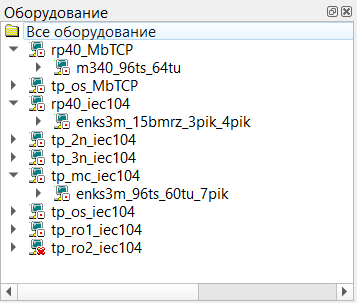
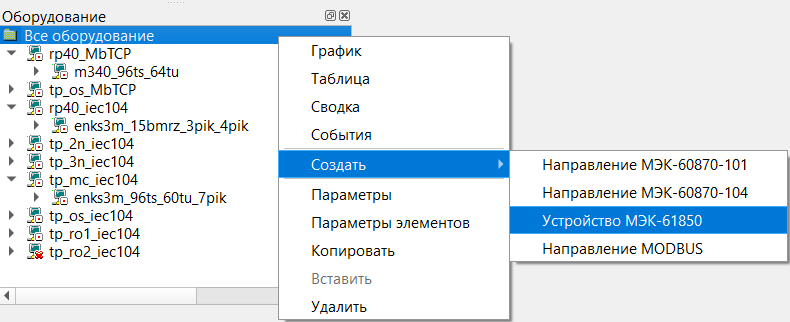
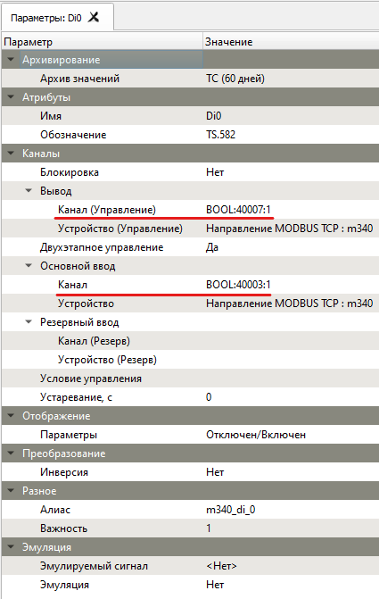
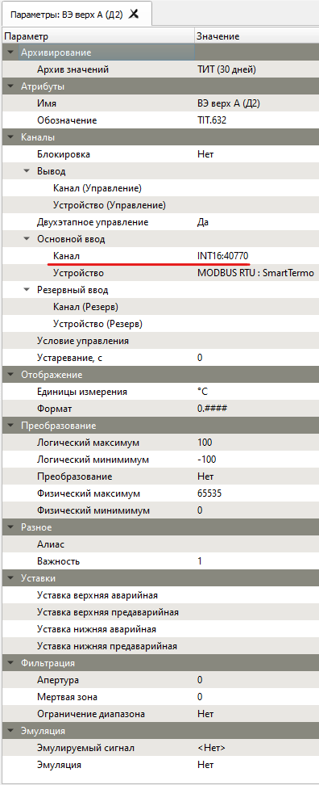
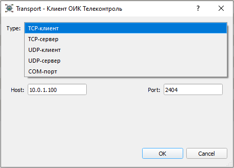

# Конфигурирование оборудования
{:.no_toc}

* TOC
{:toc}

Окно оборудования может быть отображено посредством вызова вкладки из главного меню: *Далее - Оборудование*.



## Создание устройств

Добавить направление МЭК-60870-5 можно выбрав из контекстного меню подсистемы МЭК пункт *Создать - Направление МЭК-101* или *Создать Направление МЭК-104*.



Добавить устройство МЭК-60870-5 можно из контекстного меню направления, выбрав пункт *Создать - Устройство*.

## Параметры устройств

Для редактирования параметров элемента следует из контекстного меню элемента выбрать пункт *Параметры*.

## [](#mbDevice)Устройства MODBUS

Поддерживаемые коды функций Modbus смотрите в [описании MODBUS](protocols#modbus) 

### Параметры направления MODBUS

<dl>

<dt>Задержка запроса, мс</dt>
<dd>Искусственная задержка (в миллисекундах) между ответом и запросом следующего блока данных. Используется для устройств с замедленным переключением режима приема-передачи последовательного порта.</dd>

</dl>

### Параметры устройства MODBUS

<dl>

<dt>Длительность приостановки, мс</dt>
<dd>Приостановка устройства происходит при потери связи с устройством. Если циклически опрашиваются несколько устройств и одно из устройств перестает отвечать на запросы Сервера ТК тем самым вызывая потерю связи с устройством, то имеет смысл приостановить опрос данного устройства на какое-то время (в миллисекундах), чтобы дать другим устройствам возможность своевременно опрашиваться.</dd>

<dt>Попыток повторов передачи</dt>
<dd>Максимальное число повторных запросов при отсутствии ответа от устройства. По истечении числа повторов будет зарегистрирована потеря связи с устройством.</dd>

<dt>Таймаут ответа</dt>
<dd>Максимальное время ожидания ответа от устройства, спустя которое будет выполнен повторный запрос. По истечении числа повторов будет зарегистрирована потеря связи с устройством.</dd>

</dl>

### Регистры MODBUS

Каждый Modbus регистр имеет размерность 16 бит и называется 16 битным словом или 16 разрядным словом, или одинарным словом.

Каждое слово содержит два байта: Hi (старший байт), Lo (младший байт). В регистрах Modbus используется прямой порядок следования байт в слове: [Hi] [Lo].

Два Modbus регистра образуют 32 битное слово или 32 разрядное слово, или двойное слово.

Двойное слово содержит: Hi (старшее слово), Lo (младшее слово). В регистрах Modbus используется прямой порядок следования слов: [Hi] [Lo] (прямой порядок следования байт: 2-1-4-3).

Четыре Modbus регистра образуют 64 битное слово или 64 разрядное слово, или два двойных слова.

Примеры содержимого Modbus регистров в шестнадцатеричном формате:

* содержимое одинарного слова: `0x10DE`

`0x10` - старший байт

`0xDE` - младший байт

* содержимое двойного слова: `0x10DE34A8`

`0x10DE` - старшее слово 

`0x34A8` - младшее слово

В протоколе Modbus используется четыре группы объектов (по количеству типов Modbus регистров):

| Номер регистра (dec) | Адрес регистра (hex) | Тип Modbus регистра | Команда | Доступ |
|:---------------------:|:---------------------:|:-------------------------------------:|:---------------:|:-------------:|
| 1-9999 | 0x0000-0x270F | Coils (дискретные выходы) | 0x01/0x05(0x0F) | Чтение/запись |
| 10001-19999 | 0x0000-0x270F | Discrete Inputs (дискретные входы) | 0x02 | Чтение |
| 30001-39999 | 0x0000-0x270F | Input Registers (аналоговые входы) | 0x04 | Чтение |
| 40001-49999 | 0x0000-0x270F | Holding Registers(аналоговые выходы) | 0x03/0x06(0x10) | Чтение/запись |

{: .note }
> **Номер регистра** указывается в десятичном формате (dec) и отличается от **адреса регистра**, который указывается в шестнадцатеричном формате (hex) и содержится непосредственно в самих пакетах данных (Modbus транзакциях).

Например:

первый регистр аналогового выхода (Holding Register) имеет десятичный номер `40001`, но шестнадцатеричный адрес этого регистра будет равен `0x0000`.

Разница между **номером регистра** и его **адресом** и есть смещение `offset`.

Каждый тип регистров имеет свои смещения, соответственно:

* `1`
* `10001`
* `30001`
* `40001`

Содержимое указанных четырех типов регистров MODBUS:

* COIL
* DISCINPUT
* INPUTREG
* HOLDREG

может быть преобразовано в следующие различные типы данных (со знаком/без знака):

* BOOL (бит)
* INT8/UINT8 (байт)
* INT16/UINT16 (слово)
* INT32/UINT32 (двойное слово)
* FLOAT (двойное слово)
* DOUBLE (два двойных слова)

### Полный формат адреса канала MODBUS

Полный формат содержит одно обязательное поле и пять не обязательных полей, которые заключены в квадратные скобки `[` и `]`:

```
`[type_data[count]:]NUMBER[:bit[+bitcount]][;swapbytes]`

Описание полей полного формата:

`type_data` один из поддерживаемых типов данных (BOOL,INT8,UINT8,INT16,UINT16,INT32,UINT32,FLOAT,DOUBLE)

`count` явно задает количество считываемых регистров (например для чтения BOOL из нескольких подряд регистров)

`NUMBER` десятичный номер регистра (не путать с фактическим шестнадцатеричным адресом регистра)

`bit` номер первого маскируемого бита, биты регистра нумеруются с 1 по 16 (BOOL:30003:5 означает, что маскируется 5 бит)

`bitcount` читает несколько бит, начиная с указанного в поле `bit` бита (`INT16:123:3+2` означает, что маскируются следующие биты: 3,4,5)

`;swapbytes` поменять местами Hi и Lo байты в 16 битном слове (`;swapwords` поменять местами Hi и Lo 16 битные регистры в 32 битном слове)
```

### Примеры с описанием полного формата адреса канала MODBUS

* `FLOAT:30001`
Чтение двух Modbus регистров по адресам 0x0000 и 0x0001 командой 0х04 в формате 32-битного числа с плавающей запятой одинарной точности стандарта IEEE754.

* `INT16:41105;swapbytes`
Чтение (Запись) содержимого Modbus регистра по адресу 0x0450 командой 0х03 (0x06) в формате 16 битного целого со знаком с заменой местами Hi и Lo байтов в регистре.

* `UINT32:41105;swapwords`
Чтение (Запись) содержимого двух Modbus регистров по адресам 0x0450 и 0x0451 командой 0х03 (0x10) в формате 32 битного целого без знака с заменой местами Hi и Lo регистров в слове.

* `UINT16:30001:1+7`
Чтение содержимого младшего байта в 16 битном Modbus регистре по адресу 0x0000 командой 0х04.

* `UINT16:30001:9+7`
Чтение содержимого старшего байта в 16 битном Modbus регистре по адресу 0x0000 командой 0х04.

* `BOOL:40003:5`
Чтение (Запись) 5 бита в 16 битном Modbus регистре по адресу 0x0002 командой 0х03 (0х06).

* `1`
Чтение (Запись) дискретного выхода 0 командой 0x01 (0x05).

* `10001`
Чтение дискретного входа 0 командой 0x02.

* `30001` или `INT16:30001`
Чтение содержимого Modbus регистра по адресу 0x0000 командой 0х04 в формате 16 битного целого со знаком.

* `40001` или `INT16:40001`
Чтение (Запись) содержимого Modbus регистра по адресу 0x0000 командой 0х03 (0x06) в формате 16 битного целого со знаком.

Пример окна **Параметры объекта ТС** с описанием полного формата адреса канала Modbus:



Пример окна **Параметры объекта ТИТ** с описанием полного формата адреса канала Modbus:




### Краткий формат адреса канала MODBUS

Краткий формат содержит три обязательных поля с указанием абсолютного десятичного адреса регистра Modbus, взамен десятичного номера регистра, как в описании полного формата:

```
`TYPE_REGISTER:TYPE_DATA:ADDR`

Описание полей краткого формата:

`TYPE_REGISTER` один из поддерживаемых типов регистров (COIL,DISCINPUT,INPUTREG,HOLDREG)

`TYPE_DATA` один из поддерживаемых типов данных (BOOL,INT8,UINT8,INT16,UINT16,INT32,UINT32,FLOAT,DOUBLE)

`ADDR` абсолютный десятичный адрес регистра Modbus (не путать его с десятичным номером регистра), который имеет смещение `offset = +1` относительно его фактического шестнадцатеричного адреса.
```

Краткий формат используется в тех случаях, когда фактический шестнадцатеричный адрес Modbus регистра устройства больше, чем `0x270F`.

Например:

абсолютный десятичный адрес `10001` регистра Modbus не может иметь десятичного номера регистра, потому что соответствующий ему фактический шестнадцатеричный адрес равен: `0x2710` - то есть больше, чем максимально допустимый для групп объектов шестнадцатеричный адрес: `0x270F`.


### Примеры с описанием краткого формата адреса канала MODBUS

* `HOLDREG:FLOAT:10001`
Чтение (Запись) двух Modbus регистров 0x2710 и 0x2711 командой 0х03 (0x10) в формате 32-битного числа с плавающей запятой одинарной точности стандарта IEEE754.

* `INPUTREG:FLOAT:10001`
Чтение двух Modbus регистров 0x2710 и 0x2711 командой 0х04 в формате 32-битного числа с плавающей запятой одинарной точности стандарта IEEE754.

* `HOLDREG:INT32:10001`
Чтение (Запись) двух Modbus регистров 0x2710 и 0x2711 командой 0х03 (0x10) в формате 32 битного целого со знаком.

* `INPUTREG:UINT32:10001`
Чтение двух Modbus регистров 0x2710 и 0x2711 командой 0х03 в формате 32 битного целого без знака.

* `HOLDREG:DOUBLE:10001`
Чтение (Запись) четырех Modbus регистров 0x2710, 0x2711, 0x2712 и 0x2713 командой 0х03 (0x10) в формате 64-битного числа с плавающей запятой двойной точности стандарта IEEE754.

## [](#iecDevice)Устройства МЭК-60870-5

Поддерживаемые идентификаторы типа блоков данных прикладного уровня ASDU смотрите в [описании МЭК-60870-5](protocols#iec-60870) 

### Параметры направления МЭК-60870-5

<dl>

<dt>Архив событий</dt>
<dd>Указывается архив для хранения сетевого трафика обмена данными с устройствами с целью его последующего анализа и сохранения в текстовый лог файл. Просмотреть и изменить список архивов можно выбрав из вкладки главного меню [Далее] - [Базы данных].</dd>

В окне [Наблюдение](client/device-watch) можно посмотреть, проанализировать и сохранить в лог файл сетевой трафик обмена данными с устройствам. 

<dt>Анонимный режим</dt>
<dd>Переводит ОИК из балансного режима в небалансный режим обмена, при котором устройство самостоятельно устанавливает соединение - отправлять STARTDT ACT всем устройствам после установления соединения не требуется. Передача данных от устройств осуществляется в ответ на запросы Сервера ОИК.</dd>

<dt>Очередь передачи (K)</dt>
<dd>Определяет максимальное количество отправляемых ASDU до получения квитанции.</dd>

<dt>Очередь приема (W)</dt>
<dd>Определяет количество принятых ASDU, после которых отправляется квитанция.</dd>

<dt>Попыток повторов передачи</dt>
<dd>Максимальное число повторных запросов при отсутствии ответа устройства. По истечении числа повторов будет зарегистрирована потеря связи с устройством.</dd>

<dt>Стандартные размеры полей МЭК-60870-5:</dt>

| Размер поля, байт | 104 | 101 |
|:-------------------------------------:|:---:|:---:|
| Адрес объекта информации | 3 | 2 |
| Адрес устройства (общий адрес ASDU) | 2 | 1 |
| Причина передачи | 2 | 1 |


<dt>Таймаут операции, с</dt>
<dd>Таймауты выполнения команд, выдаваемых устройству: телеуправление, полный опрос.</dd>

<dt>Таймаут передачи (Т1), с</dt>
<dd>Время в течение которого ожидается ответ на команду или подтверждение доставки ASDU. По истечении таймаута будет зарегистрирована потеря связи с устройством.</dd>

<dt>Таймаут подтверждения, с</dt>
<dd>Время в течение которого ожидается получение подтверждения о завершении выполнения команды устройством (ACTIVATION TERMINATION). По истечении таймаута будет зарегистрирована потеря связи с устройством.</dd>

<dt>Таймаут приема (Т2), с</dt>
<dd>Время в течение которого будет отправлено подтверждение о приеме ASDU в случае отсутствия пакетов с данными. Подтверждение о приеме ASDU будет отправлено по истечении таймаута, либо по факту приема предельного количества ASDU, указанного в очереди приема (W). Таймаут приема (Т2) должен быть меньше таймаута передачи (Т1).</dd>

<dt>Таймаут простоя (Т3), с</dt>
<dd>Время в течение которого, в случае простоя канала связи, будет отправлен специальный пакет (блок тестирования) для проверки связи с устройством. Если по истечении таймаута нет никакого обмена данными, то устройство может закрыть соединение.</dd>

<dt>Таймаут связи (Т0), с</dt>
<dd>Время в течение которого устанавливается соединение с устройством.</dd>

<dt>Транспорт</dt>
<dd>Параметры канала связи с устройствами:</dd>



</dl>

### Параметры устройства МЭК-60870-5

<dl>

<dt>Архив событий</dt>
<dd>Указывается архив для хранения сетевого трафика обмена данными с конкретным устройством с целью его последующего анализа и сохранения в текстовый лог файл. Просмотреть и изменить список архивов можно выбрав из вкладки главного меню [Далее] - [Базы данных].</dd>

В окне [Наблюдение](client/device-watch) можно посмотреть, проанализировать и сохранить в лог файл сетевой трафик обмена данными с конкретным устройством. 

<dt>Адрес</dt>
<dd>Определяет общий адрес устройства в кадре ASDU.</dd>

<dt>Адрес коммутатора</dt>
<dd>Определяет дополнительный канальный адрес устройства (Link address).</dd>

<dt>Время UTC</dt>
<dd>Определяет формат меток времени: UTC или Локальное время.</dd>

<dt>Периоды опросов групп 1...16, с</dt>
<dd>Определяются периоды отправки команды группового опроса по каждой группы отдельно. Описание групп смотрите в стандарте для команды полного опроса (C_IC_NA_1).</dd>

<dt>Период полного опроса, с</dt>
<dd>Определяет период отправки команды полного опроса (C_IC_NA_1). При указании значения 0 полный опрос будет выполнен один раз после установлении соединения с устройством.</dd>

<dt>Период синхронизации часов, с</dt>
<dd>Определяет период отправки команды синхронизация времени (C_CS_NA_1). При указании значения 0 синхронизация времени устройства будет выполнена один раз после установлении соединения с устройством.</dd>

<dt>Полный опрос при запуске</dt>
<dd>Если флаг отключен, то после установления соединения с устройством полный опрос устройства производиться не будет.</dd>

<dt>Синхронизация часов при запуске</dt>
<dd>Если флаг отключен, то после установления соединения с устройством синхронизация времени устройства производиться не будет.</dd>

</dl>

## Устройства МЭК-61850

Смотрите [отображение модели МЭК-61850](protocols#iec-61850) и описание архитектуры [подсистемы МЭК-61850](protocols#iec-61850).

Выбором Параметры из контекстного меню любого объекта поддерева Модели можно посмотреть адрес объекта МЭК-61850 для привязки к объектам сервера.

Создать привязанные объекты сервера также можно перетягиванием объектов из Модели в произвольную группу Панели объектов. Перетягиванием группы FC МЭК-61850 можно создать все объекты этой группы. Перетягивание объекта информационной модели на существующий объект сервера обновляет привязку объекта.
