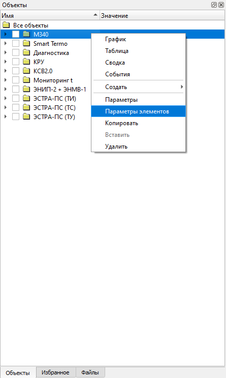
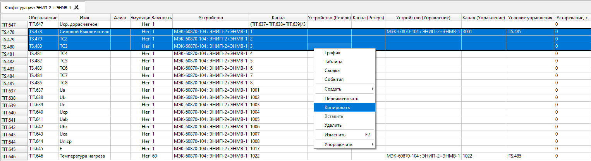
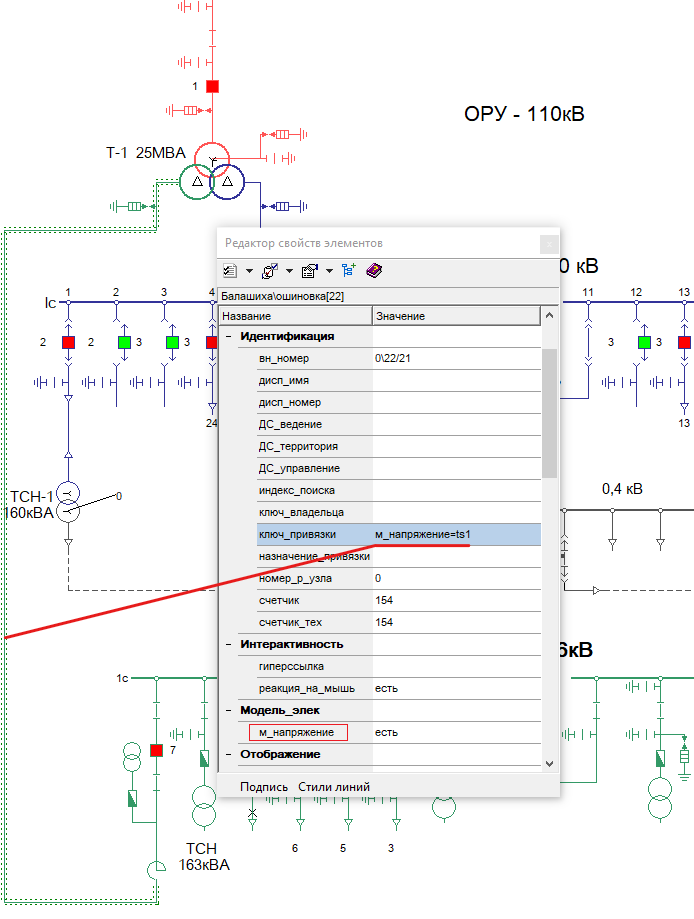
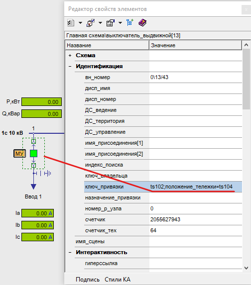
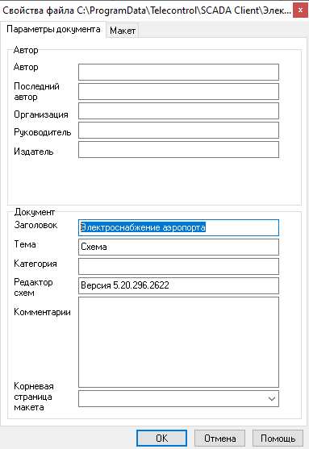
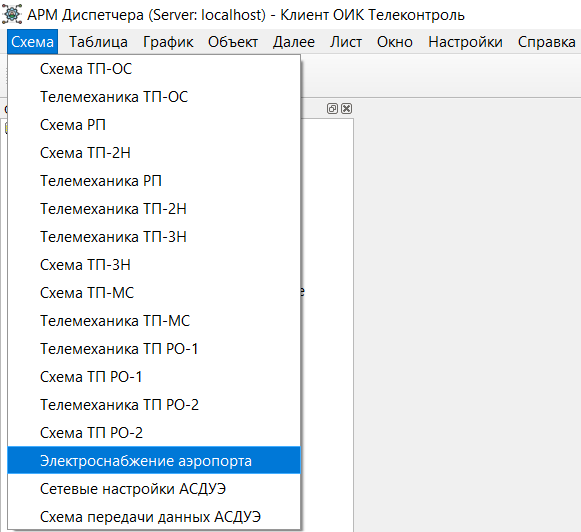

# Электронные схемы и параметры элементов
{:.no_toc}

* TOC
{:toc}

## Параметры элементов

Пункт `Параметры элементов` вызывается из контекстного меню для выделенной группы объектов по нажатию ПКМ:

Табличный режим редактирования параметров объектов упрощает работу со множеством объектов. В этом режиме объекты расположены в строках таблицы, а их различные параметры отображаются в столбцах:

Доступно тиражирование ячеек растягиванием выделения за нижний правый угол, аналогично таблицам в MS Excel. Если содержимое ячейки оканчивается числом, оно будет изменяться автоматически. При растягивании вниз число будет увеличиваться, при растягивании вверх - уменьшаться. Чтобы отключить автоматическое изменение ячейки необходимо удерживать клавишу *Ctrl* при растягивании за нижний правый угол.

Из контекстного меню таблицы доступны операции *Копирования* и *Вставки* объектов.

## Электронные схемы ActiveXeme

Мнемосхемы (файлы с расширением *sde* и *xsde*) располагаются в папке `%ProgramData%\Telecontrol\SCADA Client` на каждом рабочем месте Клиента ОИК.

При добавлении новой схемы, она будет доступна из главного меню `Схема` после перезапуска Клиента. Также, папку схем можно открыть из Клиента командой меню *Настройки - Открыть папку схем*.

При изменения схемы или алиаса достаточно закрыть и повторно открыть схему в ОИК для применения изменений.

### Привязка объектов

Для привязки объекта ТС или ТИТ к мнемосхеме нужно задать алиас объекта. Это можно сделать в окне параметров Клиента, открываемом при выборе пункта Параметры из контекстного меню объекта. Допустимы алиасы, состоящие из английских и русских букв и цифр, но не содержащие пробелов.

После того, как алиас будет определен, его нужно привязать к элементу схемы. Объекты ТС привязываются к элементам мнемосхемы, имеющим свойство *положение*, а объекты ТИТ - к текстовым полям со свойством *текст*.

В Графическом редакторе выберите элемент мнемосхемы и укажите алиас, как значение для свойства `ключ_привязки` в окне *Редактор свойств элемента* (клавиша F11).

Для привязки произвольного свойства, используйте выражение вида *имя_свойства=алиас*

Для привязки нескольких свойств одного объекта используйте разделитель `;` (точку с запятой): *имя_свойства1=алиас1;имя_свойства2=алиас2*

### Заголовок схемы

Заголовок [*Схемы*](client/display#goto-object) записывается в файлы c расширением *sde* и *xsde*. Он может быть изменен при помощи Графического редактора Модус, вызовом команды меню *Схема - Свойства страницы - О файле...* и заданием атрибута `Заголовок`:

В пункте главного меню Клиента `Схемы` будет отображаться текст, заданный в атрибуте `Заголовок`:

