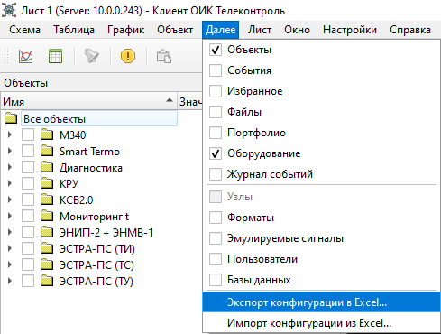
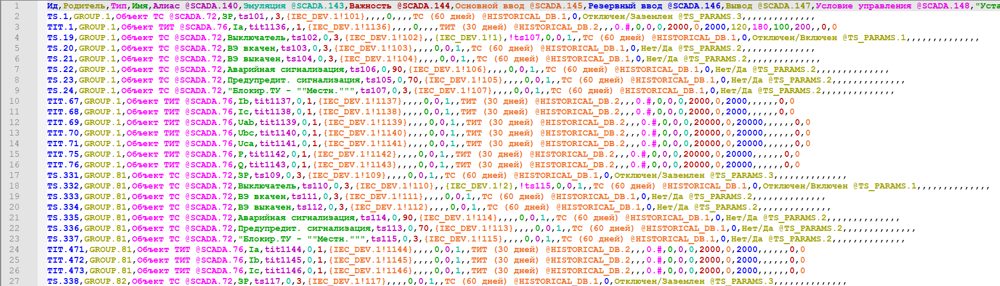

# Редактирование конфигурации в MS Excel

В главном меню Клиента `Далее` предусмотрена возможность `Экспорта` и `Импорта` текущей конфигурации в внешний текстовый файл в [формате csv](https://ru.wikipedia.org/wiki/CSV):

Текстовый файл имеет [кодировку UTF-8](https://ru.wikipedia.org/wiki/UTF-8)

Для просмотра и редактирования текстового файла можно использовать бесплатную программу [Блокнот](https://notepad-plus-plus.org/):

или программу [Microsoft Excel](https://ru.wikipedia.org/wiki/Microsoft_Excel)
