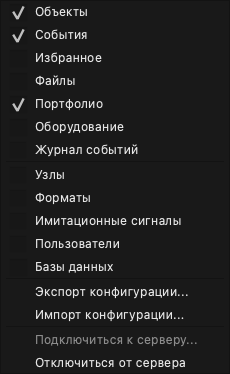

# Экспорт и импорт конфигурации

Конфигурацию сервера можно выгрузить в файл, отредактировать или сохранить
в архив и загрузить обратно. Команды доступны администраторам в главном меню
Клиента `Дополнительно`:

- `Экспорт конфигурации...` сохраняет конфигурацию в файл;
- `Импорт конфигурации...` загружает файл обратно на сервер.

В веб-клиенте те же действия находятся в разделе `Администрирование`
настроек.

## Формат файла

Конфигурация сохраняется в стандартном формате OPC UA
[NodeSet](https://reference.opcfoundation.org/Core/Part6/v105/docs/F.2) — это
XML-файл в [кодировке UTF-8](https://ru.wikipedia.org/wiki/UTF-8), который
можно просматривать и редактировать любым текстовым или XML-редактором.
Большая конфигурация сохраняется сжатой (`.xml.gz`); такой файл перед
редактированием нужно распаковать, а импортировать можно в любом виде.

Файл содержит только конфигурацию: текущие значения, архив и события в него
не входят. Учётные записи и роли пользователей по умолчанию не выгружаются
и никогда не загружаются импортом.

## Импорт

Перед применением сервер всегда проверяет файл и сообщает, что изменится:
сколько объектов будет добавлено, изменено и удалено. Изменения применяются
только после подтверждения, и применяются целиком: если хотя бы одно из них
невозможно, конфигурация не меняется, а сообщение перечисляет, что именно
помешало.

Файл, выгруженный полной конфигурацией, заменяет её: объекты, которых в
файле нет, удаляются.

Если после экспорта конфигурацию успели изменить, сервер предупредит об этом:
импорт такого файла перезапишет более поздние изменения. Его можно проверить
и применить повторно, но только явно.
