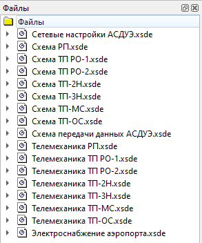

# Серверные файлы

При использовании распределенной Клиент-Серверной архитектуры ОИК на базе многомашинного комплекса с выделенным центральным Сервером всю информацию о файлах мнемосхем Сервер предоставляет всем своим Клиентам автоматически.

Окно просмотра Серверных файлов можно вызвать командой `Файлы` из главного меню Клиента `Далее`:

В окне *Файлы* Серверные файлы мнемосхем могут быть организованы по нескольким вложенным папкам хранения. Двойной клик ЛКП по выбранному файлу мнемосхемы в окне *Файлы* приведет к его отображению в Клиенте.

При этом важно, чтобы все файлы мнемосхем хранились в едином месте на Сервере в головной папке:

`%ProgramData%\Telecontrol\SCADA Server\FileSystem`

[Серверной файловой системы](server#filesystem), оттуда они и раздаются всем Клиентам.

Такой подход к хранению файлов мнемосхем предполагает, что достаточно изменить содержимое файла мнемосхемы в одном месте на Сервере, чтобы внесенные изменения автоматически вступили в силу сразу у всех Клиентов, подключенных к Серверу.
