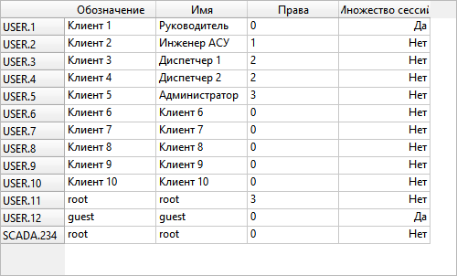

# Конфигурирование пользователей

Окно пользователей может быть отображено посредством вызова команды главного меню *Далее - Пользователи*.

Двойной щелчок в строке пользователя позволяет начать редактирование имени пользователя или прав доступа.

Возможные права доступа:

| Права доступа (Пользователь)| Функции управления, уставок	| Возможность редактирования конфигурации |
|:---------------------------:|:---------------------------:|:---------------------------------------:|
| 0 (Руководитель) 			  | НЕТ       					| НЕТ     								  |
| 1 (Инженер АСУ и связи)  	  | НЕТ               		 	| ДА	     							  |
| 2 (Диспетчер)    			  | ДА							| НЕТ     								  |
| 3 (Администратор)			  | ДА							| ДА	     							  |

Для создания нового пользователя выберите команду *Создать - Пользователь* из контекстного меню окна.

Для удаления пользователя выберите команду *Удалить* из контекстного меню пользователя.

Для смены пароля выберите команду *Задать пароль* из контекстного меню пользователя.
