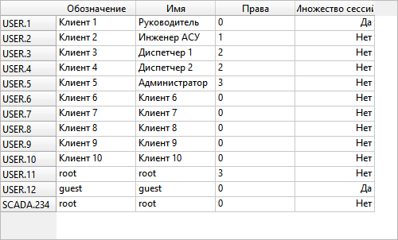

# Конфигурирование пользователей
{:.no_toc}

* TOC
{:toc}

Окно пользователей открывается командой главного меню *Дополнительно —
Пользователи* или кнопкой «Пользователи» внизу панели разделов. Окно доступно
только учётной записи с правом настройки конфигурации.

Двойной щелчок в строке пользователя позволяет начать редактирование его
свойств: имени, описания и прав доступа.

Для создания нового пользователя выберите команду *Создать - Пользователь* из контекстного меню окна.

Для удаления пользователя выберите команду *Удалить* из контекстного меню пользователя.

Для смены пароля выберите команду *Задать пароль* из контекстного меню
пользователя. Своя учётная запись требует ввода текущего пароля, чужая (сброс
администратором) — нет. Требования к паролю задаёт Сервер; смотрите
[Политика паролей](../client/workbench/#password-policy).

## Права доступа

Свойство «Права» учётной записи — это два независимых разрешения:

<dl>

<dt>Управление</dt>
<dd>Выдача команд телеуправления и телерегулирования, ручной ввод, задание
уставок.</dd>

<dt>Настройка конфигурации</dt>
<dd>Создание, изменение и удаление объектов, устройств и учётных записей.</dd>

</dl>

Их сочетания дают привычные четыре значения:

| Права | Управление, уставки | Редактирование конфигурации |
|:-----------------------:|:----------:|:---:|
| 0 (Руководитель) | НЕТ | НЕТ |
| 1 (Инженер АСУ и связи) | НЕТ | ДА |
| 2 (Диспетчер) | ДА | НЕТ |
| 3 (Администратор) | ДА | ДА |

## Роли

Проверяет запросы Сервер не по этим двум признакам напрямую, а по **ролям**
OPC UA, которые из них выводятся:

* любая учётная запись, вошедшая в систему, получает роль `Observer` — чтение
  значений, истории и событий;
* право «Управление» добавляет роль `Operator` — запись значений и вызов
  методов;
* право «Настройка конфигурации» добавляет роли `Engineer`, `Supervisor`,
  `ConfigureAdmin` и `SecurityAdmin` — полный набор, включая создание и
  удаление узлов;
* анонимная сессия получает только роль `Anonymous`.

Учётная запись может нести несколько ролей одновременно, и их разрешения
объединяются. Именно роли, а не пара признаков, показаны в окне
[«Пользователи»](../client/workbench/#users) и в панели «Права доступа»
рабочего места; там же по ролям выводится, что учётной записи разрешено
просматривать, чем управлять и что настраивать.

Состав ролей можно посмотреть в окне [«Роли»](../client/workbench/#roles). Оно
доступно только для чтения: изменение состава роли — привилегированная
операция, выполняемая на Сервере.

Все действия с учётными записями, паролями и составом ролей — и удавшиеся, и
отклонённые — записываются в [журнал аудита](../client/workbench/#audit-log).
