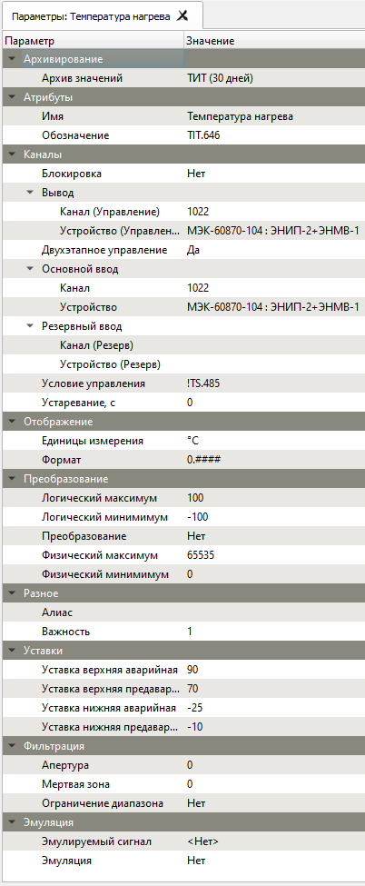
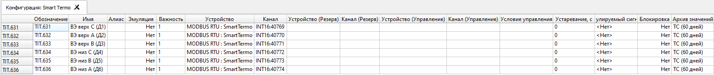
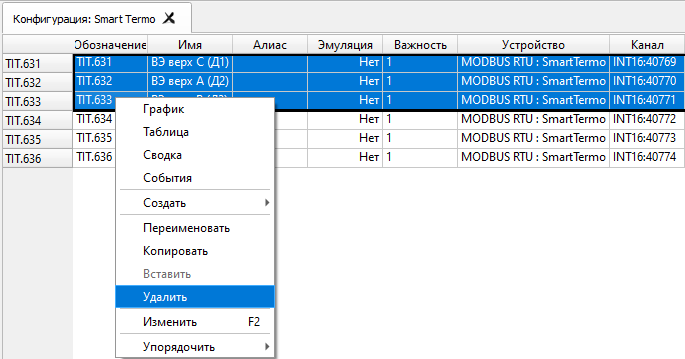

# Проектирование
{:.no_toc}

* TOC
{:toc}

Для редактирования проекта используется графический [Клиент](client). Следует выполнить вход пользователя в систему с правами администратора, после чего пункты меню [Клиента](client) будут дополнены административными командами.

## Общие административные команды

<dl>

<dt>Параметры (только для администратора)</dt>
Отображает окно параметров выделенного объекта ОИК.

<dt>Параметры элементов (только для администратора)</dt>
<dd>Отображает таблицу параметров всех элементов, входящих в выделенную группу или направление.</dd>

<dt>Удалить (только для администратора)</dt>
<dd>Удаляет выделенный объект, несколько выделенных объектов или устройство из системы.</dd>

</dl>

## Конфигурирование пользователей

Смотрите [Конфигурирование пользователей](dev/users).

## Конфигурирование оборудования

Смотрите [Конфигурирование оборудования](dev/devices).

## Конфигурирование объектов данных

Смотрите [Конфигурирование объектов данных](dev/data-items).

## Электронные схемы и параметры элементов

Смотрите [Электронные схемы и параметры элементов](dev/displays).

## Редактирование конфигурации в MS Excel

Смотрите [Редактирование конфигурации в MS Excel](dev/excel).

## Серверные файлы

Смотрите [Серверные файлы](dev/server-files).
