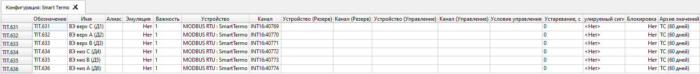
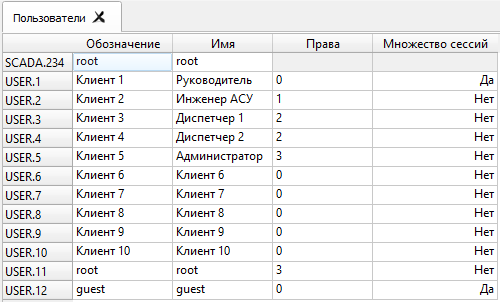
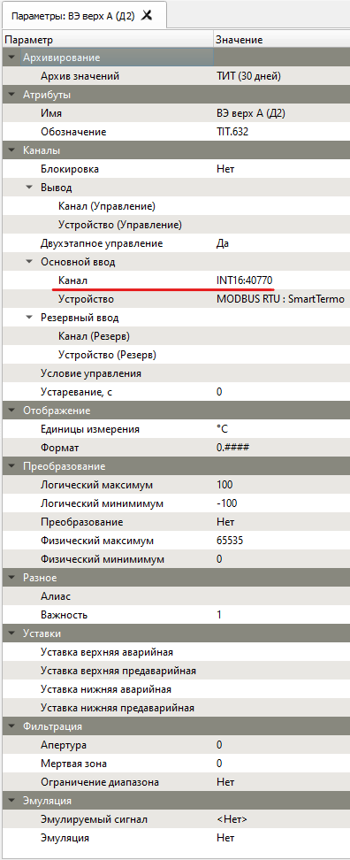
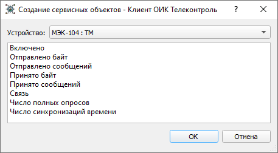
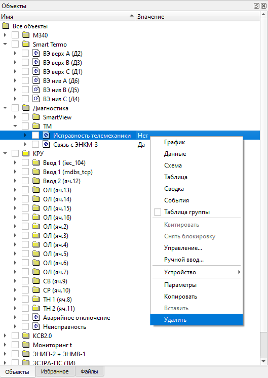
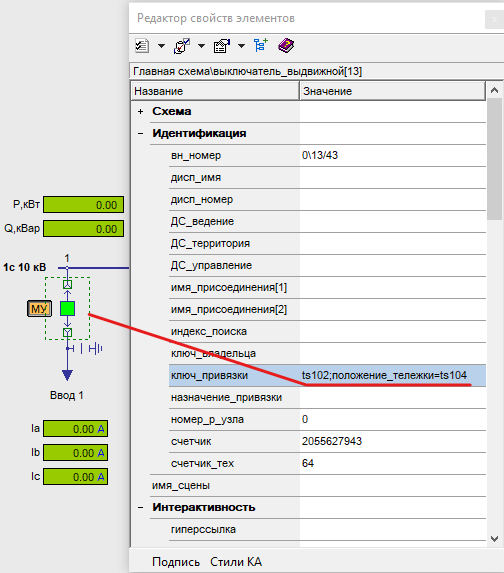

# Проектирование

{:.no_toc}

* TOC
{:toc}

Для редактирования проекта используется графический [Клиент](client). Следует выполнить вход пользователя в систему с правами администратора, после чего пункты меню [Клиента](client) будут дополнены административными командами.

### Общие административные команды

<dl>

<dt>Параметры (только для администратора)</dt>
Отображает окно параметров выделенного объекта ОИК.


<dt>Параметры элементов (только для администратора)</dt>
<dd>Отображает таблицу параметров всех элементов, входящих в выделенную группу или направление.</dd>



<dt>Удалить (только для администратора)</dt>
<dd>Удаляет выделенный объект, несколько выделенных объектов или устройство из системы.</dd>


</dl>

## Конфигурирование пользователей

Окно пользователей может быть отображено посредством вызова команды главного меню *Далее - Пользователи*.



Двойной щелчок в строке пользователя позволяет начать редактирование имени пользователя или прав доступа.

Возможные права доступа:

| Права доступа (Пользователь)| Функции управления, уставок	| Возможность редактирования конфигурации |
|:---------------------------:|:---------------------------:|:---------------------------------------:|
| 0 (Руководитель) 			  | НЕТ       					| НЕТ     								  |
| 1 (Инженер АСУ и связи)  	  | НЕТ               		 	| ДА	     							  |
| 2 (Диспетчер)    			  | ДА							| НЕТ     								  |
| 3 (Администратор)			  | ДА							| ДА	     							  |


Для создания нового пользователя выберите команду *Создать - Пользователь* из контекстного меню окна.

Для удаления пользователя выберите команду *Удалить* из контекстного меню пользователя.

Для смены пароля выберите команду *Задать пароль* из контекстного меню пользователя.

## Конфигурирование оборудования

Окно оборудования может быть отображено посредством вызова вкладки из главного меню: *Далее - Оборудование*.


### Создание устройств

Добавить направление МЭК-60870-5 можно выбрав из контекстного меню подсистемы МЭК пункт *Создать - Направление МЭК-101* или *Создать Направление МЭК-104*.


Добавить устройство МЭК-60870-5 можно из контекстного меню направления, выбрав пункт *Создать - Устройство*.

### Параметры устройств

Для редактирования параметров элемента следует из контекстного меню элемента выбрать пункт *Параметры*.

### [](#mbDevice)Устройства MODBUS

Поддерживаемые коды функций Modbus смотрите в [описании MODBUS](architecture#modbus) 

#### Параметры направления MODBUS

<dl>

<dt>Задержка запроса, мс</dt>
<dd>Искусственная задержка (в миллисекундах) между ответом и запросом следующего блока данных. Используется для устройств с замедленным переключением режима приема-передачи последовательного порта.</dd>

</dl>

#### Параметры устройства MODBUS

<dl>

<dt>Длительность приостановки, мс</dt>
<dd>Приостановка устройства происходит при потери связи с устройством. Если циклически опрашиваются несколько устройств и одно из устройств перестает отвечать на запросы Сервера ТК тем самым вызывая потерю связи с устройством, то имеет смысл приостановить опрос данного устройства на какое-то время (в миллисекундах), чтобы дать другим устройствам возможность своевременно опрашиваться.</dd>

<dt>Попыток повторов передачи</dt>
<dd>Максимальное число повторных запросов при отсутствии ответа от устройства. По истечении числа повторов будет зарегистрирована потеря связи с устройством.</dd>

<dt>Таймаут ответа</dt>
<dd>Максимальное время ожидания ответа от устройства, спустя которое будет выполнен повторный запрос. По истечении числа повторов будет зарегистрирована потеря связи с устройством.</dd>

</dl>

#### Регистры MODBUS

Каждый Modbus регистр имеет размерность 16 бит и называется 16 битным словом или 16 разрядным словом, или одинарным словом.

Каждое слово содержит два байта: Hi (старший байт), Lo (младший байт). В регистрах Modbus используется прямой порядок следования байт в слове: [Hi] [Lo].

Два Modbus регистра образуют 32 битное слово или 32 разрядное слово, или двойное слово.

Двойное слово содержит: Hi (старшее слово), Lo (младшее слово). В регистрах Modbus используется прямой порядок следования слов: [Hi] [Lo] (прямой порядок следования байт: 2-1-4-3).

Четыре Modbus регистра образуют 64 битное слово или 64 разрядное слово, или два двойных слова.

Примеры содержимого Modbus регистров в шестнадцатеричном формате:

* содержимое одинарного слова: `0x10DE`

`0x10` - старший байт

`0xDE` - младший байт

* содержимое двойного слова: `0x10DE34A8`

`0x10DE` - старшее слово 

`0x34A8` - младшее слово

В протоколе Modbus используется четыре группы объектов (по количеству типов Modbus регистров):

| Номер регистра (dec)	| Адрес регистра (hex)	| Тип Modbus регистра 					| Команда		  | Доступ		  |
|:---------------------:|:---------------------:|:-------------------------------------:|:---------------:|:-------------:|
| 1-9999		 		| 0x0000-0x270F			| Coils (дискретные выходы)				| 0x01/0x05(0x0F) | Чтение/запись |
| 10001-19999			| 0x0000-0x270F			| Discrete Inputs (дискретные входы)	| 0x02      	  | Чтение        |
| 30001-39999			| 0x0000-0x270F			| Input Registers (аналоговые входы)  	| 0x04      	  | Чтение        |
| 40001-49999			| 0x0000-0x270F			| Holding Registers(аналоговые выходы) 	| 0x03/0x06(0x10) | Чтение/запись |

---
> **Номер регистра** указывается в десятичном формате (dec) и отличается от **адреса регистра**, который указывается в шестнадцатеричном формате (hex) и содержится непосредственно в самих пакетах данных (Modbus транзакциях). 
---

Например:

первый регистр аналогового выхода (Holding Register) имеет десятичный номер `40001`, но шестнадцатеричный адрес этого регистра будет равен `0x0000`.

Разница между **номером регистра** и его **адресом** и есть смещение `offset`.

Каждый тип регистров имеет свои смещения, соответственно:

* `1`
* `10001`
* `30001`
* `40001`

Содержимое указанных четырех типов регистров MODBUS:

* COIL
* DISCINPUT
* INPUTREG
* HOLDREG

может быть преобразовано в следующие различные типы данных (со знаком/без знака):

* BOOL (бит)
* INT8/UINT8 (байт)
* INT16/UINT16 (слово)
* INT32/UINT32 (двойное слово)
* FLOAT (двойное слово)
* DOUBLE (два двойных слова)

#### Полный формат адреса канала MODBUS

Полный формат содержит одно обязательное поле и пять не обязательных полей, которые заключены в квадратные скобки `[` и `]`:

```
`[type_data[count]:]NUMBER[:bit[+bitcount]][;swapbytes]`

Описание полей полного формата:

`type_data` один из поддерживаемых типов данных (BOOL,INT8,UINT8,INT16,UINT16,INT32,UINT32,FLOAT,DOUBLE)

`count`	явно задает количество считываемых регистров (например для чтения BOOL из нескольких подряд регистров)

`NUMBER` десятичный номер регистра (не путать с фактическим шестнадцатеричным адресом регистра)

`bit` номер первого маскируемого бита, биты регистра нумеруются с 1 по 16 (BOOL:30003:5 означает, что маскируется 5 бит)

`bitcount` читает несколько бит, начиная с указанного в поле `bit` бита (`INT16:123:3+2` означает, что маскируются следующие биты: 3,4,5)

`;swapbytes` поменять местами Hi и Lo байты в 16 битном слове (`;swapwords` поменять местами Hi и Lo 16 битные регистры в 32 битном слове)
```

#### Примеры с описанием полного формата адреса канала MODBUS

* `FLOAT:30001`
Чтение двух Modbus регистров по адресам 0x0000 и 0x0001 командой 0х04 в формате 32-битного числа с плавающей запятой одинарной точности стандарта IEEE754.

* `INT16:41105;swapbytes`
Чтение (Запись) содержимого Modbus регистра по адресу 0x0450 командой 0х03 (0x06) в формате 16 битного целого со знаком с заменой местами Hi и Lo байтов в регистре.

* `UINT32:41105;swapwords`
Чтение (Запись) содержимого двух Modbus регистров по адресам 0x0450 и 0x0451 командой 0х03 (0x10) в формате 32 битного целого без знака с заменой местами Hi и Lo регистров в слове.

* `UINT16:30001:1+7`
Чтение содержимого младшего байта в 16 битном Modbus регистре по адресу 0x0000 командой 0х04.

* `UINT16:30001:9+7`
Чтение содержимого старшего байта в 16 битном Modbus регистре по адресу 0x0000 командой 0х04.

* `BOOL:40003:5`
Чтение (Запись) 5 бита в 16 битном Modbus регистре по адресу 0x0002 командой 0х03 (0х06).

* `1`
Чтение (Запись) дискретного выхода 0 командой 0x01 (0x05).

* `10001`
Чтение дискретного входа 0 командой 0x02.

* `30001` или `INT16:30001`
Чтение содержимого Modbus регистра по адресу 0x0000 командой 0х04 в формате 16 битного целого со знаком.

* `40001` или `INT16:40001`
Чтение (Запись) содержимого Modbus регистра по адресу 0x0000 командой 0х03 (0x06) в формате 16 битного целого со знаком.

Пример окна **Параметры объекта ТС** с описанием полного формата адреса канала Modbus:


Пример окна **Параметры объекта ТИТ** с описанием полного формата адреса канала Modbus:




#### Краткий формат адреса канала MODBUS

Краткий формат содержит три обязательных поля с указанием абсолютного десятичного адреса регистра Modbus, взамен десятичного номера регистра, как в описании полного формата:

```
`TYPE_REGISTER:TYPE_DATA:ADDR`

Описание полей краткого формата:

`TYPE_REGISTER` один из поддерживаемых типов регистров (COIL,DISCINPUT,INPUTREG,HOLDREG)

`TYPE_DATA` один из поддерживаемых типов данных (BOOL,INT8,UINT8,INT16,UINT16,INT32,UINT32,FLOAT,DOUBLE)

`ADDR`	абсолютный десятичный адрес регистра Modbus (не путать его с десятичным номером регистра), который имеет смещение `offset = +1` относительно его фактического шестнадцатеричного адреса.
```

Краткий формат используется в тех случаях, когда фактический шестнадцатеричный адрес Modbus регистра устройства больше, чем `0x270F`.

Например:

абсолютный десятичный адрес `10001` регистра Modbus не может иметь десятичного номера регистра, потому что соответствующий ему фактический шестнадцатеричный адрес равен: `0x2710` - то есть больше, чем максимально допустимый для групп объектов шестнадцатеричный адрес: `0x270F`.


#### Примеры с описанием краткого формата адреса канала MODBUS

* `HOLDREG:FLOAT:10001`
Чтение (Запись) двух Modbus регистров 0x2710 и 0x2711 командой 0х03 (0x10) в формате 32-битного числа с плавающей запятой одинарной точности стандарта IEEE754.

* `INPUTREG:FLOAT:10001`
Чтение двух Modbus регистров 0x2710 и 0x2711 командой 0х04 в формате 32-битного числа с плавающей запятой одинарной точности стандарта IEEE754.

* `HOLDREG:INT32:10001`
Чтение (Запись) двух Modbus регистров 0x2710 и 0x2711 командой 0х03 (0x10) в формате 32 битного целого со знаком.

* `INPUTREG:UINT32:10001`
Чтение двух Modbus регистров 0x2710 и 0x2711 командой 0х03 в формате 32 битного целого без знака.

* `HOLDREG:DOUBLE:10001`
Чтение (Запись) четырех Modbus регистров 0x2710, 0x2711, 0x2712 и 0x2713 командой 0х03 (0x10) в формате 64-битного числа с плавающей запятой двойной точности стандарта IEEE754.

### [](#iecDevice)Устройства МЭК-60870-5

Поддерживаемые идентификаторы типа блоков данных прикладного уровня ASDU смотрите в [описании МЭК-60870-5](architecture#iec-60870) 

#### Параметры направления МЭК-60870-5

<dl>

<dt>Архив событий</dt>
<dd>Указывается архив для хранения сетевого трафика обмена данными с устройствами с целью его последующего анализа и сохранения в текстовый лог файл. Просмотреть и изменить список архивов можно выбрав из вкладки главного меню [Далее] - [Базы данных].</dd>

В окне [Наблюдение](client#device-watch) можно посмотреть, проанализировать и сохранить в лог файл сетевой трафик обмена данными с устройствам. 

<dt>Анонимный режим</dt>
<dd>Переводит ОИК из балансного режима в небалансный режим обмена, при котором устройство самостоятельно устанавливает соединение - отправлять STARTDT ACT всем устройствам после установления соединения не требуется. Передача данных от устройств осуществляется в ответ на запросы Сервера ОИК.</dd>

<dt>Очередь передачи (K)</dt>
<dd>Определяет максимальное количество отправляемых ASDU до получения квитанции.</dd>

<dt>Очередь приема (W)</dt>
<dd>Определяет количество принятых ASDU, после которых отправляется квитанция.</dd>

<dt>Попыток повторов передачи</dt>
<dd>Максимальное число повторных запросов при отсутствии ответа устройства. По истечении числа повторов будет зарегистрирована потеря связи с устройством.</dd>

<dt>Стандартные размеры полей МЭК-60870-5:</dt>

| Размер поля, байт						| 104 | 101 |
|:-------------------------------------:|:---:|:---:|
| Адрес объекта информации				| 3   | 2   |
| Адрес устройства (общий адрес ASDU)	| 2   | 1   |
| Причина передачи						| 2   | 1   |


<dt>Таймаут операции, с</dt>
<dd>Таймауты выполнения команд, выдаваемых устройству: телеуправление, полный опрос.</dd>

<dt>Таймаут передачи (Т1), с</dt>
<dd>Время в течение которого ожидается ответ на команду или подтверждение доставки ASDU. По истечении таймаута будет зарегистрирована потеря связи с устройством.</dd>

<dt>Таймаут подтверждения, с</dt>
<dd>Время в течение которого ожидается получение подтверждения о завершении выполнения команды устройством (ACTIVATION TERMINATION). По истечении таймаута будет зарегистрирована потеря связи с устройством.</dd>

<dt>Таймаут приема (Т2), с</dt>
<dd>Время в течение которого будет отправлено подтверждение о приеме ASDU в случае отсутствия пакетов с данными. Подтверждение о приеме ASDU будет отправлено по истечении таймаута, либо по факту приема предельного количества ASDU, указанного в очереди приема (W). Таймаут приема (Т2) должен быть меньше таймаута передачи (Т1).</dd>

<dt>Таймаут простоя (Т3), с</dt>
<dd>Время в течение которого, в случае простоя канала связи, будет отправлен специальный пакет (блок тестирования) для проверки связи с устройством. Если по истечении таймаута нет никакого обмена данными, то устройство может закрыть соединение.</dd>

<dt>Таймаут связи (Т0), с</dt>
<dd>Время в течение которого устанавливается соединение с устройством.</dd>

<dt>Транспорт</dt>
<dd>Параметры канала связи с устройствами:</dd>


</dl>

#### Параметры устройства МЭК-60870-5

<dl>

<dt>Архив событий</dt>
<dd>Указывается архив для хранения сетевого трафика обмена данными с конкретным устройством с целью его последующего анализа и сохранения в текстовый лог файл. Просмотреть и изменить список архивов можно выбрав из вкладки главного меню [Далее] - [Базы данных].</dd>

В окне [Наблюдение](client#device-watch) можно посмотреть, проанализировать и сохранить в лог файл сетевой трафик обмена данными с конкретным устройством. 

<dt>Адрес</dt>
<dd>Определяет общий адрес устройства в кадре ASDU.</dd>

<dt>Адрес коммутатора</dt>
<dd>Определяет дополнительный канальный адрес устройства (Link address).</dd>

<dt>Время UTC</dt>
<dd>Определяет формат меток времени: UTC или Локальное время.</dd>

<dt>Периоды опросов групп 1...16, с</dt>
<dd>Определяются периоды отправки команды группового опроса по каждой группы отдельно. Описание групп смотрите в стандарте для команды полного опроса (C_IC_NA_1).</dd>

<dt>Период полного опроса, с</dt>
<dd>Определяет период отправки команды полного опроса (C_IC_NA_1). При указании значения 0 полный опрос будет выполнен один раз после установлении соединения с устройством.</dd>

<dt>Период синхронизации часов, с</dt>
<dd>Определяет период отправки команды синхронизация времени (C_CS_NA_1). При указании значения 0 синхронизация времени устройства будет выполнена один раз после установлении соединения с устройством.</dd>

<dt>Полный опрос при запуске</dt>
<dd>Если флаг отключен, то после установления соединения с устройством полный опрос устройства производиться не будет.</dd>

<dt>Синхронизация часов при запуске</dt>
<dd>Если флаг отключен, то после установления соединения с устройством синхронизация времени устройства производиться не будет.</dd>

</dl>

### Устройства МЭК-61850

Смотрите [отображение модели МЭК-61850](architecture#iec-61850) и описание архитектуры [подсистемы МЭК-61850](architecture#iec-61850).

Выбором Параметры из контекстного меню любого объекта поддерева Модели можно посмотреть адрес объекта МЭК-61850 для привязки к объектам сервера.

Создать привязанные объекты сервера также можно перетягиванием объектов из Модели в произвольную группу Панели объектов. Перетягиванием группы FC МЭК-61850 можно создать все объекты этой группы. Перетягивание объекта информационной модели на существующий объект сервера обновляет привязку объекта.

## Конфигурирование исторических баз данных

Только администраторы системы (пользователи с правами `Администратор` или `Инженер АСУ`) могут создавать, конфигурировать, удалять, копировать объекты между группами, создавать и удалять группы, копировать и перемещать группы.

## Конфигурирование объектов данных

[Объектам данных](architecture#data-items) может быть присвоено до двух источников данных (каналов) для выполнения горячего резервирования.
В случае двух источников, потеря достоверности приведет к автоматическому переключению объекта на резервный источник, а при восстановлении основного канала он снова будет задействован в качестве источника данных объекта.

Для каждого объекта данных может быть задан один канал управления (ТУ или телерегулирования). В частности, каналом управления, может быть канал управления, используемый в качестве источника данных этого же объекта.

Для канала управления может быть задано условие управления - логическое выражение, при выполнении которого управление может быть активно:


иначе управление будет заблокировано:


Значения, полученные от источников данных, могут быть инвертированы (для объектов ТС), преобразованы по линейной шкале (для объектов ТИТ) или вычислены с использованием математической формулы [Дорасчет](architecture#calc).

Доступ к просмотру и редактированию конфигурации объекта данных возможен через пункты меню `Параметры` для одного объекта  или меню `Параметры элементов` для группы объектов.


### Создание объектов

Объекты могут быть созданы только внутри группы объектов. Группы, в свою очередь, могут быть включены в другие группы.

Создание одного объекта или серии из нескольких объектов внутри выбранной группы осуществляется через меню `Создать`:


При создании `Серии объектов` требуется выбрать тип объекта (ТС или ТИТ) и указать соответствующие параметры для новых объектов, которые будут созданы:


После успешного создания серии объектов указанные параметры могут быть изменены.

При создании `Сервисных объектов` требуется выбрать один из предлагаемых типов сервисного (служебного) объекта для конкретного устройства:



После успешного создания сервисного объекта его тип может быть заменен.

### Удаление объектов

Удаление объектов или групп объектов выполняется через пункты меню `Удалить`.

Пример контекстного меню, всплывающего по нажатию ПКМ:



### Копирование объектов

Копирование объектов или групп объектов выполняется через пункты меню `Копировать`.

Пример главного меню:


### Перетягивание объектов

Удержание ЛКМ и перетягивание объектов или групп объектов внутри дерева объектов в окне `Объекты`.

### Параметры объектов

Пример параметров объекта ТИТ `Температура нагрева`:


<dl>

<dt>Архив значений</dt>
<dd>Задает глубину (в днях) хранения архивных данных для объекта. Из выпадающего списка выбирается архив для хранения значений данных объекта с целью его последующего анализа на графиках, в таблицах сводки и в журнале событий. Просмотреть и изменить список архивов можно выбрав из вкладки главного меню [Далее] - [Базы данных].</dd>

<dt>Имя</dt>
<dd>Отображается в любом месте системы, где есть упоминание об этом объекте. Имя может состоять из произвольных символов и пробелов, уникальность имени не требуется. Для точной идентификации объекта в местах отображения используется полный формат имени, включающий в себя имена всех родительских групп, например: Группа 1 : Подгруппа 1 : ТИТ1.</dd>

<dt>Канал (Управление)</dt>
<dd>Здесь указывается десятичный адрес команды управления в требуемом формате протокола обмена данными.</dd>

<dt>Устройство (Управление)</dt>
<dd>Позволяет выбрать устройство, являющееся источником данных для режима Управления, если требуется телеуправление объектом.</dd>

<dt>Двухэтапное Управление</dt>
<dd>Позволяет выбрать режим управления, в соответствии с МЭК-60870-5, в два этапа (SELECT/EXECUTE), иначе команда управления будет реализована в один этап (EXECUTE).</dd>

<dt>Канал</dt>
<dd>Здесь указывается либо десятичный адрес информационного объекта в требуемом формате протокола обмена данными, либо выбирается сервисный объект из выпадающего списка. Если устройство не выбрано, здесь вводится формула [Дорасчета].</dd>

<dt>Устройство</dt>
<dd>Позволяет выбрать устройство, являющееся основным источником данных. Либо, если устройство не выбрано, то в поле [Канал] задается формула [Дорасчета].</dd>

<dt>Канал (Резерв)</dt>
<dd>Здесь указывается либо десятичный адрес информационного объекта для резервного источника данных в требуемом формате протокола обмена данными, либо выбирается сервисный объект из выпадающего списка.</dd>

<dt>Устройство (Резерв)</dt>
<dd>Позволяет выбрать устройство, являющееся резервным источником данных.</dd>

<dt>Условие управления</dt>
<dd>Логическое выражение, при выполнении которого управление может быть либо активно, либо заблокировано. В логическом выражении обычно содержатся алиасы объектов ТС, либо не редактируемые номера объектов ТС (номера объектов, которые автоматически присваиваются системой при их создании).</dd>

<dt>Устаревание, с</dt>
<dd>Контроль устаревания позволяет задать время в секундах, в течение которого значения данных должно изменяться, иначе данные будут отмечаться, как устаревшие.</dd>

<dt>Параметры отображения</dt>
<dd>Позволяет указать способ отображения объектов ТС на экране, выбрав один из существующих форматов. Просмотреть и изменить список форматов можно выбрав из вкладки главного меню [Далее] - [Форматы].</dd>

<dt>Инверсия</dt>
<dd>Используется только для объектов ТС и определяет, следует ли инвертировать полученное с устройства состояние ТС.</dd>

<dt>Преобразование</dt>
<dd>Содержит параметры, определяющие правила обработки входящих данных для объектов ТИТ:
  <dl>

* <dt>Линейное</dt>
	<dd>Используется линейное преобразование шкалы (смещение и масштабирование).</dd>

* <dt>Нет</dt>
	<dd>Позволяет отключить преобразование входных данных.</dd>

  </dl>
</dd>

<dt>Логический максимум и Логический минимум</dt>
<dd>Определяют логический диапазон значений объекта ТИТ. Используются для любого типа преобразования. Определяют шкалу графиков по оси Y.</dd>

<dt>Физический максимум и Физический минимум</dt>
<dd>Используются для линейного преобразования и определяют физический диапазон значений получаемых от устройств.</dd>

<dt>Алиас</dt>
<dd>Задает псевдоним - уникальное имя объекта в системе. Алиас может использоваться в логических выражениях и математических формулах, для быстрого ввода объекта в таблицы и графики, а также для привязки объектов к элементам мнемосхем. В других случаях Алиас можно не указывать. Допустимы алиасы, состоящие из английских и русских букв и цифр, но не содержащие пробелов. Длина алиаса не должна превышать 50 символов.</dd>

<dt>Важность</dt>
<dd>Задает десятичное число в диапазоне от 0 до 1 000 000 000. Показатель Важность нужен для выделения цветом событий при их отображении и фильтрации в журнале событий по критерию Важность, а также для установки текущего порога фильтра по критерию Важность при отображении событий в панели текущих событий. Окно панели текущих событий доступно из вкладки главного меню: Далее – События. Окно журнала событий доступно из вкладки главного меню: Далее – Журнал событий.</dd>

<dd>В зависимости от показателя важности все квитированные события в журнале событий имеют следующие цветовую маркировку:</dd>

* Важность < 60 чёрный шрифт на белом фоне (основная зона событий);

* Важность < 80 чёрный шрифт на желтом фоне (предупредительная сигнализация);

* Важность > 80 чёрный шрифт на красном фоне (аварийная сигнализация);

<dd>Неквитированные события (не важно из какой они зоны Важности) до момента квитирования всегда отображаются чёрным шрифтом на зеленом фоне. Просмотреть все не квитированные события можно выбрав из вкладки главного меню [Далее] - [События].</dd>

</dd>

<dt>Ограничение диапазона</dt>
<dd>Ограничивает значение пределами логического диапазона.</dd>

<dt>Отображение</dt>
<dd>Определяет форматирование значения объекта ТИТ при его отображении в системе:
  <dl>

* <dt>Единицы измерения</dt>
	<dd>Определяет единицу измерения, выводимую после значения (кВт, А, °С, ...).</dd>

* <dt>Формат</dt>
	<dd>Определяет количество знаков после запятой.</dd>

  </dl>
</dd>

<dt>Эмуляция</dt>
<dd>Позволяет включить эмуляцию сигнала. Тип эмуляции можно выбрать в выпадающем списке. Редактирование списка доступно из вкладки главного меню: [Далее] – [Эмулируемые сигналы].</dd>

</dl>

## Параметры элементов

Пункт `Параметры элементов` вызывается из контекстного меню для выделенной группы объектов по нажатию ПКМ:


Табличный режим редактирования параметров объектов упрощает работу со множеством объектов. В этом режиме объекты расположены в строках таблицы, а их различные параметры отображаются в столбцах:


Доступно тиражирование ячеек растягиванием выделения за нижний правый угол, аналогично таблицам в MS Excel. Если содержимое ячейки оканчивается числом, оно будет изменяться автоматически. При растягивании вниз число будет увеличиваться, при растягивании вверх - уменьшаться. Чтобы отключить автоматическое изменение ячейки необходимо удерживать клавишу *Ctrl* при растягивании за нижний правый угол.

Из контекстного меню таблицы доступны операции *Копирования* и *Вставки* объектов.

## Электронные схемы ActiveXeme

Мнемосхемы (файлы с расширением *sde* и *xsde*) располагаются в папке `%ProgramData%\Telecontrol\SCADA Client` на каждом рабочем месте Клиента ОИК.

При добавлении новой схемы, она будет доступна из главного меню `Схема` после перезапуска Клиента. Также, папку схем можно открыть из Клиента командой меню *Настройки - Открыть папку схем*.

При изменения схемы или алиаса достаточно закрыть и повторно открыть схему в ОИК для применения изменений.

### Привязка объектов

Для привязки объекта ТС или ТИТ к мнемосхеме нужно задать алиас объекта. Это можно сделать в окне параметров Клиента, открываемом при выборе пункта Параметры из контекстного меню объекта. Допустимы алиасы, состоящие из английских и русских букв и цифр, но не содержащие пробелов.

После того, как алиас будет определен, его нужно привязать к элементу схемы. Объекты ТС привязываются к элементам мнемосхемы, имеющим свойство *положение*, а объекты ТИТ - к текстовым полям со свойством *текст*.

В Графическом редакторе выберите элемент мнемосхемы и укажите алиас, как значение для свойства `ключ_привязки` в окне *Редактор свойств элемента* (клавиша F11).

Для привязки произвольного свойства, используйте выражение вида *имя_свойства=алиас*


Для привязки нескольких свойств одного объекта используйте разделитель `;` (точку с запятой): *имя_свойства1=алиас1;имя_свойства2=алиас2*



### Заголовок схемы

Заголовок [*Схемы*](client/display#goto-object) записывается в файлы c расширением *sde* и *xsde*. Он может быть изменен при помощи Графического редактора Модус, вызовом команды меню *Схема - Свойства страницы - О файле...* и заданием атрибута `Заголовок`:


В пункте главного меню Клиента `Схемы` будет отображаться текст, заданный в атрибуте `Заголовок`:


## [](#excel-cfg)Редактирование конфигурации в MS Excel

В главном меню Клиента `Далее` предусмотрена возможность `Экспорта`и `Импорта` текущей конфигурации в внешний текстовый файл в [формате csv](https://ru.wikipedia.org/wiki/CSV):


Текстовый файл имеет [кодировку UTF-8](https://ru.wikipedia.org/wiki/UTF-8)

Для просмотра и редактирования текстового файла можно использовать бесплатную программу [Блокнот](https://notepad-plus-plus.org/):


или программу [Microsoft Excel](https://ru.wikipedia.org/wiki/Microsoft_Excel)

## Серверные файлы

При использовании распределенной Клиент-Серверной архитектуры ОИК на базе многомашинного комплекса с выделенным центральным Сервером всю информацию о файлах мнемосхем Сервер предоставляет всем своим Клиентам автоматически.

Окно просмотра Серверных файлов можно вызвать командой `Файлы` из главного меню Клиента `Далее`:


В окне *Файлы* Серверные файлы мнемосхем могут быть организованы по нескольким вложенным папкам хранения. Двойной клик ЛКП по выбранному файлу мнемосхемы в окне *Файлы* приведет к его отображению в Клиенте.

При этом важно, чтобы все файлы мнемосхем хранились в едином месте на Сервере в головной папке:

`%ProgramData%\Telecontrol\SCADA Server\FileSystem`

[Серверной файловой системы](server#filesystem), оттуда они и раздаются всем Клиентам.

Такой подход к хранению файлов мнемосхем предполагает, что достаточно изменить содержимое файла мнемосхемы в одном месте на Сервере, чтобы внесенные изменения автоматически вступили в силу сразу у всех Клиентов, подключенных к Серверу.
