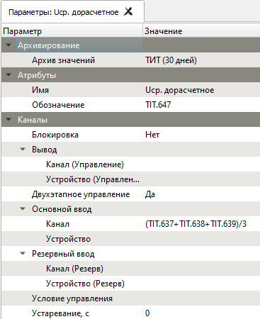

# Формулы
{:.no_toc}

* TOC
{:toc}

В качестве источника данных любому объекту ОИК можно задать математическое выражение, также называемое дорасчетом. Формулы используются в конфигурации [объектов](architecture#data-items), в [таблицах](client/table), [пользовательских таблицах](client/sheet) и в условиях управления.

## Ссылки на объекты

В формулах можно ссылаться на значения других объектов по алиасу:

* `ТИТ.1` — ссылка на объект по алиасу
* `{имя объекта}` — имена, содержащие специальные символы, заключаются в фигурные скобки
* `{IEC_DEV.1\Канал1}` — ссылка на канал устройства

Символ `=` в начале формулы допускается, но не обязателен.

## Арифметические операции

Поддерживаются операторы сложения (`+`), вычитания (`-`), умножения (`*`) и деления (`/`). Допускается использование скобок для группировки.

Пример: `ТИТ.1 + ТИТ.2 * ТИТ.3`

## Функции

| Функция            | Описание                   |
|:------------------:|----------------------------|
| `sin(x)`           | синус                      |
| `cos(x)`           | косинус                    |
| `tan(x)`           | тангенс                    |
| `asin(x)`          | арксинус                   |
| `acos(x)`          | арккосинус                 |
| `atan(x)`          | арктангенс                 |
| `atan2(y, x)`      | арктангенс y/x             |
| `abs(x)`           | модуль                     |
| `not(x)`           | отрицание                  |
| `sqrt(x)`          | квадратный корень          |
| `sign(x)`          | знак числа                 |
| `min(x1, x2, ...)` | минимум                    |
| `max(x1, x2, ...)` | максимум                   |
| `and(x1, x2, ...)` | логическое И               |
| `or(x1, x2, ...)`  | логическое ИЛИ             |
| `if(x, a, b)`      | тернарный условный оператор |

Углы тригонометрических функций задаются в радианах.
`...` означает произвольное число параметров.

## Примеры

* `ТИТ1 + ТИТ2 * ТИТ3`
* `sin({IEC_DEV.1\Канал1})`
* `if (or(рек1_ток>3, рек2_ток>3),рек3_ток,0)`
* `and(!TS.1379,!TS.1380,!TS.1382)`
* `or(ТС.1, ТС.2)`

`TIT.637, TIT.638, TIT.639` — не редактируемый номер объекта ТИТ, который присваивается ему Сервером ОИК автоматически при его создании в базе данных (БД) объектов.

## Ошибки

При вводе некорректной формулы отображается сообщение об ошибке. В признаках качества объекта отображается [Н] — ошибка подключения или неверное выражение.
