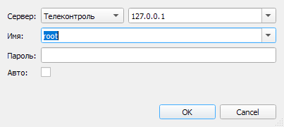

# Начало работы
{:.no_toc}

* TOC
{:toc}

## Системные требования

* ОС Windows 10 и выше (Сервер и Клиент) или Linux (только Сервер)
* Протокол TCP/IP для связи клиентов с сервером (порт 2000 по умолчанию)
* Аппаратный ключ HASP или Guardant для работы Сервера (без ключа Сервер работает 2 часа)
* Компонент [ActiveXeme](http://swman.ru/content/blogcategory/21/49/) для отображения мнемосхем в Клиенте (опционально)

## Установка под Windows

[Скачать дистрибутив ОИК Телеконтроль](https://telecontrol-public.s3-us-west-2.amazonaws.com/telecontrol-scada/telecontrol-scada-2.4.0.msi) (версия 2.4.0).

Дистрибутив включает два компонента: Сервер и Графический клиент. Предполагается, что Сервер устанавливается на серверном компьютере, а Клиент — на одной или нескольких рабочих станциях. Оба компонента могут быть установлены на одном компьютере.

Сервер устанавливается в виде системной службы *Telecontrol SCADA Server*, что позволяет начать сбор данных до входа пользователя в систему. Служба будет запущена автоматически после перезагрузки компьютера.

При установке, в зависимости от выбранных компонентов, будет создана группа *ОИК Телеконтроль* в меню Пуск с пиктограммами *Сервер (консоль)* и *Клиент*. Эти же пиктограммы будут созданы на рабочем столе.

### Установка ActiveXeme

Графический клиент использует для отображения мнемосхем компонент [ActiveXeme](http://swman.ru/content/blogcategory/21/49/), который можно загрузить с сайта компании МОДУС. Установка ActiveXeme необязательна — Клиент поддерживает встроенную отрисовку схем (включается в меню *Настройки — Встроенная отрисовка схем Модус*).

### Подключение аппаратного ключа

Сервер требует аппаратный ключ HASP или Guardant для своей работы. Драйверы ключей [HASP](https://sentinelcustomer.gemalto.com/sentinelsupport/) и [Guardant](https://www.guardant.ru/support/download/drivers/) могут быть загружены с сайтов производителей.

При отсутствии ключа Сервер работает в демонстрационном режиме и останавливается через 2 часа после запуска. Для продолжения работы необходимо подключить ключ и перезапустить Сервер.

## Установка под Linux

Серверный компонент доступен для Linux. Для установки распакуйте архив дистрибутива и следуйте инструкциям в прилагаемом файле.

Графический клиент под Linux не поддерживается. Для доступа с рабочих мест Linux используйте [Веб-интерфейс](client/web).

## Настройка сети

Если на серверном компьютере используется Брандмауэр Windows или какая-либо другая программа, ограничивающая сетевой доступ, необходимо разрешить входящие подключения TCP/IP на порт 2000. На клиентском компьютере должны быть разрешены исходящие соединения TCP/IP.

Порт подключения можно изменить в [параметрах сервера](server#parameters).

## Подготовка проекта

При первом запуске Сервер создает демонстрационную конфигурацию с эмулируемыми объектами. Это позволяет ознакомиться с интерфейсом без подключения реального оборудования.

Для использования собственного проекта:
* На серверном компьютере: скопировать конфигурацию в папку *%ProgramData%\Telecontrol\SCADA Server\Configuration*.
* На каждом рабочем месте: скопировать файлы мнемосхем (.sde) в папку *%ProgramData%\Telecontrol\SCADA Client*. При использовании [серверной файловой системы](server#filesystem) достаточно загрузить файлы мнемосхем на сервер.

Подробности о создании проекта и настройке оборудования смотрите в разделе [Проектирование](development).

## Запуск Сервера

Сервер запускается автоматически вместе с запуском Windows. Вход пользователя в систему не требуется.

В качестве альтернативы Сервер может быть запущен в [консольном режиме](server#console).

Также можно дополнительно настроить [параметры сервера](server#parameters).

## Запуск Клиента

Для запуска Клиента используйте пиктограмму *Клиент* на рабочем столе или из меню *Пуск — ОИК Телеконтроль*. При этом будут запрошены реквизиты пользователя ОИК для подключения к Серверу:

При первом запуске следует воспользоваться реквизитами администратора. Для этого нужно указать имя *root*, а пароль оставить пустым.

В поле *Сервер* нужно ввести имя или адрес IP компьютера, где установлен Сервер, если он отличается от текущего. Иначе, поле *Сервер* следует оставить пустым.

При установленном флаге *Автоматический вход* программа будет использовать указанные реквизиты при каждом последующем запуске без отображения окна входа. Для отключения этого режима удерживайте *Ctrl* при запуске Клиента.

## Первые шаги после входа

После входа в систему:

1. **Откройте панель объектов** — меню *Далее — Объекты*. В панели отображается дерево объектов с текущими значениями. Двойной клик по объекту открывает его график.

2. **Просмотрите мнемосхемы** — меню *Схема*. Выберите доступную схему из списка.

3. **Проверьте состояние оборудования** — меню *Далее — Оборудование*. Иконки слева от устройств показывают состояние связи.

4. **Создайте пользователей** — меню *Далее — Пользователи*. Создайте учетные записи для операторов и задайте безопасный пароль администратору *root*. Смотрите [Конфигурирование пользователей](dev/users).

Далее смотрите описание [Клиента](client).

## Обновление

Для обновления ОИК установите новую версию поверх существующей. Конфигурация, исторические данные и файлы мнемосхем сохраняются.

Перед обновлением рекомендуется сделать резервную копию папки *%ProgramData%\Telecontrol\SCADA Server*.

## Устранение неполадок

<dl>

<dt>Клиент не может подключиться к Серверу</dt>
<dd>Убедитесь, что служба <em>Telecontrol SCADA Server</em> запущена (Панель управления — Службы). Проверьте, что порт 2000 разрешен в брандмауэре и доступен по сети.</dd>

<dt>Сервер останавливается через 2 часа</dt>
<dd>Аппаратный ключ не подключен или не распознан. Подключите ключ и перезапустите службу Сервера.</dd>

<dt>Мнемосхемы не отображаются</dt>
<dd>Установите компонент ActiveXeme или включите встроенную отрисовку в меню <em>Настройки — Встроенная отрисовка схем Модус</em>.</dd>

<dt>Значения объектов отображаются серым цветом</dt>
<dd>Нет связи с устройством или данные недостоверны. Проверьте состояние устройств в панели оборудования (<em>Далее — Оборудование</em>).</dd>

</dl>
