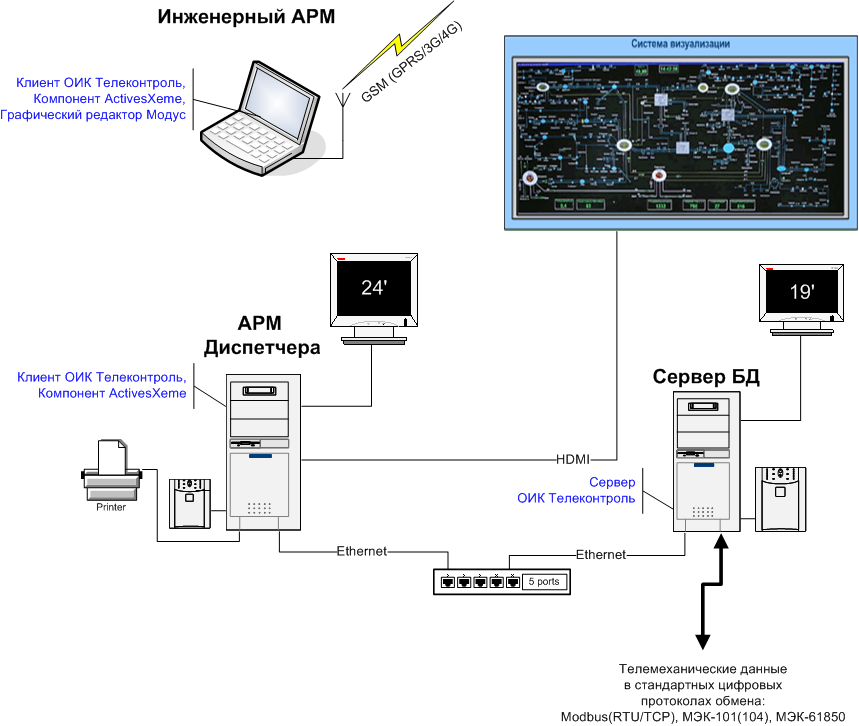

# Назначение

ОИК Телеконтроль (ОИК) - это программное обеспечение верхнего уровня, предназначенное для сбора и представления информации в требуемых конечному пользователю формах, выдачи управляющих команд на контролируемое оборудование, архивирования телеинформации, регистрации и отображения архивных данных.

ОИК имеет в основе клиент-серверную архитектуру, с центральным сервером. Количество клиентов при этом не ограничивается.

Все клиенты подключаются к центральному серверу посредством протокола TCP/IP и устойчивы к потере связи в течение работы сервера.

Для работы ОИК потребуется один (одномашинный комплекс) или несколько (многомашинный комплекс) компьютеров с установленной ОС Windows 7 или выше. Для отображения и привязки схем к реальным телемеханическим данным необходим компонент [ActiveXeme](http://swman.ru/content/blogcategory/21/49/). Для редактирования схем потребуется [Графический редактор Модус](http://swman.ru/content/blogcategory/19/47/).

Все схемы выполнены в виде векторной графики, благодаря чему даже большие схемы имеют минимальный размер и отображаются на жидкокристаллических панелях коллективного пользования в увеличенном масштабе без потери качества рисунка.

ОИК позволяет создавать одно и более автоматизированных рабочих мест (АРМ) операторов в зависимости от категории пользователей и прав доступа к данным для различных систем автоматизации контроля и управления технологическими процессами.

Пример организации многомашинного комплекса:

## Функции

* Распределенная многопользовательская [архитектура](architecture)
* Отображение данных на электронных схемах [ActiveXeme](client/display)
* Интуитивное построение [таблиц](client/table), [трендов и графиков](client/graph), инструменты графического анализа
* Сбор данных с устройств в протоколах [MODBUS](architecture#modbus), [МЭК-60870-5](architecture#iec-60870) и [МЭК-61850](architecture#iec-61850), выдача команд телеуправления и телерегулирования
* [Дорасчет](architecture#calc), [ручной ввод](architecture#manual-write) и [контроль уставок](architecture#limits)
* Ведение [архива измерений и сигнализациии](server#history), автоматическое обслуживание БД
* [Резервирование](#data-items) информационных объектов
* Конфигурирование во время работы с любого рабочего места, возможность [редактирования конфигурации в Excel](development#excel-cfg)
* [Наблюдение](client#device-watch) за каналами связи с любого рабочего места