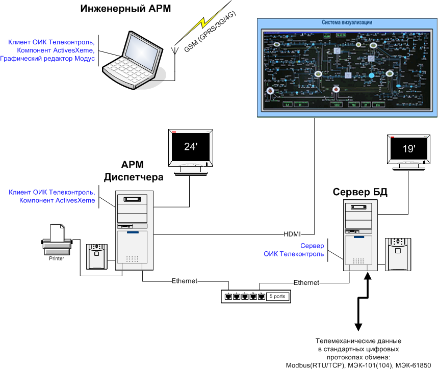

# Назначение

ОИК Телеконтроль (ОИК) - это программное обеспечение верхнего уровня, предназначенное для сбора и представления информации в требуемых конечному пользователю формах, выдачи управляющих команд на контролируемое оборудование, архивирования телеинформации, регистрации и отображения архивных данных.

ОИК имеет в основе Клиент-Серверную архитектуру, с центральным Сервером. Количество клиентов при этом не ограничивается.

Все клиенты подключаются к центральному Серверу посредством протокола TCP/IP и устойчивы к потере связи в течение работы Сервера.

Для работы ОИК потребуется один (одномашинный комплекс) или несколько (многомашинный комплекс) компьютеров с установленной ОС Windows 10 и выше. Для отображения и привязки схем к реальным телемеханическим данным необходим компонент [ActiveXeme](http://swman.ru/content/blogcategory/21/49/). Для редактирования схем потребуется [Графический редактор Модус](http://swman.ru/content/blogcategory/19/47/).

Все схемы выполнены в виде векторной графики, благодаря чему даже большие схемы имеют минимальный размер и отображаются на жидкокристаллических панелях коллективного пользования в увеличенном масштабе без потери качества рисунка.

ОИК позволяет создавать одно и более автоматизированных рабочих мест (АРМ) операторов в зависимости от категории пользователей и прав доступа к данным для различных систем автоматизации контроля и управления технологическими процессами. 

Пример организации многомашинного комплекса:

## Функции

* Распределенная многопользовательская [Архитектура](architecture), поддержка серверов на Windows и Linux
* Отображение данных на электронных схемах [ActiveXeme](client/display)
* Интуитивное построение [Таблиц](client/table), [Трендов и Графиков](client/graph), [Сводок](client/summary) с агрегацией данных
* [Пользовательские таблицы](client/sheet) с формулами и условным форматированием
* Сбор данных с устройств в протоколах [MODBUS](protocols#modbus), [МЭК-60870-5](protocols#iec-60870) и [МЭК-61850](protocols#iec-61850), выдача команд телеуправления и телерегулирования
* Ретрансляция данных на системы верхнего уровня, сервер OPC UA
* [Дорасчет](formulas), [Ручной ввод](architecture#manual-write) и [Контроль уставок](architecture#limits)
* Эмуляция объектов для тестирования без оборудования
* Ведение [Архива измерений и сигнализации](server#history), автоматическое обслуживание БД
* [Журнал событий](client/events) с квитированием и цветовой маркировкой по важности
* [Резервирование](architecture#data-items) информационных объектов
* [Разграничение доступа](dev/users) по ролям пользователей
* Конфигурирование во время работы с любого рабочего места, возможность [Редактирования конфигурации в Excel](dev/excel)
* [Наблюдение](client/device-watch) за каналами связи и [метрики устройств](client/device-metrics)
* [Экспорт](client/export) данных в CSV, [печать](client/print) таблиц и графиков
* [Веб-интерфейс](client/web) для удаленного доступа через браузер