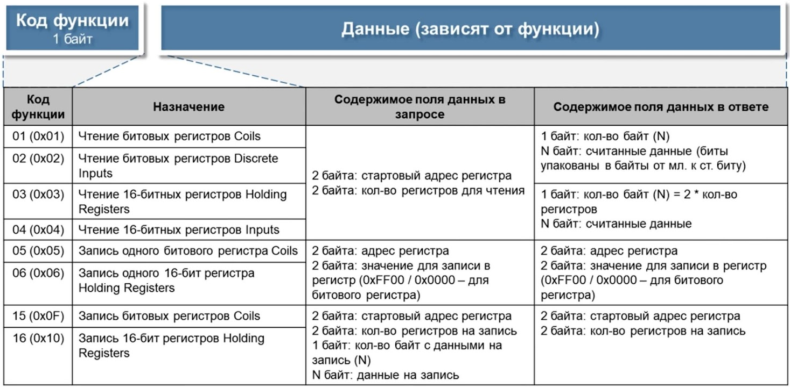

# Поддерживаемые протоколы
{:.no_toc}

* TOC
{:toc}

Для всех протоколов предоставляется возможность наблюдения за обменом с устройством. Смотрите [Наблюдение](client/device-watch) в Клиенте ОИК.

## MODBUS

Modbus — коммуникационный протокол, основан на архитектуре ведущий-подчиненный (master-slave). Использует для передачи данных следующие интерфейсы: RS-485, RS-422, RS-232 (протоколы Modbus RTU/ASCII), а также интерфейс Ethernet сети TCP/IP (протокол Modbus TCP).

Поддерживаются стандартные коды функций Modbus:

Смотрите описание [Устройства MODBUS](dev/devices#mbDevice) в Клиенте ОИК.

Смотрите описание протокола [MODBUS](https://ru.wikipedia.org/wiki/Modbus).

## МЭК-60870-5

Элементами подсистемы МЭК-60870-5 являются направления, определяющие каналы данных: сетевой адрес или последовательный порт. Одно направление может обеспечивать соединение с несколькими устройствами.

Поддерживаемые блоки данных прикладного уровня ASDU:

| Метка типа ASDU	| Идентификатор типа ASDU	| Описание информации																						|
|:------------------|:-------------------------:|:---------------------------------------------------------------------------------------------------------:|
| M_SP_NA_1			| 1  			 			| одноэлементная (0 – ОТКЛ, 1 – ВКЛ)																		| 
| M_SP_TA_1 		| 2  			 			| одноэлементная с меткой времени																			| 
| M_DP_NA_1 		| 3 						| двухэлементная (0 – Неопределенное или Промежуточное, 1 – ОТКЛ, 2 – ВКЛ, 3 – Неопределенное)				| 
| M_BO_NA_1 		| 7 			 			| строка из 32 бит	(unsigned int32)																		| 
| M_ME_NA_1 		| 9 			 			| нормализованное значение	(float)																			| 
| M_ME_NB_1 		| 11 						| масштабированное значение (float)																			| 
| M_ME_TB_1 		| 12 			 			| масштабированное значение с меткой времени																| 
| M_ME_NC_1 		| 13 			 			| короткий формат с плавающей запятой (float)																| 
| M_IT_NA_1 		| 15 			 			| интегральная сумма (int32)																				| 
| M_SP_TB_1 		| 30 			 			| одноэлементная с меткой времени (СР56Время2а)																| 
| M_DP_TB_1 		| 31 			 			| двухэлементная с меткой времени (СР56Время2а)																| 
| M_ME_TD_1 		| 34 			 			| нормализованное значение с меткой времени (СР56Время2а)													| 
| M_ME_TE_1 		| 35 			 			| масштабированное значение с меткой времени (СР56Время2а)													| 
| M_ME_TF_1 		| 36 						| короткий формат с плавающей запятой с меткой времени (СР56Время2а)										| 
| M_IT_TB_1 		| 37 			 			| интегральные суммы с меткой времени (СР56Время2а)															| 
| C_SC_NA_1 		| 45 						| одноэлементная команда управления (0 – ОТКЛЮЧИТЬ, 1 – ВКЛЮЧИТЬ)											| 
| M_EI_NA_1 		| 70 			 			| конец инициализации (END OF INITIALIZATION)																| 
| C_IC_NA_1 		| 100 						| команда полного опроса (INTERROGATION)																	| 
| C_CI_NA_1		 	| 101 			 			| команда опроса счетчика (COUNTER INTERROGATION)															| 
| C_CS_NA_1 		| 103 			 			| команда синхронизации времени (SYNCHRONIZATION)															| 
| C_RP_NA_1 		| 105 			 			| команда установки процесса в исходное состояние (RESET PROCESS ACTIVATION / RESET PROCESS CONFIRMATION)	| 
| P_ME_NA_1 		| 110 			 			| запись параметра измеряемой величины, нормализованное значение (float)									| 
| P_ME_NB_1 		| 111 			 			| запись параметра измеряемой величины, масштабированное значение (float)									| 
| P_ME_NC_1 		| 112 			 			| запись параметра измеряемой величины, короткий формат с плавающей запятой (float)							| 

При управлении используются ADSU `C_SC_NA_1` для объектов ТС и `P_ME_NC_1` для объектов ТИТ.

Для переопределения типа ASDU можно указать тип в поле вывода в формате `тип:адрес`

где `тип` один из:

* `BOOL` - используется ASDU `C_SC_NA_1`;
* `INT16` - используется ASDU `P_ME_NB_1`;
* `FLOAT` - используется ASDU `P_ME_NC_1`.

Переопределение типа ASDU может использоваться если для управлении объектом ТИТ требуется отправить команду управления ASDU `C_SC_NA_1`.

Сервер UDP позволяет одновременную работу с несколькими удаленными устройствам через одно направление, так что нет необходимости задавать разные порты приема для разных устройств. Устройство идентифицируется по удаленному IP-адресу и порту.

При использовании сервера UDP поддерживаются устройства, отправляющие датаграммы из нескольких сообщений МЭК.

Смотрите параметры [Устройства МЭК-60870-5](dev/devices#iecDevice) в Клиенте ОИК.

Смотрите описание протоколов [МЭК-60870-5](https://ru.wikipedia.org/wiki/IEC_60870-5).

## МЭК-61850

Предоставляется прозрачный доступ к информационной модели устройства. Смотрите описание [МЭК-61850](client#iec-61850) в Клиенте ОИК и [Проектирование](dev/devices#iec-61850).

Сбор данных осуществляется посредством подписки на блоки отчетов RCB/BRCB сервиса MMS сообщений. Для включения сбора данных, блоки отчетов должны быть предварительно созданы для соответствующего устройства МЭК-61850. При установлении соединения с устройством, Сервер ОИК выполняет конфигурирование блоков отчетов устройства для спорадической передачи событий.

Для привязки объектов ТС и ТИТ к объектам МЭК-61850 используются адреса MMS в формате LogicalDevice/LogicalNode$FC$DataObject.

Для привязки объектов ТС используются объекты типа FC=ST, для привязки объектов ТИТ используются объекты типа FC=MX.

Поддерживается выдача двухфазной команды ТУ. Для привязки команды ТУ используется FC=CO.

<dl>

<dt>ВНИМАНИЕ: Поддерживается передача меток времени только в UTC. Если устройство использует другую временную зону, возникнут сложности с обновлением значений.</dt>

</dl>

Оператором может быть инициирована команда полного опроса устройства.

Смотрите описание протоколов [МЭК-61850](https://ru.wikipedia.org/wiki/МЭК-61850).
